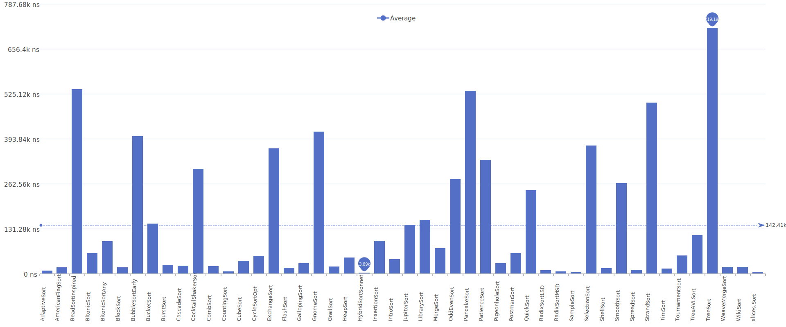
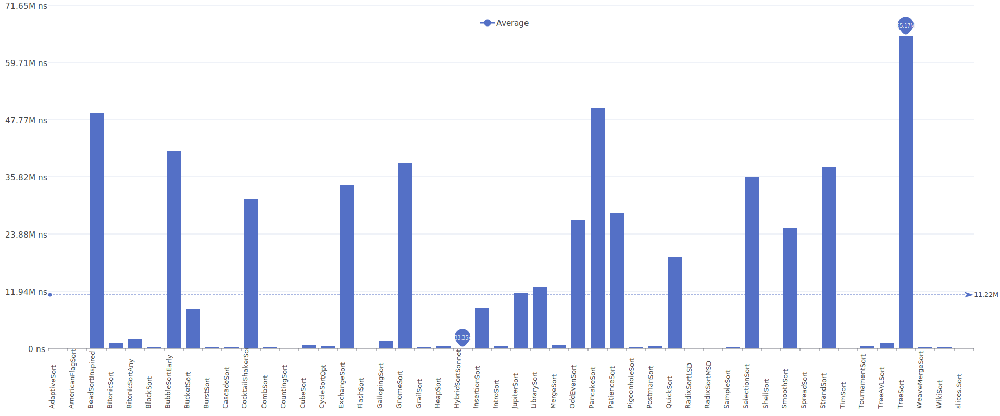
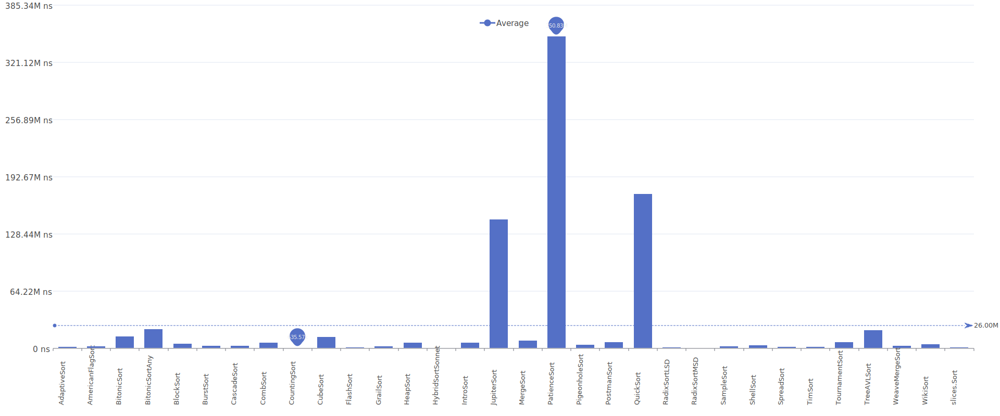
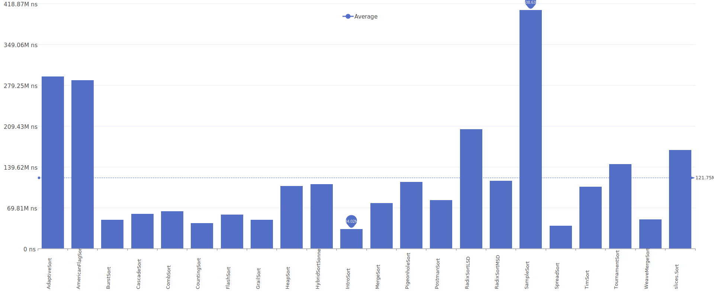
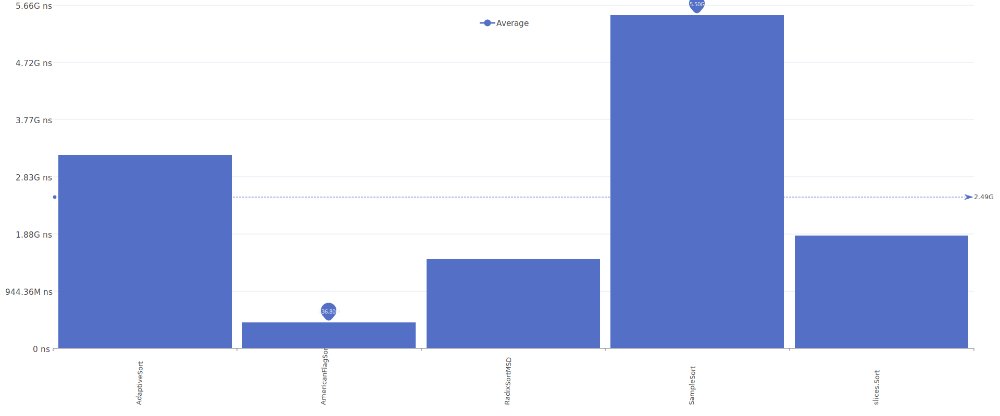

# Sort Comparison

A comprehensive collection of sorting algorithm implementations in Go for
educational purposes.

## Sorting Algorithms

### Average Results

| Number of Elements | Results                                                                           |
| ------------------ | --------------------------------------------------------------------------------- |
| 10                 |          |
| 100                |         |
| 1,000              |        |
| 10,000             |       |
| 100,000            |      |
| 1,000,000          |     |
| 10,000,000         |    |
| 100,000,000        |   |
| 1,000,000,000      |  |


### Benchmarks up to 1B elements

| Name                                                  | Best       | Average    | Worst      | Memory   | Stable | In-place |
| ----------------------------------------------------- | ---------- | ---------- | ---------- | -------- | ------ | -------- |
| [**slices.Sort**](docs/algo/slices.Sort.md)           | O(n)       | O(n log n) | O(n log n) | O(1)     | Yes    | Yes      |
| [**AmericanFlagSort**](docs/algo/AmericanFlagSort.md) | O(n+k)     | O(n+k)     | O(n+k)     | O(1)     | Yes    | Yes      |
| [**HybridSort**](docs/algo/HybridSort.md)             | O(n)       | O(n log n) | O(n log n) | O(n)     | Yes    | No       |
| [**JupiterSort**](docs/algo/JupiterSort.md)           | O(n log n) | O(n log n) | O(n log n) | O(log n) | No     | Yes      |
| [**RadixSort**](docs/algo/RadixSort.md)               | O(n+k)     | O(n+k)     | O(n+k)     | O(1)     | Yes    | Yes      |

### Benchmarks up to 100M elements

| Name                                              | Best       | Average     | Worst       | Memory   | Stable | In-place |
| ------------------------------------------------- | ---------- | ----------- | ----------- | -------- | ------ | -------- |
| [**BurstSort**](docs/algo/BurstSort.md)           | O(n log n) | O(n log n)  | O(n log n)  | O(n)     | Yes    | No       |
| [**CascadeSort**](docs/algo/CascadeSort.md)       | O(n)       | O(n log n)  | O(n log n)  | O(n)     | Yes    | No       |
| [**CombSort**](docs/algo/CombSort.md)             | O(n log n) | O(n log n)  | O(n²)       | O(1)     | No     | Yes      |
| [**CountingSort**](docs/algo/CountingSort.md)     | O(n+k)     | O(n+k)      | O(n+k)      | O(k)     | Yes    | No       |
| [**CycleSortOpt**](docs/algo/CycleSortOpt.md)     | O(n log n) | O(n log n)  | O(n log n)  | O(n)     | Yes    | Yes      |
| [**FlashSort**](docs/algo/FlashSort.md)           | O(n)       | O(n)        | O(n²)       | O(n)     | No     | No       |
| [**GeneralSort**](docs/algo/GeneralSort.md)       | O(n)       | O(n log n)  | O(n log n)  | O(n)     | Yes    | No       |
| [**GrailSort**](docs/algo/GrailSort.md)           | O(n log n) | O(n log n)  | O(n log n)  | O(√n)    | Yes    | No       |
| [**HeapSort**](docs/algo/HeapSort.md)             | O(n log n) | O(n log n)  | O(n log n)  | O(1)     | No     | Yes      |
| [**IntroSort**](docs/algo/IntroSort.md)           | O(n log n) | O(n log n)  | O(n log n)  | O(log n) | No     | Yes      |
| [**MergeSort**](docs/algo/MergeSort.md)           | O(n log n) | O(n log n)  | O(n log n)  | O(n)     | Yes    | No       |
| [**PigeonholeSort**](docs/algo/PigeonholeSort.md) | O(n+r)     | O(n+r)      | O(n+r)      | O(r)     | Yes    | No       |
| [**PostmanSort**](docs/algo/PostmanSort.md)       | O(n)       | O(n*m)      | O(n*m)      | O(n)     | Yes    | No       |
| [**QuickSort**](docs/algo/QuickSort.md)           | O(n log n) | O(n log n)  | O(n²)       | O(log n) | No     | Yes      |
| [**SampleSort**](docs/algo/SampleSort.md)         | O(n log n) | O(n log n)  | O(n log n)  | O(n)     | No     | No       |
| [**SpreadSort**](docs/algo/SpreadSort.md)         | O(n)       | O(n log² n) | O(n log² n) | O(n)     | No     | No       |
| [**TimSort**](docs/algo/TimSort.md)               | O(n)       | O(n log n)  | O(n log n)  | O(n)     | Yes    | No       |
| [**TournamentSort**](docs/algo/TournamentSort.md) | O(n log n) | O(n log n)  | O(n log n)  | O(n)     | No     | No       |
| [**WeaveMergeSort**](docs/algo/WeaveMergeSort.md) | O(n log n) | O(n log n)  | O(n log n)  | O(n)     | Yes    | No       |

### Benchmarks up to 1M elements

| Name                                          | Best       | Average     | Worst       | Memory | Stable | In-place |
| --------------------------------------------- | ---------- | ----------- | ----------- | ------ | ------ | -------- |
| [**BitonicSort**](docs/algo/BitonicSort.md)   | O(n log n) | O(n log² n) | O(n log² n) | O(1)   | No     | Yes      |
| [**BlockSort**](docs/algo/BlockSort.md)       | O(n log n) | O(n log n)  | O(n log n)  | O(n)   | Yes    | No       |
| [**CubeSort**](docs/algo/CubeSort.md)         | O(n)       | O(n log n)  | O(n log n)  | O(n)   | Yes    | No       |
| [**PatienceSort**](docs/algo/PatienceSort.md) | O(n log n) | O(n log n)  | O(n log n)  | O(n)   | Yes    | No       |
| [**ShellSort**](docs/algo/ShellSort.md)       | O(n log n) | O(n log² n) | O(n log² n) | O(1)   | No     | Yes      |
| [**StrandSort**](docs/algo/StrandSort.md)     | O(n)       | O(n²)       | O(n²)       | O(n)   | Yes    | No       |
| [**TreeSortAVL**](docs/algo/TreeSortAVL.md)   | O(n log n) | O(n log n)  | O(n log n)  | O(n)   | Yes    | No       |
| [**WikiSort**](docs/algo/WikiSort.md)         | O(n log n) | O(n log n)  | O(n log n)  | O(1)   | Yes    | Yes      |

### Benchmarks up to 10k elements

> :warning: O(n²) was expected to being slow. But some implementations needs to be analyzed for performance improvements.

| Name                                                      | Best       | Average    | Worst      | Memory  | Stable | In-place |
| --------------------------------------------------------- | ---------- | ---------- | ---------- | ------- | ------ | -------- |
| [**BeadSortInspired**](docs/algo/BeadSortInspired.md)     | O(n)       | O(n\*m)    | O(n\*m)    | O(n\*m) | Yes    | No       |
| [**BubbleSort**](docs/algo/BubbleSort.md)                 | O(n)       | O(n²)      | O(n²)      | O(1)    | Yes    | Yes      |
| [**BucketSort**](docs/algo/BucketSort.md)                 | O(n+k)     | O(n+k)     | O(n²)      | O(n+k)  | Yes    | No       |
| [**CocktailShakerSort**](docs/algo/CocktailShakerSort.md) | O(n)       | O(n²)      | O(n²)      | O(1)    | Yes    | Yes      |
| [**CycleSort**](docs/algo/CycleSort.md)                   | O(n²)      | O(n²)      | O(n²)      | O(1)    | No     | Yes      |
| [**ExchangeSort**](docs/algo/ExchangeSort.md)             | O(n²)      | O(n²)      | O(n²)      | O(1)    | No     | Yes      |
| [**GallopingSort**](docs/algo/GallopingSort.md)           | O(n)       | O(n log n) | O(n log n) | O(1)    | Yes    | Yes      |
| [**GnomeSort**](docs/algo/GnomeSort.md)                   | O(n)       | O(n²)      | O(n²)      | O(1)    | Yes    | Yes      |
| [**InsertionSort**](docs/algo/InsertionSort.md)           | O(n)       | O(n²)      | O(n²)      | O(1)    | Yes    | Yes      |
| [**LibrarySort**](docs/algo/LibrarySort.md)               | O(n log n) | O(n log n) | O(n log n) | O(n)    | Yes    | No       |
| [**OddEvenSort**](docs/algo/OddEvenSort.md)               | O(n)       | O(n²)      | O(n²)      | O(1)    | Yes    | Yes      |
| [**PancakeSort**](docs/algo/PancakeSort.md)               | O(n)       | O(n²)      | O(n²)      | O(1)    | No     | Yes      |
| [**SelectionSort**](docs/algo/SelectionSort.md)           | O(n²)      | O(n²)      | O(n²)      | O(1)    | No     | Yes      |
| [**SmoothSort**](docs/algo/SmoothSort.md)                 | O(n)       | O(n log n) | O(n log n) | O(1)    | No     | Yes      |
| [**TreeSort**](docs/algo/TreeSort.md)                     | O(n log n) | O(n log n) | O(n²)      | O(n)    | Yes    | No       |

### removed from benchmarking

| Name                                  | Best | Average | Worst   | Memory  | Stable | In-place | Notes                                                                         |
| ------------------------------------- | ---- | ------- | ------- | ------- | ------ | -------- | ----------------------------------------------------------------------------- |
| [**BeadSort**](docs/algo/BeadSort.md) | O(n) | O(n\*m) | O(n\*m) | O(n\*m) | Yes    | No       | visual/physical metaphor, BeadSortInspired with Bitset optimzations was added |

## Benchmarking


Attention: running all benchmarks really takes a long time. It is recommended to run benchmarks for specific algorithms or distributions.

### Results

[benchstat-results.txt](data/benchstat-result.txt)

### Run Benchmarks

```go
go test -bench=. -timeout 6h
```

Compare specific algorithms:

```go
go test -bench "//Quick/10"
```

Compare specific distributions:

```go
go test -bench "/RandomMax//10"
```

Benchmarks test each algorithm against different:

- Input sizes (10 to 1B elements)
- Data distributions (random, sorted, reversed, etc.)
- Operation types (in-place vs return new array)

## Data Distributions

| Name                                                  | Description                               | Image                                                     |
| ----------------------------------------------------- | ----------------------------------------- | --------------------------------------------------------- |
| [AllZero](docs/distribution/AllZero.md)               | Array of all zeros                        |                |
| [BackToFront](docs/distribution/BackToFront.md)       | Single element pushed from back to front  |        |
| [FrontToBack](docs/distribution/FrontToBack.md)       | Single element pushed from front to back  |        |
| [MiddleToBack](docs/distribution/MiddleToBack.md)     | Single element pushed from middle to back |      |
| [Mountain](docs/distribution/Mountain.md)             | Elements form a mountain shape            |              |
| [NearlyReversed](docs/distribution/NearlyReversed.md) | Almost completely reversed sequence       |  |
| [NearlySorted](docs/distribution/NearlySorted.md)     | Almost completely sorted sequence         |      |
| [Plateau](docs/distribution/Plateau.md)               | Elements form a plateau shape             |                |
| [PushMiddle](docs/distribution/PushMiddle.md)         | Elements pushed towards the middle        |          |
| [Random](docs/distribution/Random.md)                 | Completely random distribution            |                  |
| [RandomMaxN](docs/distribution/RandomMaxN.md)         | Random integers up to max N               |          |
| [RandomMod8](docs/distribution/RandomMod8.md)         | Random values modulo 8                    |          |
| [RandomMod16](docs/distribution/RandomMod16.md)       | Random values modulo 16                   |        |
| [RepeatedMod8](docs/distribution/RepeatedMod8.md)     | Repeated sequence modulo 8                |      |
| [RepeatedMod16](docs/distribution/RepeatedMod16.md)   | Repeated sequence modulo 16               |    |
| [Reversed](docs/distribution/Reversed.md)             | Completely reversed sequence              |              |
| [Rotated](docs/distribution/Rotated.md)               | Sorted sequence rotated by N positions    |                |
| [SmallHills](docs/distribution/SmallHills.md)         | Elements form small hill patterns         |          |
| [Sorted](docs/distribution/Sorted.md)                 | Completely sorted sequence                |                  |
| [Valley](docs/distribution/Valley.md)                 | Elements form a valley shape              |                  |

Usage License This project is licensed under the MIT License.
