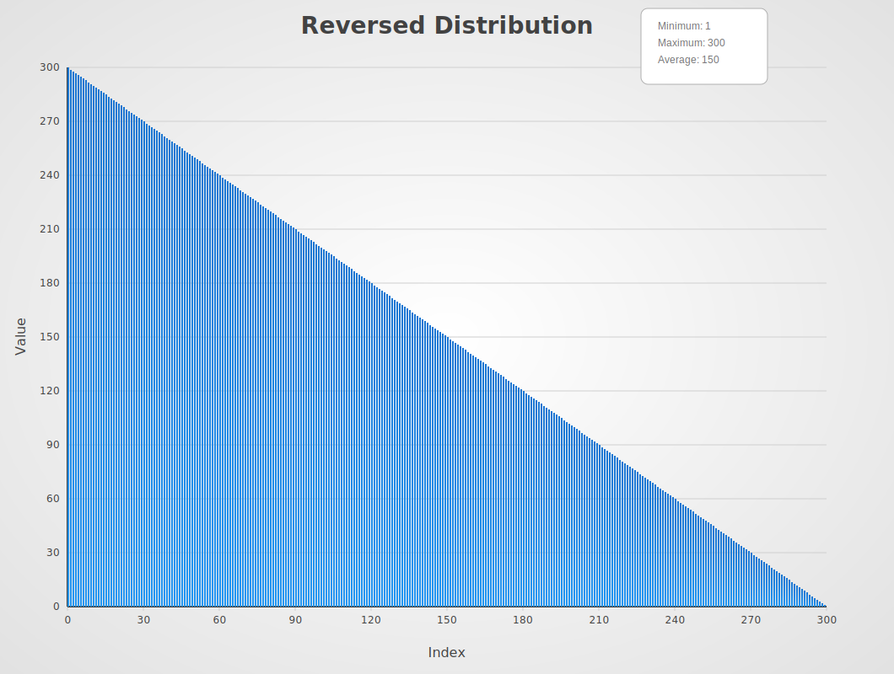

h# Sort Comparison

A comprehensive collection of sorting algorithm implementations in Go for
educational purposes.

# ideas

- one svg bar chart for each algo
- one svg bar chart for each distribution
- svg generation might be simpler to incorporate into a local test setup
- a single gigantic echarts with distribution as series + on algo has to be
  selectable as well

## Sorting Algorithms

### Benchmarks up to 1B elements

| Name                                                  | Best       | Average    | Worst      | Memory   | Stable | In-place |
| ----------------------------------------------------- | ---------- | ---------- | ---------- | -------- | ------ | -------- |
| **slices.Sort**                                       | O(n)       | O(n log n) | O(n log n) | O(1)     | Yes    | Yes      |
| [**AmericanFlagSort**](docs/algo/AmericanFlagSort.md) | O(n+k)     | O(n+k)     | O(n+k)     | O(1)     | Yes    | Yes      |
| **HybridSort**                                        | O(n)       | O(n log n) | O(n log n) | O(n)     | Yes    | No       |
| **JupiterSort**                                       | O(n log n) | O(n log n) | O(n log n) | O(log n) | No     | Yes      |
| **RadixSort**                                         | O(n+k)     | O(n+k)     | O(n+k)     | O(1)     | Yes    | Yes      |

### Benchmarks up to 100M elements

| Name               | Best       | Average     | Worst       | Memory   | Stable | In-place |
| ------------------ | ---------- | ----------- | ----------- | -------- | ------ | -------- |
| **BurstSort**      | O(n log n) | O(n log n)  | O(n log n)  | O(n)     | Yes    | No       |
| **CascadeSort**    | O(n)       | O(n log n)  | O(n log n)  | O(n)     | Yes    | No       |
| **CombSort**       | O(n log n) | O(n log n)  | O(n²)       | O(1)     | No     | Yes      |
| **CountingSort**   | O(n+k)     | O(n+k)      | O(n+k)      | O(k)     | Yes    | No       |
| **CycleSortOpt**   | O(n log n) | O(n log n)  | O(n log n)  | O(n)     | Yes    | Yes      |
| **FlashSort**      | O(n)       | O(n)        | O(n²)       | O(n)     | No     | No       |
| **GeneralSort**    | O(n)       | O(n log n)  | O(n log n)  | O(n)     | Yes    | No       |
| **GrailSort**      | O(n log n) | O(n log n)  | O(n log n)  | O(√n)    | Yes    | No       |
| **HeapSort**       | O(n log n) | O(n log n)  | O(n log n)  | O(1)     | No     | Yes      |
| **IntroSort**      | O(n log n) | O(n log n)  | O(n log n)  | O(log n) | No     | Yes      |
| **MergeSort**      | O(n log n) | O(n log n)  | O(n log n)  | O(n)     | Yes    | No       |
| **PigeonholeSort** | O(n+r)     | O(n+r)      | O(n+r)      | O(r)     | Yes    | No       |
| **PostmanSort**    | O(n)       | O(n*m)      | O(n*m)      | O(n)     | Yes    | No       |
| **QuickSort**      | O(n log n) | O(n log n)  | O(n²)       | O(log n) | No     | Yes      |
| **SampleSort**     | O(n log n) | O(n log n)  | O(n log n)  | O(n)     | No     | No       |
| **SpreadSort**     | O(n)       | O(n log² n) | O(n log² n) | O(n)     | No     | No       |
| **TimSort**        | O(n)       | O(n log n)  | O(n log n)  | O(n)     | Yes    | No       |
| **TournamentSort** | O(n log n) | O(n log n)  | O(n log n)  | O(n)     | No     | No       |
| **UltimateSort**   | O(n log n) | O(n log n)  | O(n log n)  | O(log n) | No     | Yes      |
| **WeaveMergeSort** | O(n log n) | O(n log n)  | O(n log n)  | O(n)     | Yes    | No       |

### Benchmarks up to 1M elements

| Name             | Best       | Average     | Worst       | Memory | Stable | In-place |
| ---------------- | ---------- | ----------- | ----------- | ------ | ------ | -------- |
| **BitonicSort**  | O(n log n) | O(n log² n) | O(n log² n) | O(1)   | No     | Yes      |
| **BlockSort**    | O(n log n) | O(n log n)  | O(n log n)  | O(n)   | Yes    | No       |
| **CubeSort**     | O(n)       | O(n log n)  | O(n log n)  | O(n)   | Yes    | No       |
| **PatienceSort** | O(n log n) | O(n log n)  | O(n log n)  | O(n)   | Yes    | No       |
| **ShellSort**    | O(n log n) | O(n log² n) | O(n log² n) | O(1)   | No     | Yes      |
| **StrandSort**   | O(n)       | O(n²)       | O(n²)       | O(n)   | Yes    | No       |
| **TreeSortAVL**  | O(n log n) | O(n log n)  | O(n log n)  | O(n)   | Yes    | No       |
| **WikiSort**     | O(n log n) | O(n log n)  | O(n log n)  | O(1)   | Yes    | Yes      |

### Benchmarks up to 10k elements

> :warning: O(n²) was expected to being slow. But some implementations needs to be analyzed for performance improvements.

| Name                   | Best       | Average    | Worst      | Memory  | Stable | In-place |
| ---------------------- | ---------- | ---------- | ---------- | ------- | ------ | -------- |
| **BeadSortInspired**   | O(n)       | O(n\*m)    | O(n\*m)    | O(n\*m) | Yes    | No       |
| **BubbleSort**         | O(n)       | O(n²)      | O(n²)      | O(1)    | Yes    | Yes      |
| **BucketSort**         | O(n+k)     | O(n+k)     | O(n²)      | O(n+k)  | Yes    | No       |
| **CocktailShakerSort** | O(n)       | O(n²)      | O(n²)      | O(1)    | Yes    | Yes      |
| **CycleSort**          | O(n²)      | O(n²)      | O(n²)      | O(1)    | No     | Yes      |
| **ExchangeSort**       | O(n²)      | O(n²)      | O(n²)      | O(1)    | No     | Yes      |
| **GallopingSort**      | O(n)       | O(n log n) | O(n log n) | O(1)    | Yes    | Yes      |
| **GnomeSort**          | O(n)       | O(n²)      | O(n²)      | O(1)    | Yes    | Yes      |
| **InsertionSort**      | O(n)       | O(n²)      | O(n²)      | O(1)    | Yes    | Yes      |
| **LibrarySort**        | O(n log n) | O(n log n) | O(n log n) | O(n)    | Yes    | No       |
| **OddEvenSort**        | O(n)       | O(n²)      | O(n²)      | O(1)    | Yes    | Yes      |
| **PancakeSort**        | O(n)       | O(n²)      | O(n²)      | O(1)    | No     | Yes      |
| **SelectionSort**      | O(n²)      | O(n²)      | O(n²)      | O(1)    | No     | Yes      |
| **SmoothSort**         | O(n)       | O(n log n) | O(n log n) | O(1)    | No     | Yes      |
| **TreeSort**           | O(n log n) | O(n log n) | O(n²)      | O(n)    | Yes    | No       |

### removed from benchmarking

| Name         | Best | Average | Worst   | Memory  | Stable | In-place | Notes                                                                         |
| ------------ | ---- | ------- | ------- | ------- | ------ | -------- | ----------------------------------------------------------------------------- |
| **BeadSort** | O(n) | O(n\*m) | O(n\*m) | O(n\*m) | Yes    | No       | visual/physical metaphor, BeadSortInspired with Bitset optimzations was added |

## Benchmarking


Attention: running all benchmarks really takes a long time. It is recommended to run benchmarks for specific algorithms or distributions.

### Results

[benchstat-results.txt](data/benchstat-result.txt)

### Run Benchmarks

```go
go test -bench=. -timeout 6h
```

Compare specific algorithms:

```go
go test -bench "//Quick/10"
```

Compare specific distributions:

```go
go test -bench "/RandomMax//10"
```

Benchmarks test each algorithm against different:

- Input sizes (10 to 1B elements)
- Data distributions (random, sorted, reversed, etc.)
- Operation types (in-place vs return new array)

## Data Distributions

| Name                                                  | Description                               | Image                                                     |
| ----------------------------------------------------- | ----------------------------------------- | --------------------------------------------------------- |
| [AllZero](docs/distribution/AllZero.md)               | Array of all zeros                        |                |
| [BackToFront](docs/distribution/BackToFront.md)       | Single element pushed from back to front  |        |
| [FrontToBack](docs/distribution/FrontToBack.md)       | Single element pushed from front to back  |        |
| [MiddleToBack](docs/distribution/MiddleToBack.md)     | Single element pushed from middle to back |      |
| [Mountain](docs/distribution/Mountain.md)             | Elements form a mountain shape            |              |
| [NearlyReversed](docs/distribution/NearlyReversed.md) | Almost completely reversed sequence       |  |
| [NearlySorted](docs/distribution/NearlySorted.md)     | Almost completely sorted sequence         |      |
| [Plateau](docs/distribution/Plateau.md)               | Elements form a plateau shape             |                |
| [PushMiddle](docs/distribution/PushMiddle.md)         | Elements pushed towards the middle        |          |
| [Random](docs/distribution/Random.md)                 | Completely random distribution            |                  |
| [RandomMaxN](docs/distribution/RandomMaxN.md)         | Random integers up to max N               |          |
| [RandomMod8](docs/distribution/RandomMod8.md)         | Random values modulo 8                    |          |
| [RandomMod16](docs/distribution/RandomMod16.md)       | Random values modulo 16                   |        |
| [RepeatedMod8](docs/distribution/RepeatedMod8.md)     | Repeated sequence modulo 8                |      |
| [RepeatedMod16](docs/distribution/RepeatedMod16.md)   | Repeated sequence modulo 16               |    |
| [Reversed](docs/distribution/Reversed.md)             | Completely reversed sequence              |              |
| [Rotated](docs/distribution/Rotated.md)               | Sorted sequence rotated by N positions    |                |
| [SmallHills](docs/distribution/SmallHills.md)         | Elements form small hill patterns         |          |
| [Sorted](docs/distribution/Sorted.md)                 | Completely sorted sequence                |                  |
| [Valley](docs/distribution/Valley.md)                 | Elements form a valley shape              |                  |

Usage License This project is licensed under the MIT License.
