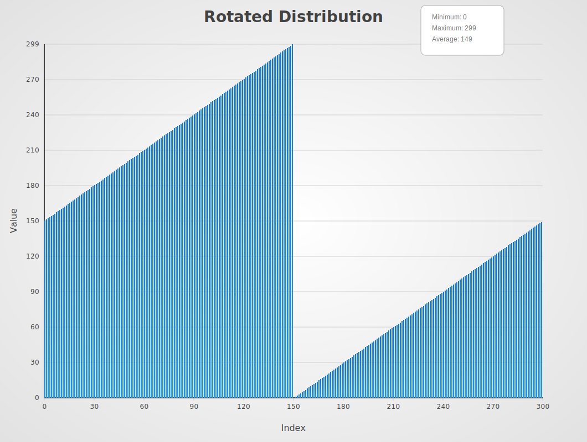

# Sort Comparison

A comprehensive collection of sorting algorithm implementations in Go for
educational purposes.

# ideas

- one svg bar chart for each algo
- one svg bar chart for each distribution
- svg generation might be simpler to incorporate into a local test setup
- a single gigantic echarts with distribution as series + on algo has to be
  selectable as well

# what benchmarks work

- StdSort up to 1B
- AdaptiveSort up to 100M
- AmericanFlagSort up to 100M
- BeadSort up to 10K - ohne Random
- BitonicSort up to 10M
- BlockSort up to 10M
- BubbleSort up to 100K
- BucketSort up to 100K
- BurstSort up to 100M
- CascadeSort up to 10M
- CocktailshakerSort up to 10K
- CombSort up to 10M
- CountingSort up to 100M

## Sorting Algorithms

### Comparison Based

| Name              | Best       | Average     | Worst       | Memory   | Stable | In-place | Method               | Notes                                           |
| ----------------- | ---------- | ----------- | ----------- | -------- | ------ | -------- | -------------------- | ----------------------------------------------- |
| **BubbleSort**    | O(n)       | O(n²)       | O(n²)       | O(1)     | Yes    | Yes      | Comparison           | Simple implementation, good for teaching        |
| **CocktailSort**  | O(n)       | O(n²)       | O(n²)       | O(1)     | Yes    | Yes      | Bidirectional bubble | Slightly better than bubble sort                |
| **CombSort**      | O(n log n) | O(n log n)  | O(n²)       | O(1)     | No     | Yes      | Gap sequence         | Improvement over bubble sort                    |
| **ExchangeSort**  | O(n²)      | O(n²)       | O(n²)       | O(1)     | No     | Yes      | Comparison           | Similar to bubble sort                          |
| **GnomeSort**     | O(n)       | O(n²)       | O(n²)       | O(1)     | Yes    | Yes      | Insertion variant    | Simple but inefficient                          |
| **HeapSort**      | O(n log n) | O(n log n)  | O(n log n)  | O(1)     | No     | Yes      | Selection heap       | Optimal complexity but cache-unfriendly         |
| **InsertionSort** | O(n)       | O(n²)       | O(n²)       | O(1)     | Yes    | Yes      | Insertion            | Excellent for small arrays                      |
| **IntroSort**     | O(n log n) | O(n log n)  | O(n log n)  | O(log n) | No     | Yes      | Hybrid quicksort     | Combines quicksort, heapsort and insertion sort |
| **MergeSort**     | O(n log n) | O(n log n)  | O(n log n)  | O(n)     | Yes    | No       | Divide & conquer     | Stable but requires extra space                 |
| **QuickSort**     | O(n log n) | O(n log n)  | O(n²)       | O(log n) | No     | Yes      | Partitioning         | Fast in practice, widely used                   |
| **SelectionSort** | O(n²)      | O(n²)       | O(n²)       | O(1)     | No     | Yes      | Selection            | Minimal memory writes                           |
| **ShellSort**     | O(n log n) | O(n log² n) | O(n log² n) | O(1)     | No     | Yes      | Gap insertion        | Good for medium-sized arrays                    |
| **TimSort**       | O(n)       | O(n log n)  | O(n log n)  | O(n)     | Yes    | No       | Hybrid merge         | Python's standard sort                          |
| **OddEvenSort**   | O(n)       | O(n²)       | O(n²)       | O(1)     | Yes    | Yes      | Parallel compare     | Good for parallel implementation                |

### Distribution Based

| Name                 | Best       | Average        | Worst      | Memory | Stable | In-place | Method         | Notes                             |
| -------------------- | ---------- | -------------- | ---------- | ------ | ------ | -------- | -------------- | --------------------------------- |
| **BlockSort**        | O(n log n) | O(n log n)     | O(n log n) | O(n)   | Yes    | No       | Block merging  | Cache-friendly merge sort variant |
| **BucketSort**       | O(n+k)     | O(n+k)         | O(n²)      | O(n+k) | Yes    | No       | Distribution   | Good for uniform distribution     |
| **CountingSort**     | O(n+k)     | O(n+k)         | O(n+k)     | O(k)   | Yes    | No       | Counting       | Excellent for small ranges        |
| **FlashSort**        | O(n)       | O(n)           | O(n²)      | O(n)   | No     | No       | Distribution   | Fast for uniform distribution     |
| **PigeonholeSort**   | O(n+r)     | O(n+r)         | O(n+r)     | O(r)   | Yes    | No       | Distribution   | r is the range of input           |
| **RadixSort**        | O(d(n+k))  | O(d(n+k))      | O(d(n+k))  | O(n+k) | Yes    | No       | Digit by digit | d is number of digits             |
| **SpreadSort**       | O(n)       | O(n log log n) | O(n log n) | O(n)   | No     | No       | Distribution   | Adaptive to input distribution    |
| **AmericanFlagSort** | O(n+k)     | O(n+k)         | O(n+k)     | O(1)   | Yes    | Yes      | MSD radix      | In-place radix sort variant       |

### Specialized

| Name               | Best       | Average    | Worst      | Memory | Stable | In-place | Method           | Notes                         |
| ------------------ | ---------- | ---------- | ---------- | ------ | ------ | -------- | ---------------- | ----------------------------- |
| **BurstSort**      | O(n log n) | O(n log n) | O(n log n) | O(n)   | Yes    | No       | Burst trie       | Originally for string sorting |
| **CycleSort**      | O(n²)      | O(n²)      | O(n²)      | O(1)   | No     | Yes      | Cycle detection  | Optimal memory writes         |
| **LibrarySort**    | O(n log n) | O(n log n) | O(n log n) | O(n)   | Yes    | No       | Gapped insertion | Also called Library sort      |
| **PatienceSort**   | O(n log n) | O(n log n) | O(n log n) | O(n)   | Yes    | No       | Card solitaire   | Based on patience card game   |
| **PostmanSort**    | O(n+r)     | O(n+r)     | O(n+r)     | O(n)   | Yes    | No       | Distribution     | r is the range of keys        |
| **SmoothSort**     | O(n)       | O(n log n) | O(n log n) | O(1)   | No     | Yes      | Leonardo heaps   | Variation of heapsort         |
| **StrandSort**     | O(n)       | O(n²)      | O(n²)      | O(n)   | Yes    | No       | Natural merging  | Good for nearly sorted data   |
| **TournamentSort** | O(n log n) | O(n log n) | O(n log n) | O(n)   | No     | No       | Tree-based       | Selection tree variant        |
| **TreeSort**       | O(n log n) | O(n log n) | O(n²)      | O(n)   | Yes    | No       | BST-based        | Binary search tree sort       |

### Modern Hybrids

| Name               | Best       | Average    | Worst      | Memory   | Stable | In-place | Method                        | Notes                                            |
| ------------------ | ---------- | ---------- | ---------- | -------- | ------ | -------- | ----------------------------- | ------------------------------------------------ |
| **GeneralSort**    | O(n)       | O(n log n) | O(n log n) | O(n)     | Yes    | No       | Adaptive hybrid               | Timsort-inspired adaptive sort                   |
| **HybridSort**     | O(n)       | O(n log n) | O(n log n) | O(n)     | Yes    | No       | Multi-strategy                | Combines counting/radix/insertion                |
| **UltimateSort**   | O(n log n) | O(n log n) | O(n log n) | O(log n) | No     | Yes      | Parallel hybrid               | Dual-pivot quick + parallel merge                |
| **CascadeSort**    | O(n)       | O(n log n) | O(n log n) | O(n)     | Yes    | No       | Cascading merge sort          | Efficient for partially sorted data              |
| **JupiterSort**    | O(n log n) | O(n log n) | O(n log n) | O(log n) | No     | Yes      | Parallel dual-pivot quicksort | Uses orbital partitioning and parallelism        |
| **WeaveMergeSort** | O(n log n) | O(n log n) | O(n log n) | O(n)     | Yes    | No       | Cache-optimized merge sort    | Improves cache locality with unrolled merge loop |
| **GallopingSort**  | O(n)       | O(n log n) | O(n log n) | O(1)     | Yes    | Yes      | Insertion sort with galloping | Excels on nearly sorted data                     |

## Benchmarking

```go
go test -bench=.
```

Compare specific algorithms:

```go
go test -bench "//Quick/10"
```

Benchmarks test each algorithm against different:

- Input sizes (10 to 1B elements)
- Data distributions (random, sorted, reversed, etc.)
- Operation types (in-place vs return new array)

## Data Distributions

| Name           | Description                               | Image                                                     |
| -------------- | ----------------------------------------- | --------------------------------------------------------- |
| AllZero        | Array of all zeros                        |                |
| BackToFront    | Single element pushed from back to front  |        |
| FrontToBack    | Single element pushed from front to back  |        |
| MiddleToBack   | Single element pushed from middle to back |      |
| Mountain       | Elements form a mountain shape            |              |
| NearlyReversed | Almost completely reversed sequence       |  |
| NearlySorted   | Almost completely sorted sequence         |      |
| Plateau        | Elements form a plateau shape             |                |
| PushMiddle     | Elements pushed towards the middle        |          |
| Random         | Completely random distribution            |                  |
| RandomMaxN     | Random integers up to max N               |          |
| RandomMod8     | Random values modulo 8                    |          |
| RandomMod16    | Random values modulo 16                   |        |
| RepeatedMod8   | Repeated sequence modulo 8                |      |
| RepeatedMod16  | Repeated sequence modulo 16               |    |
| Reversed       | Completely reversed sequence              |              |
| Rotated        | Sorted sequence rotated by N positions    |                |
| SmallHills     | Elements form small hill patterns         |          |
| Sorted         | Completely sorted sequence                |                  |
| Valley         | Elements form a valley shape              |                  |

Usage License This project is licensed under the MIT License.
