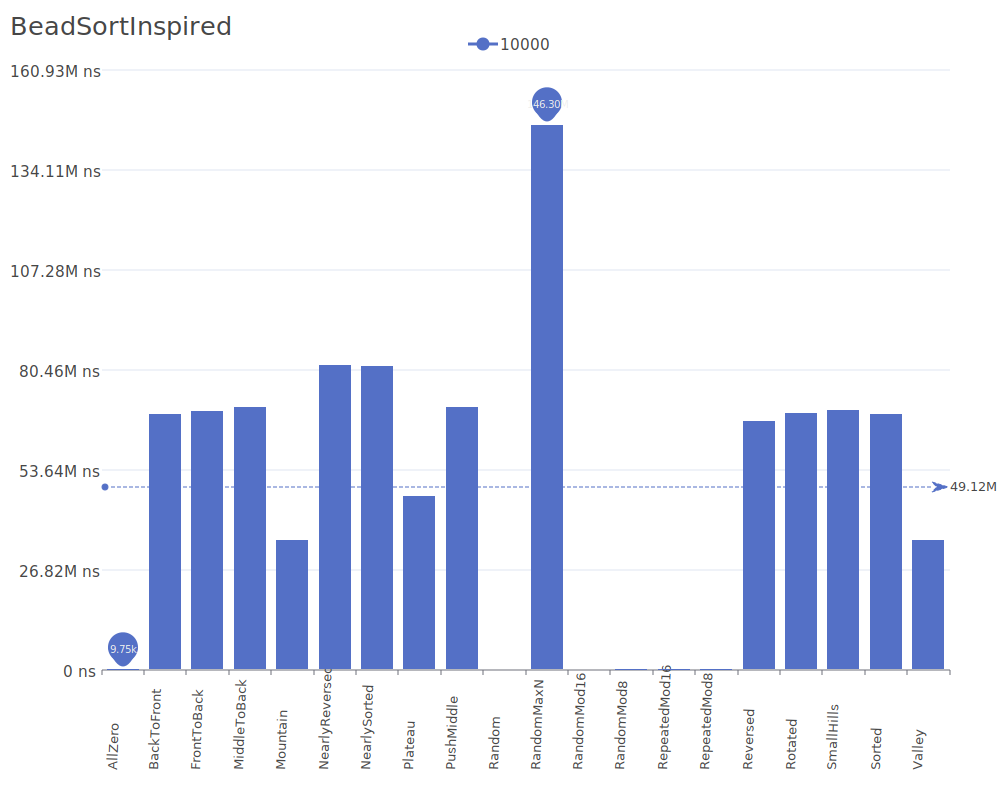

# Bead Sort Inspired

Bead Sort Inspired is an implementation based on the visual/physical metaphor of Bead Sort, but with Bitset optimizations for improved performance. For a basic understanding of the original algorithm, see the [Bead Sort Wikipedia article](https://en.wikipedia.org/wiki/Bead_sort).

## Benchmark Results

| Number of Elements | Benchmark Visualization                                                                        |
| ------------------ | ---------------------------------------------------------------------------------------------- |
| 10                 |     |
| 100                |    |
| 1,000              |   |
| 10,000             |  |