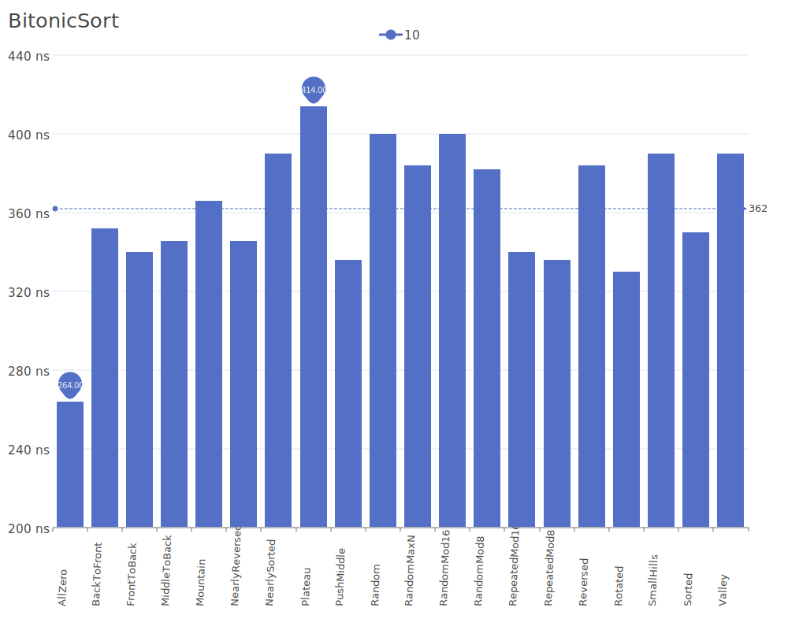
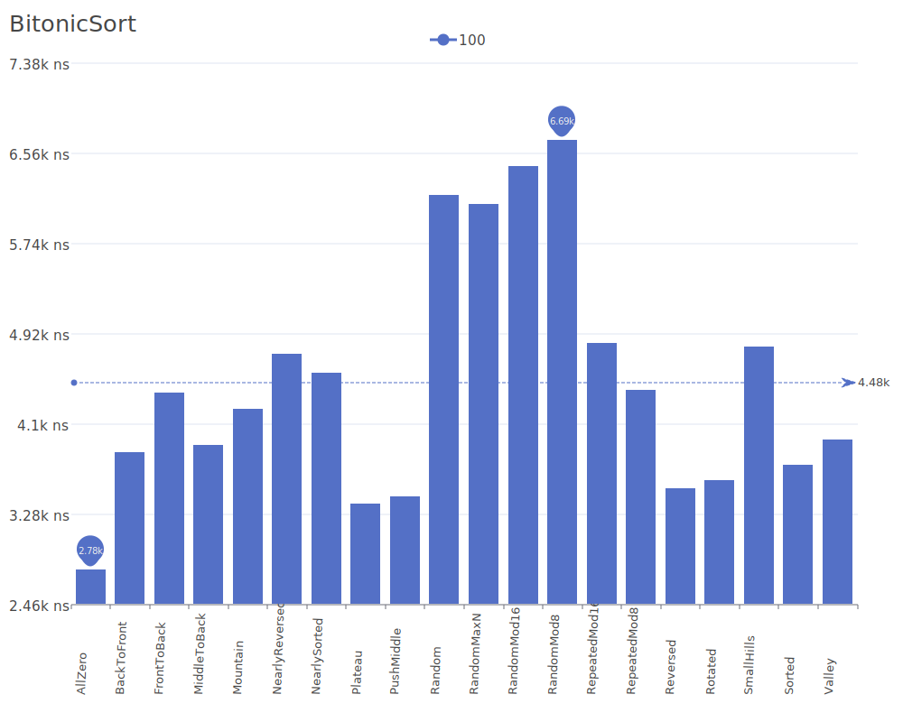
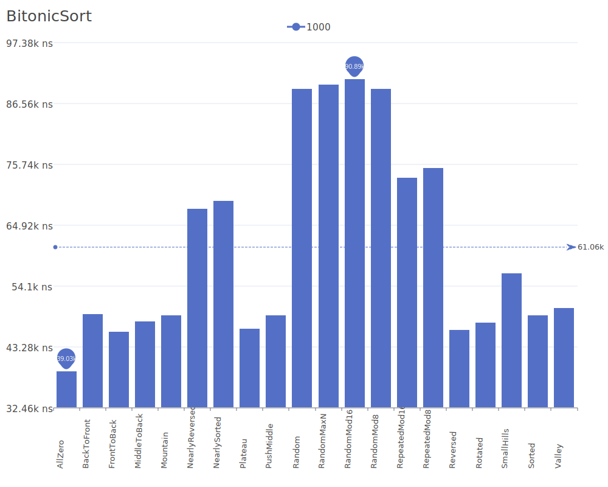
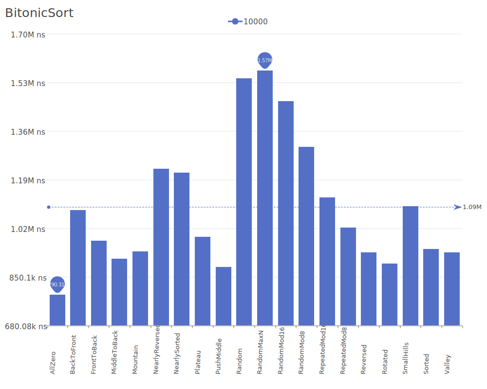
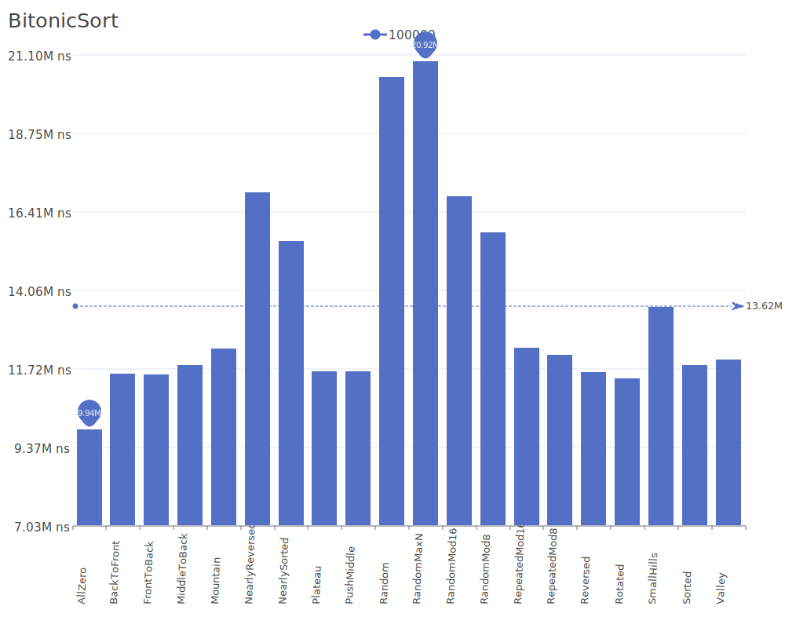
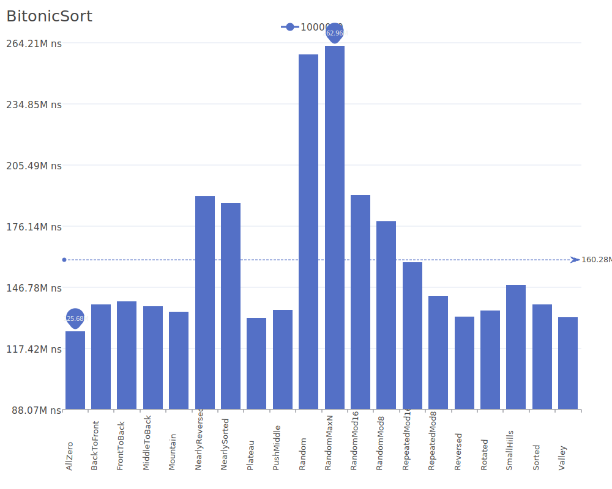

# Bitonic Sort

Bitonic Sort is a parallel algorithm for sorting that is particularly suited for hardware implementation. It works by repeatedly merging bitonic sequences until the entire sequence is sorted. A bitonic sequence is one that first monotonically increases, then monotonically decreases. For more details on the algorithm and its theory, see the [Bitonic Sort Wikipedia article](https://en.wikipedia.org/wiki/Bitonic_sorter).

## Benchmark Results

| Number of Elements | Benchmark Visualization                                                                     |
| ------------------ | ------------------------------------------------------------------------------------------- |
| 10                 |       |
| 100                |      |
| 1,000              |     |
| 10,000             |    |
| 100,000            |   |
| 1,000,000          |  |