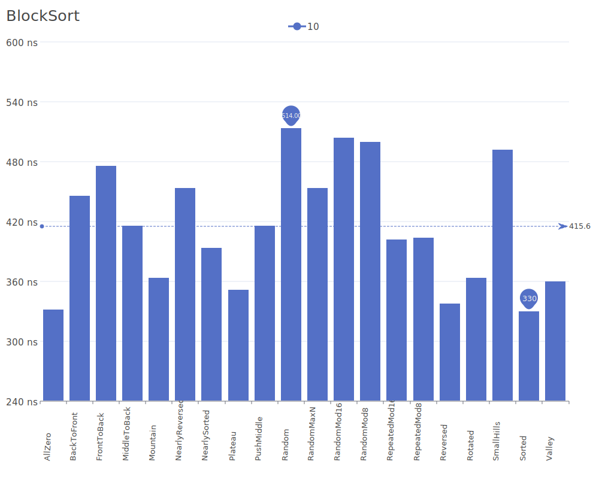
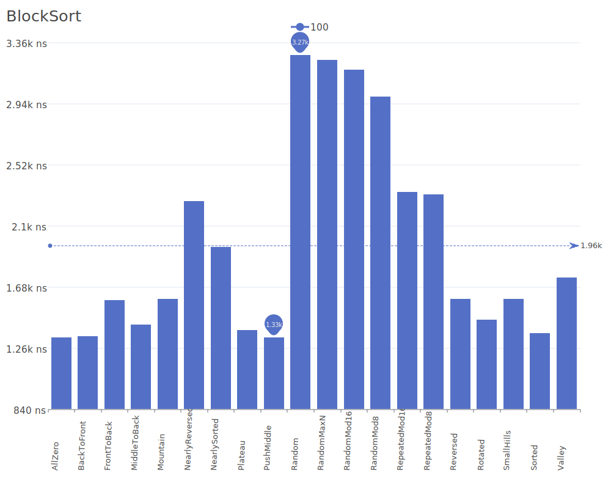
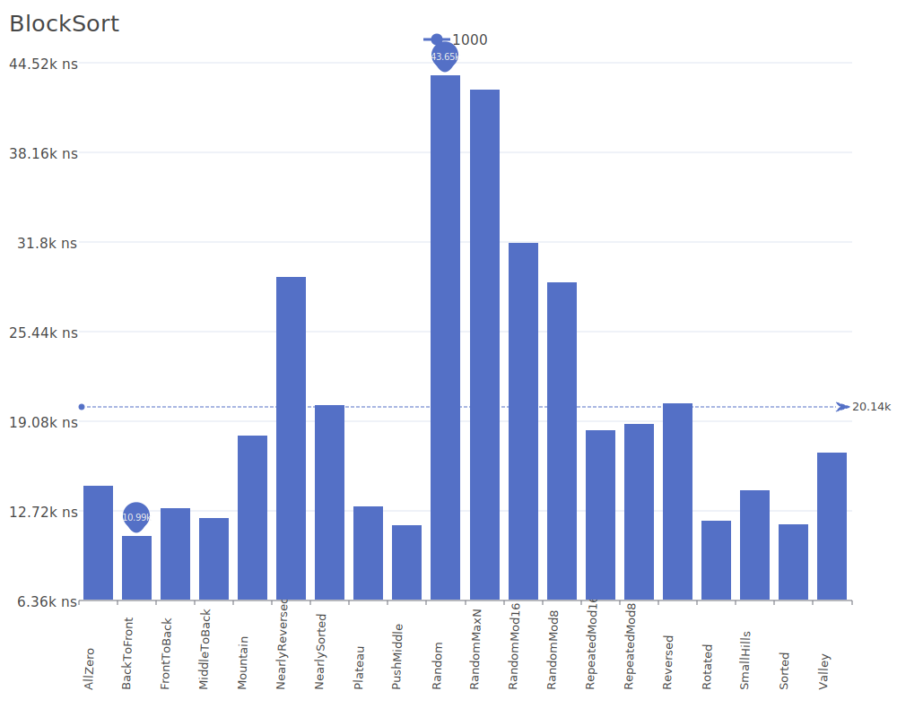
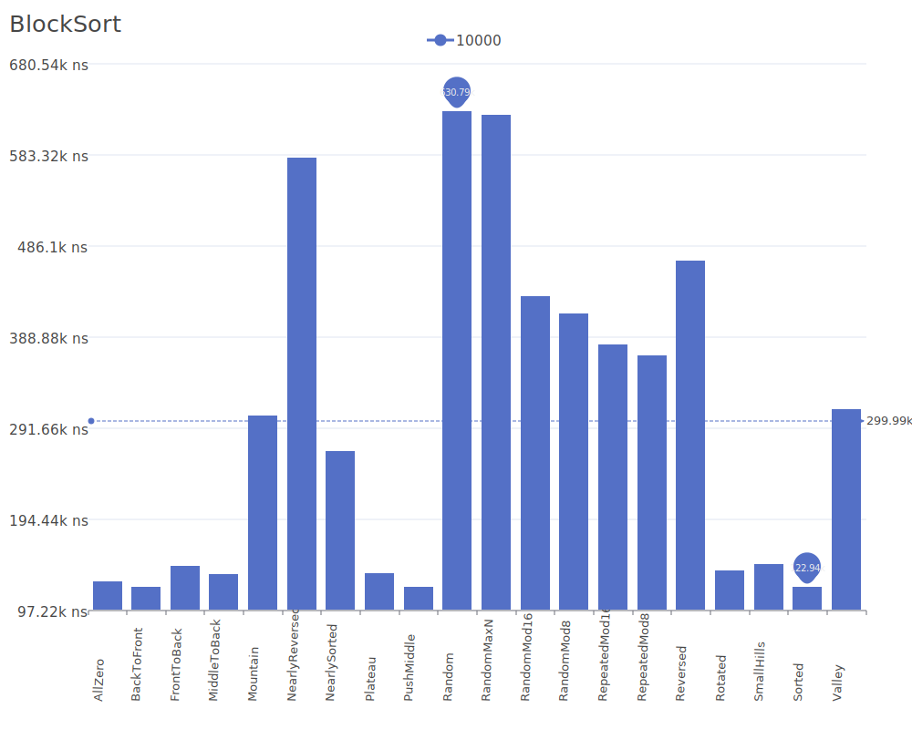
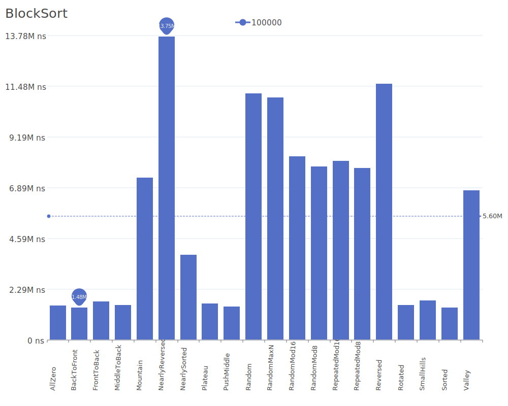
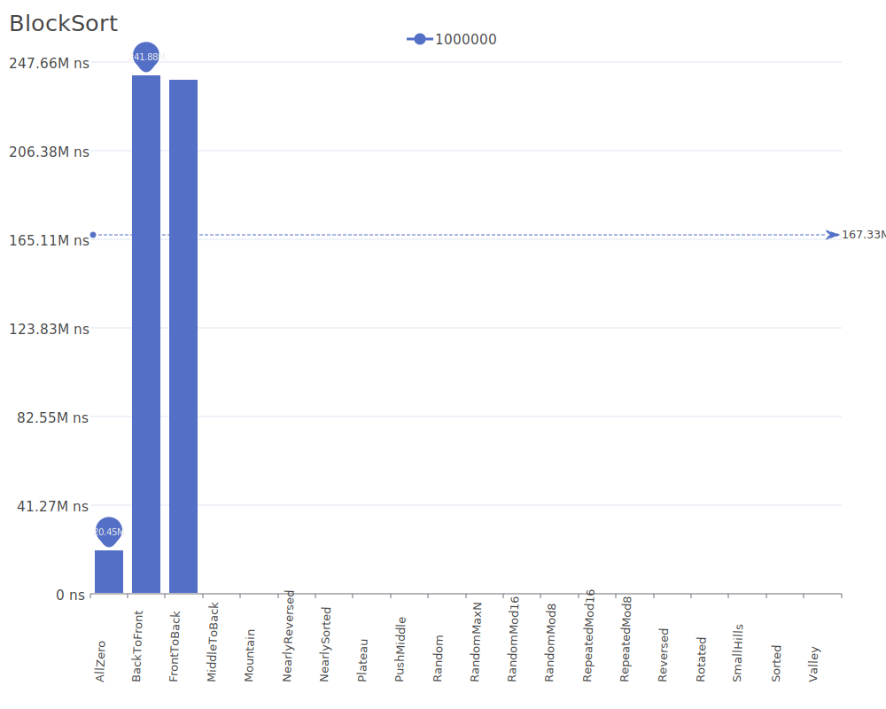

# Block Sort

Block Sort is a sorting algorithm that combines elements of insertion sort with block operations for improved efficiency. It works by dividing the input into blocks, sorting them individually, and then merging them in a way that minimizes memory operations. For more details on the algorithm and its theory, see the [Block Sort description](https://en.wikipedia.org/wiki/Block_sort).

## Benchmark Results

| Number of Elements | Benchmark Visualization                                                                   |
| ------------------ | ----------------------------------------------------------------------------------------- |
| 10                 |       |
| 100                |      |
| 1,000              |     |
| 10,000             |    |
| 100,000            |   |
| 1,000,000          |  |