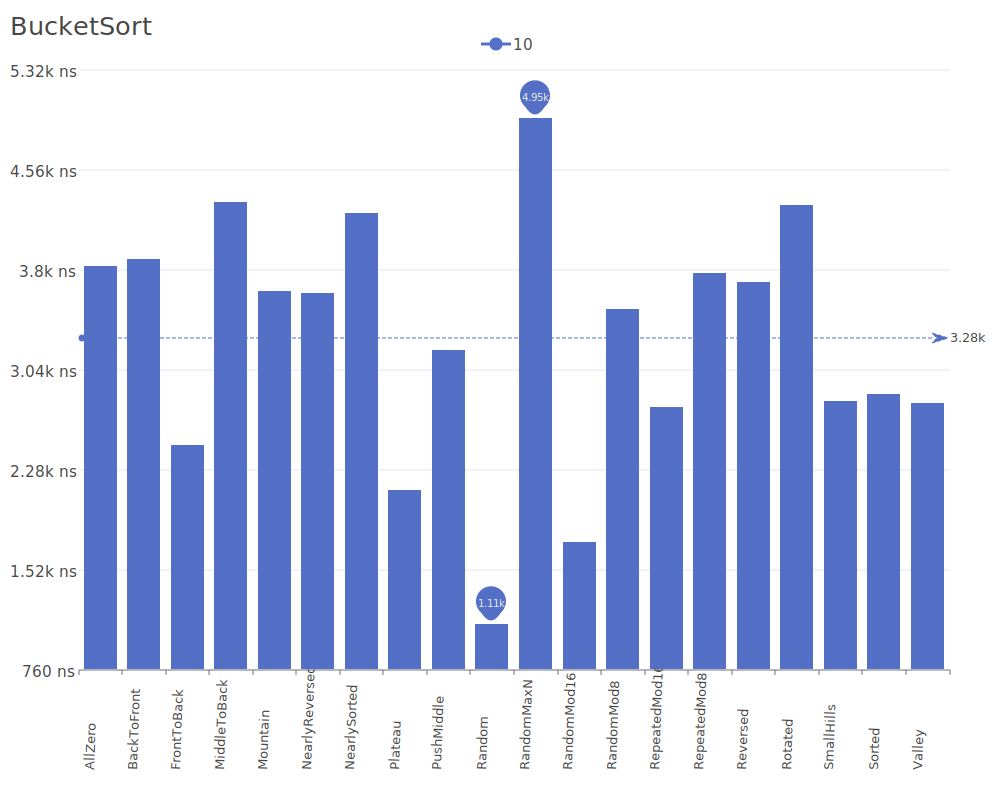
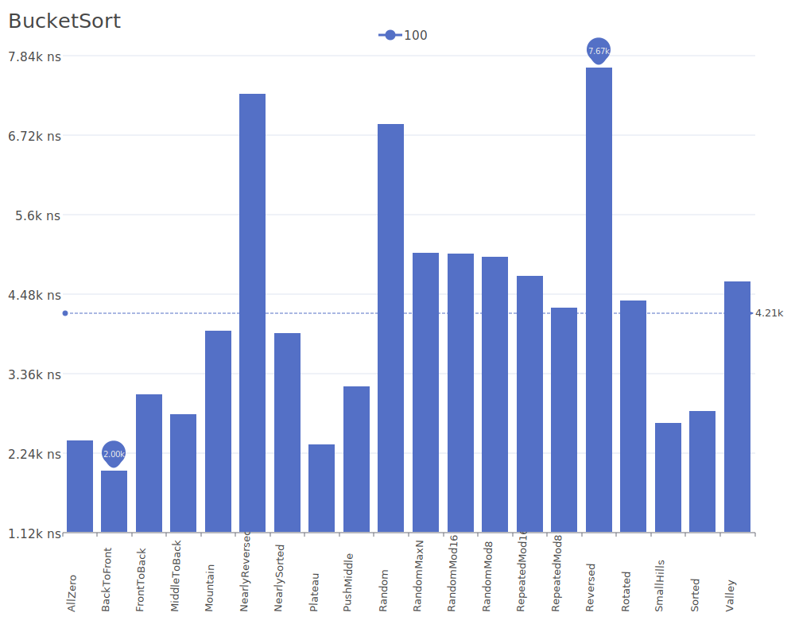
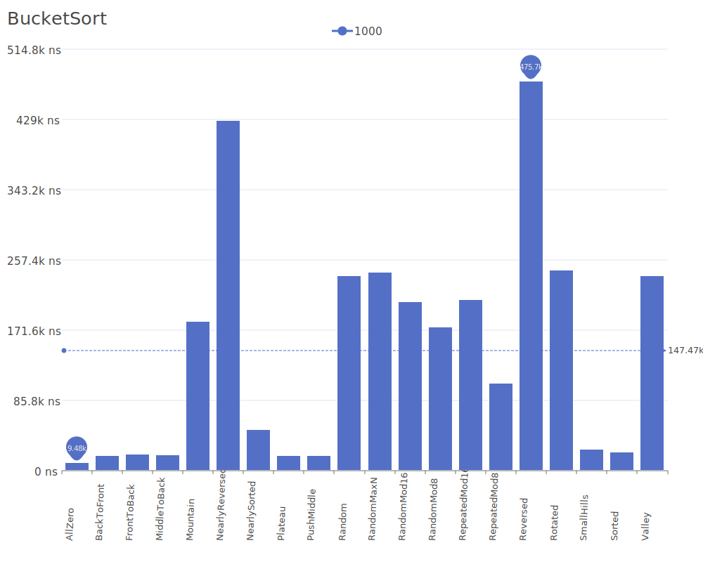
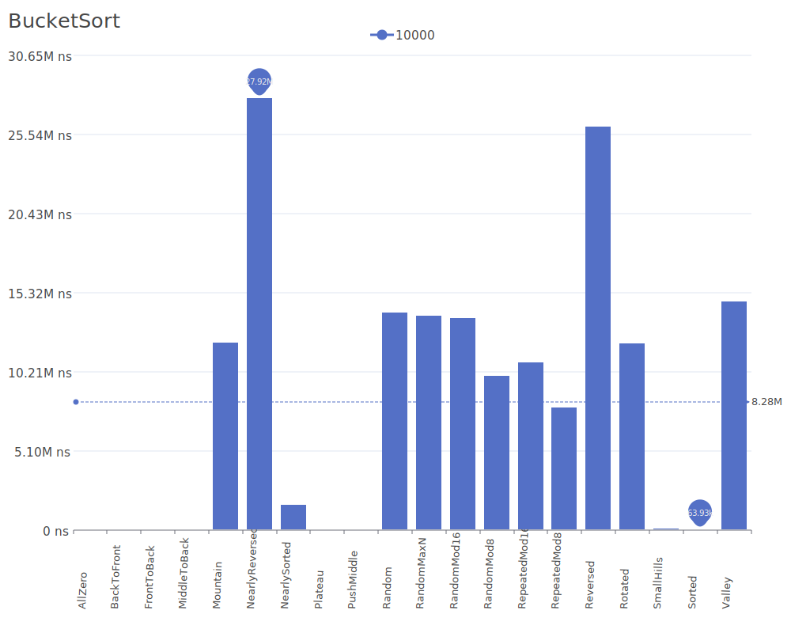

# Bucket Sort

Bucket Sort is a distribution-based sorting algorithm that works by distributing elements into a number of buckets, then sorting these buckets individually. Each bucket holds a range of values, and the final sorted array is produced by concatenating all buckets in order. For more details on the algorithm and its theory, see the [Bucket Sort Wikipedia article](https://en.wikipedia.org/wiki/Bucket_sort).

## Benchmark Results

| Number of Elements | Benchmark Visualization                                                                  |
| ------------------ | ---------------------------------------------------------------------------------------- |
| 10                 |     |
| 100                |    |
| 1,000              |   |
| 10,000             |  |

Note: While Bucket Sort can achieve O(n+k) complexity in the best and average cases, its worst-case performance of O(n²) and memory requirements limit its practical use to smaller datasets.