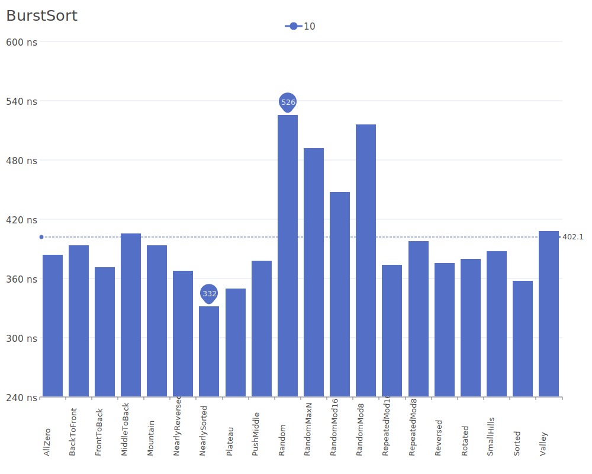
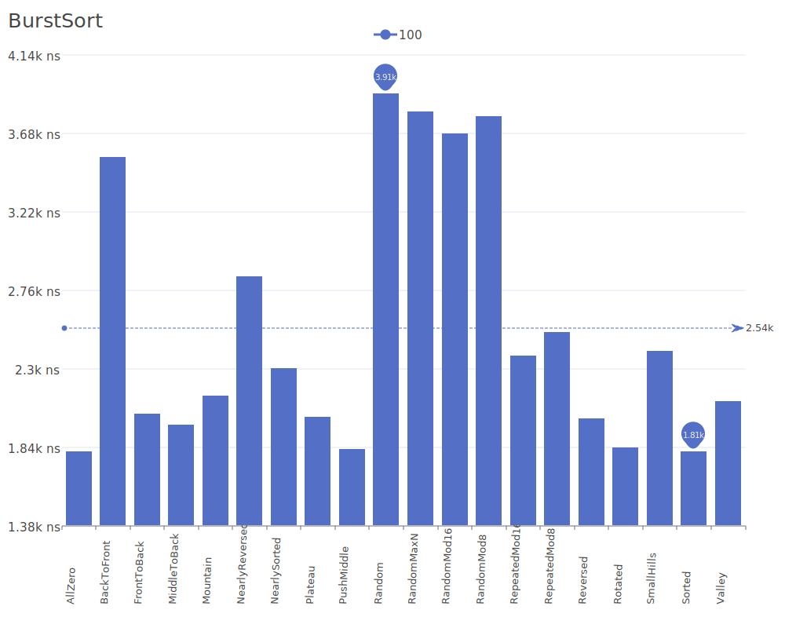
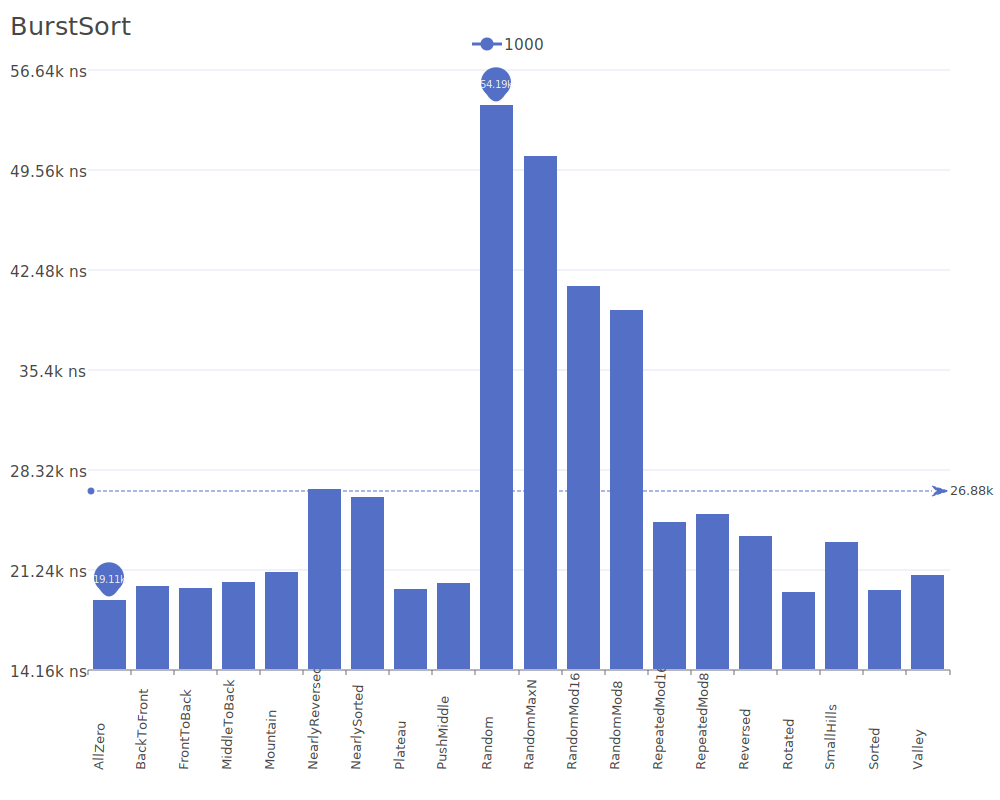
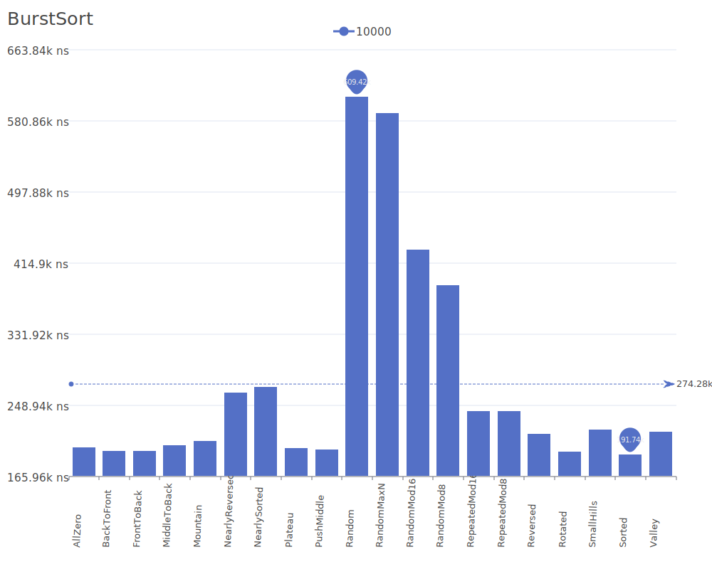
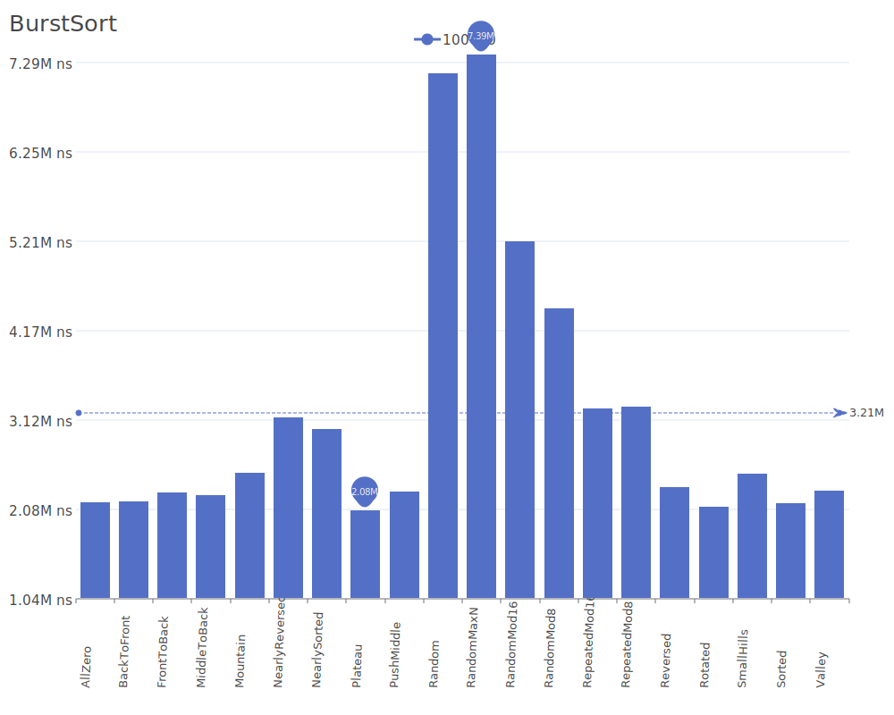
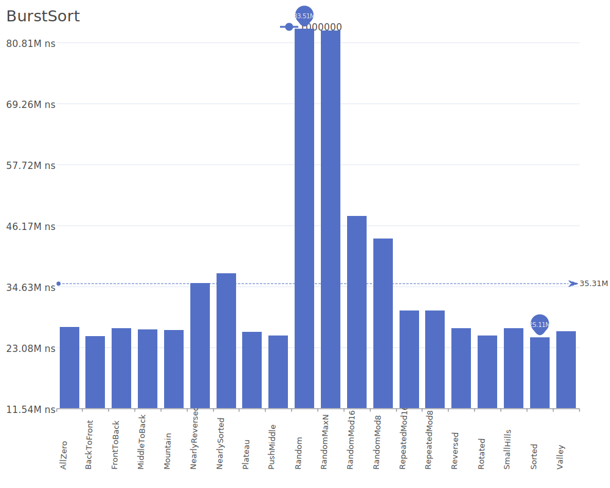
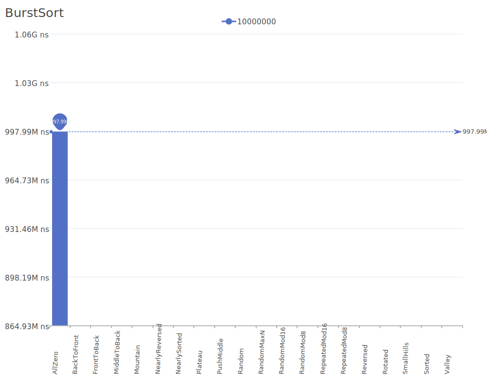

# BurstSort

BurstSort is a high-performance string sorting algorithm that intelligently partitions data into buckets ("bursts") to achieve faster sorting results on large datasets. For more details on the algorithm and its theory, see the [BurstSort Wikipedia article](https://en.wikipedia.org/wiki/Burstsort) or, if unavailable, refer to the [Sorting algorithm](https://en.wikipedia.org/wiki/Sorting_algorithm) page.

## Benchmark Results

| Number of Elements | Benchmark Visualization                                                                      |
| ------------------ | -------------------------------------------------------------------------------------------- |
| 10                 |          |
| 100                |         |
| 1,000              |        |
| 10,000             |       |
| 100,000            |      |
| 1,000,000          |     |
| 10,000,000         |    |
| 100,000,000        |   |
| 1,000,000,000      |  |