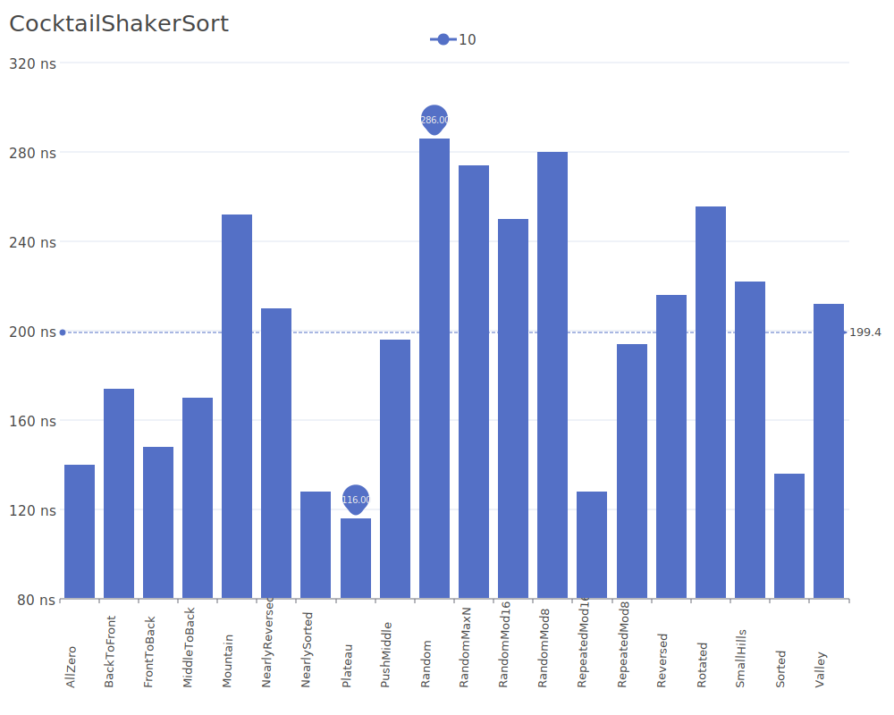
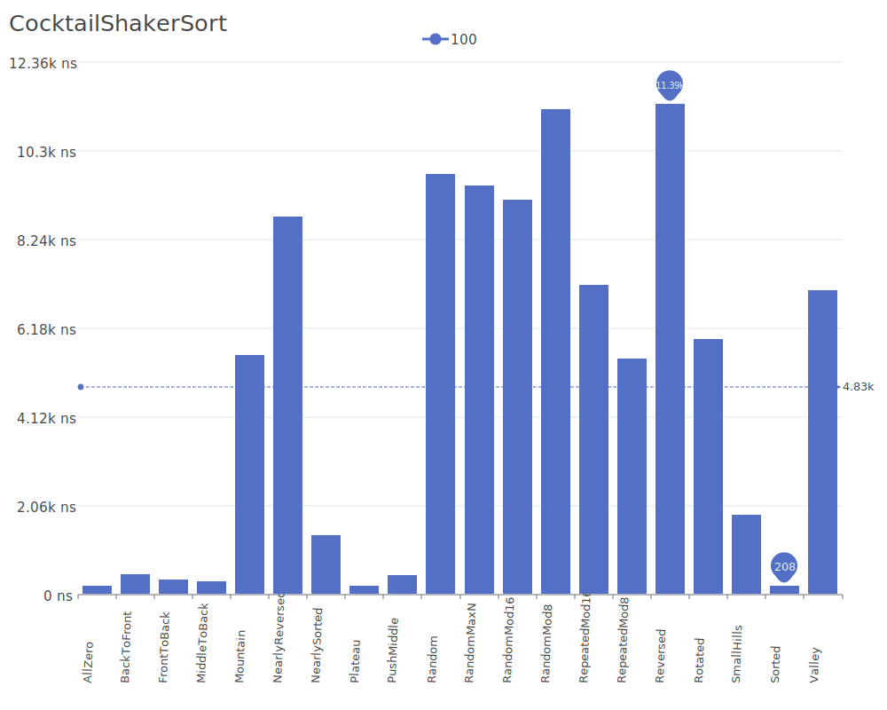
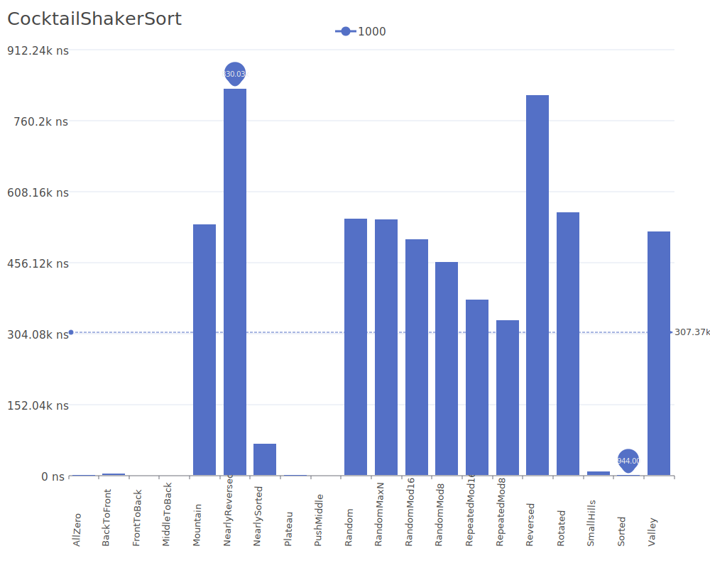
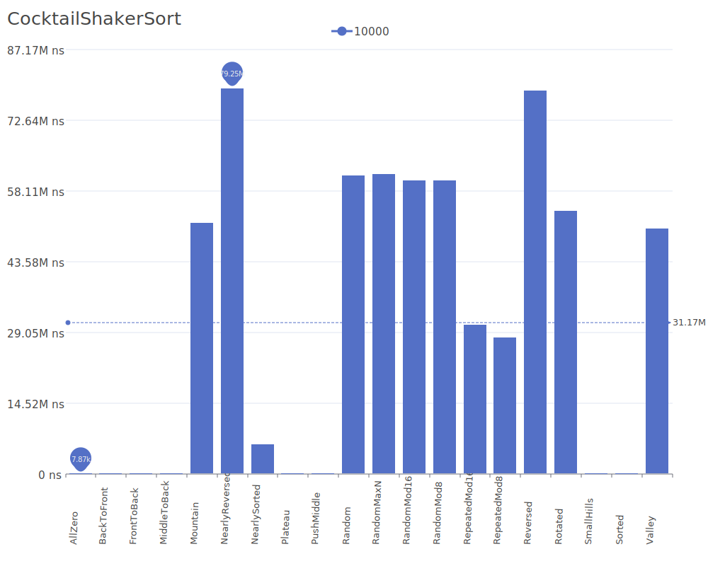

# Cocktail Shaker Sort

Cocktail Shaker Sort, also known as Bidirectional Bubble Sort, is a variation of Bubble Sort that sorts in both directions on each pass through the list. While moving forward, it moves the largest element to its position, and while moving backward, it moves the smallest element to its position. For more details on the algorithm and its theory, see the [Cocktail Shaker Sort Wikipedia article](https://en.wikipedia.org/wiki/Cocktail_shaker_sort).

## Benchmark Results

| Number of Elements | Benchmark Visualization                                                                          |
| ------------------ | ------------------------------------------------------------------------------------------------ |
| 10                 |     |
| 100                |    |
| 1,000              |   |
| 10,000             |  |

Note: Like Bubble Sort, Cocktail Shaker Sort has O(n²) complexity in average and worst cases, making it unsuitable for large datasets. However, it can perform slightly better than Bubble Sort on some types of data.