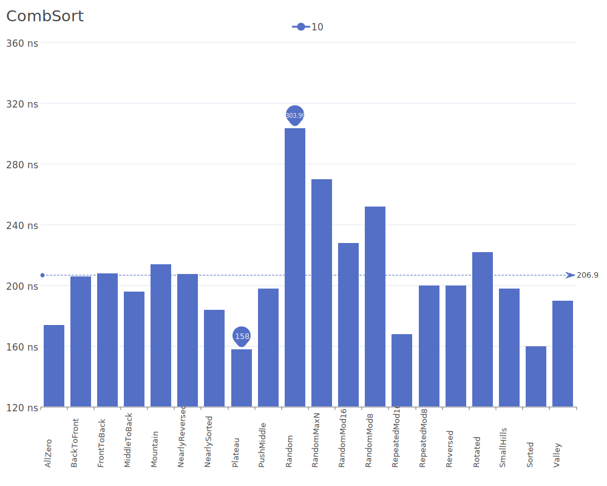
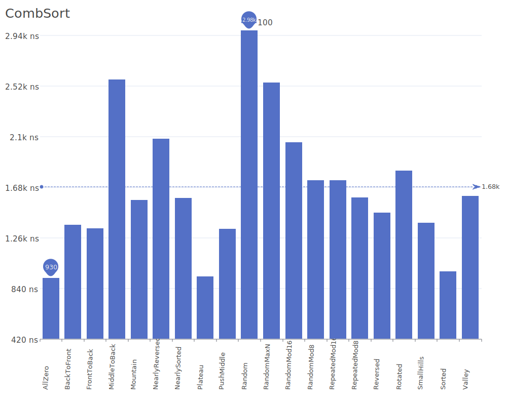
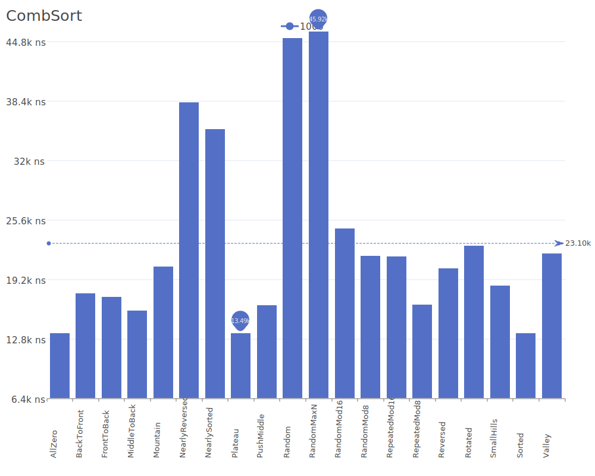
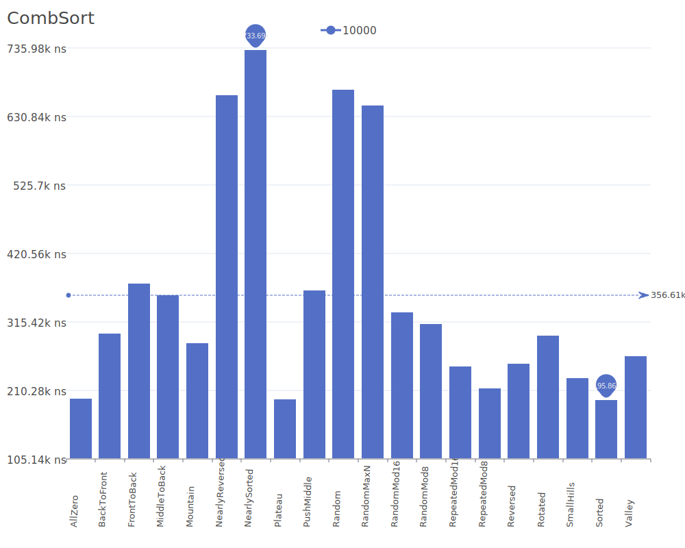
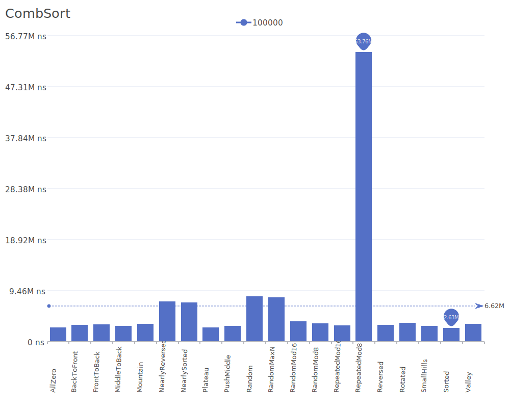
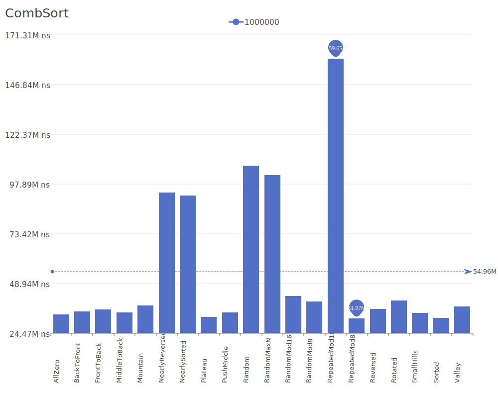

# CombSort

CombSort is an improvement over Bubble Sort that eliminates small values near the end of the list by using gap-based comparisons. For more details on the algorithm and its theory, see the [Comb Sort Wikipedia article](https://en.wikipedia.org/wiki/Comb_sort).

## Benchmark Results

| Number of Elements | Benchmark Visualization                                                                     |
| ------------------ | ------------------------------------------------------------------------------------------- |
| 10                 |          |
| 100                |         |
| 1,000              |        |
| 10,000             |       |
| 100,000            |      |
| 1,000,000          |     |
| 10,000,000         |    |
| 100,000,000        |   |
| 1,000,000,000      |  |