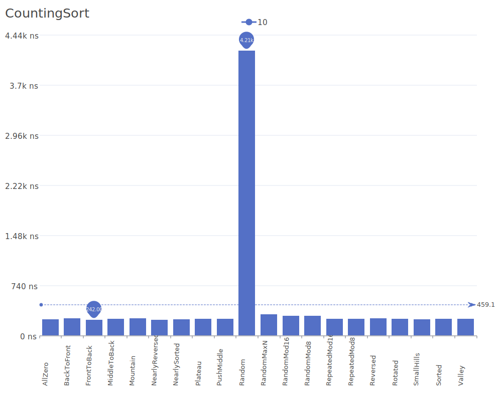
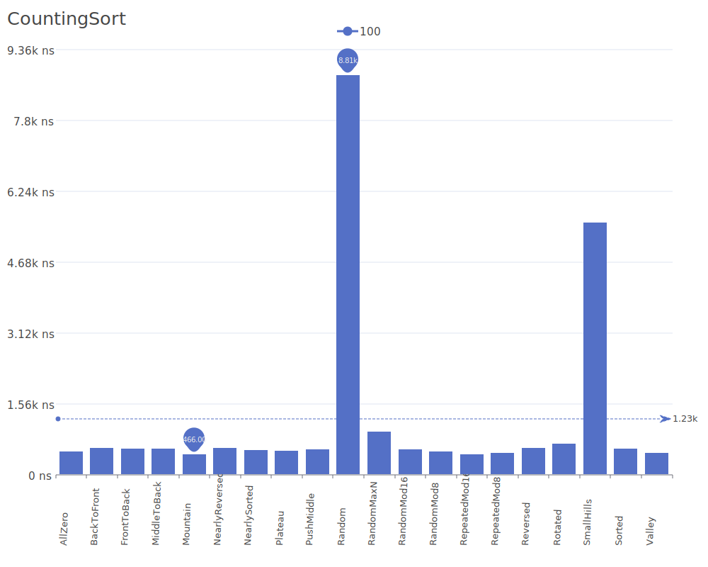
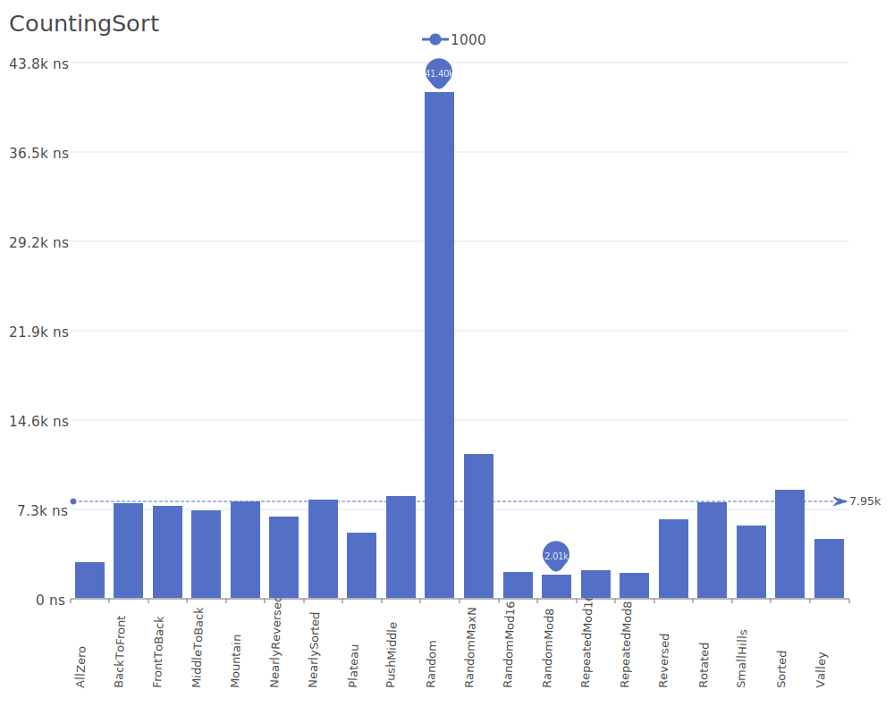
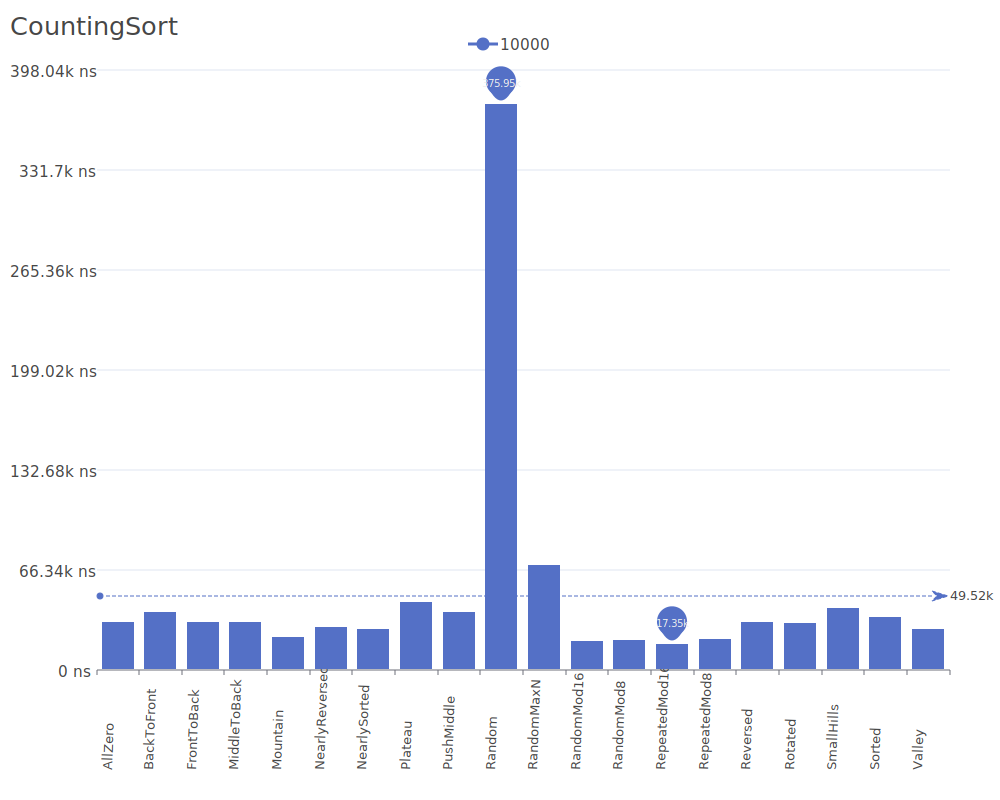
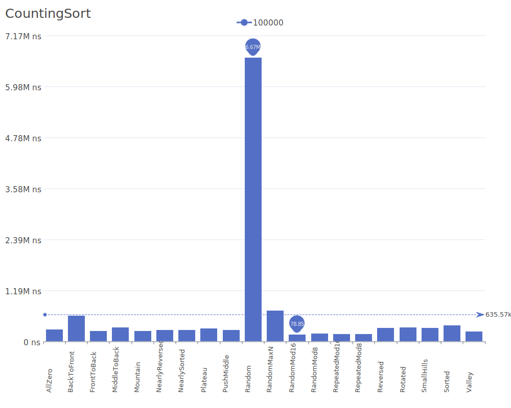
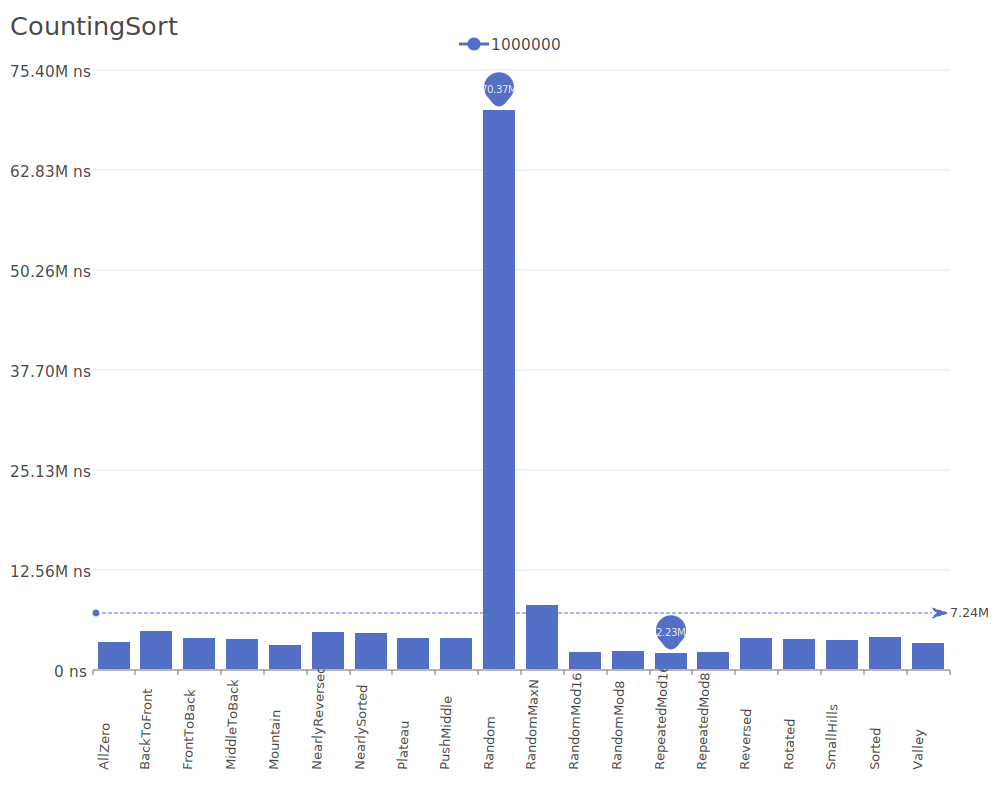
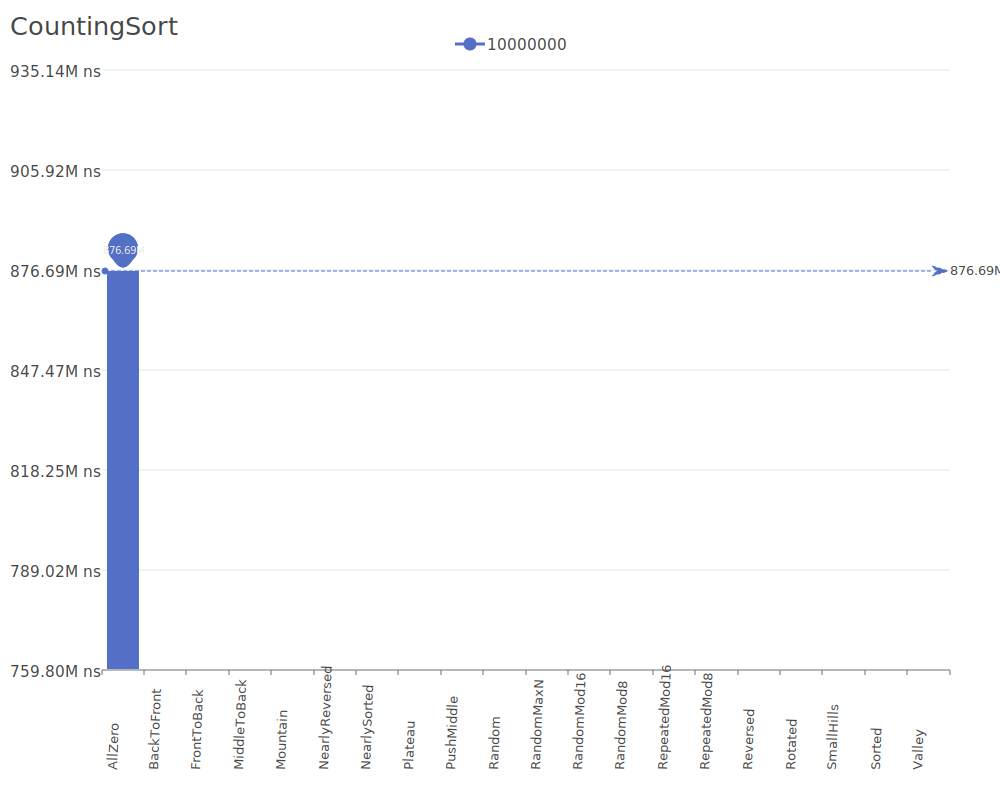

# CountingSort

CountingSort is a non-comparison based sorting algorithm that sorts elements by counting the number of occurrences of each unique value. For more details on the algorithm and its theory, see the [Counting Sort Wikipedia article](https://en.wikipedia.org/wiki/Counting_sort).

## Benchmark Results

| Number of Elements | Benchmark Visualization                                                                         |
| ------------------ | ----------------------------------------------------------------------------------------------- |
| 10                 |          |
| 100                |         |
| 1,000              |        |
| 10,000             |       |
| 100,000            |      |
| 1,000,000          |     |
| 10,000,000         |    |
| 100,000,000        |   |
| 1,000,000,000      |  |