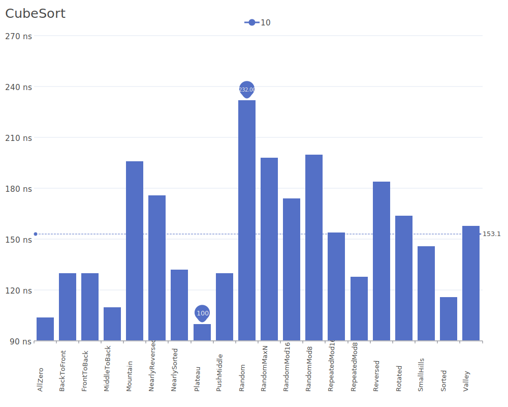
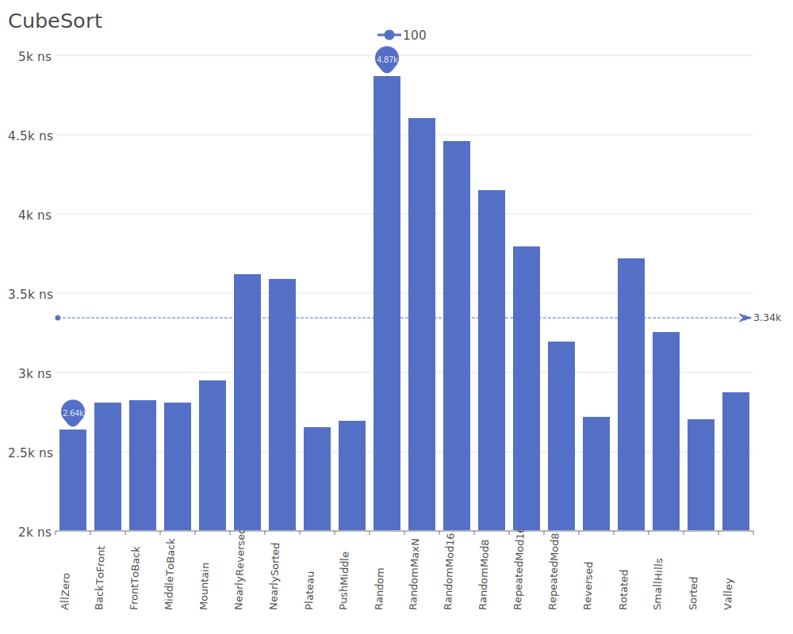
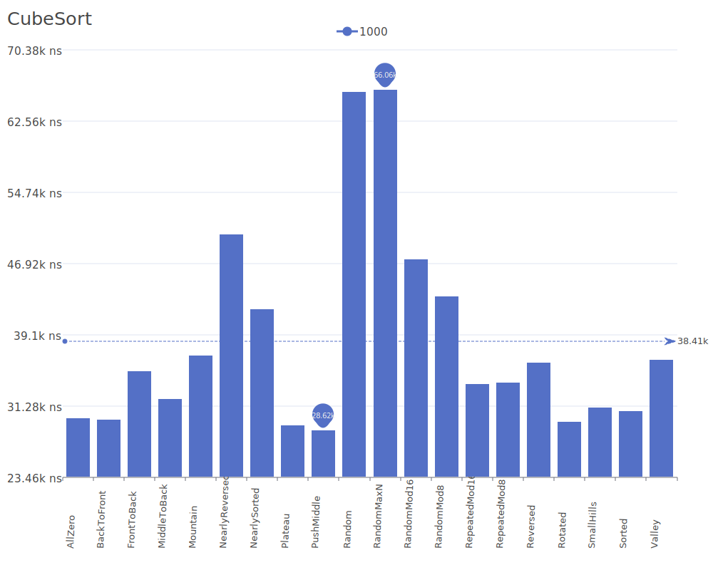
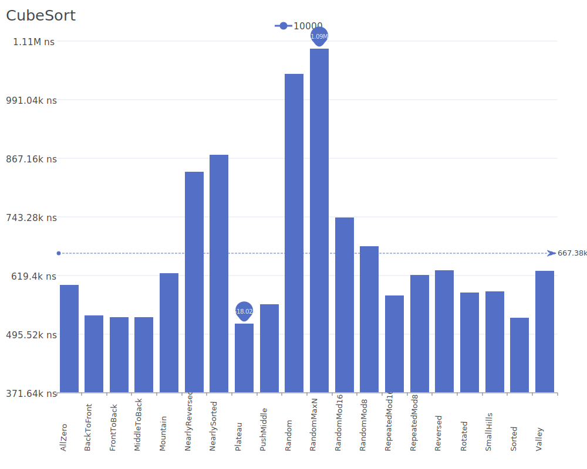
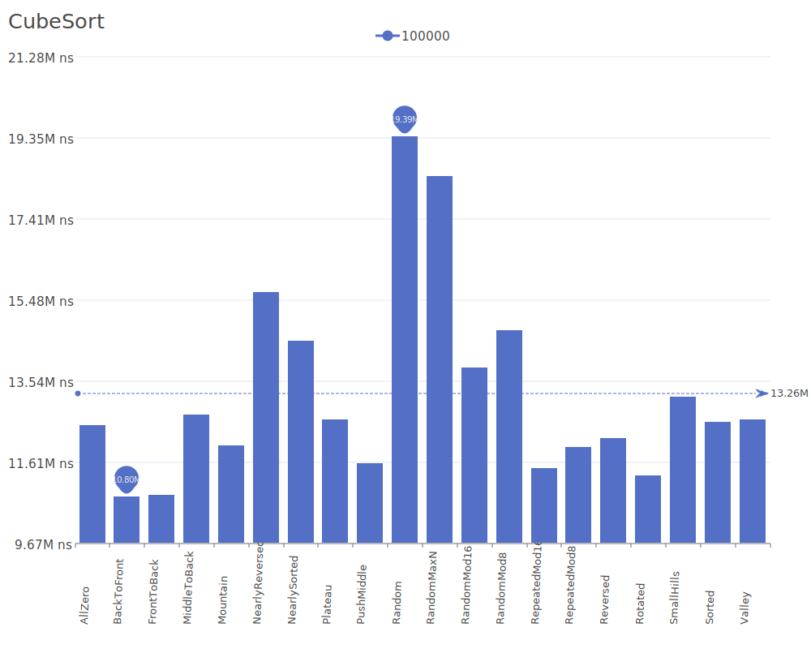
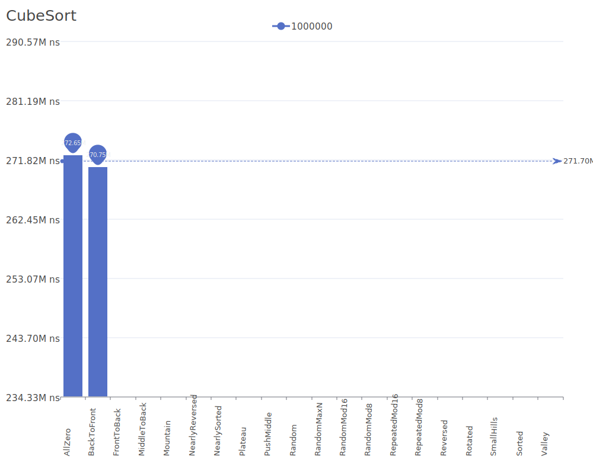

# Cube Sort

Cube Sort is a parallel sorting algorithm that works by repeatedly passing through a sequence of elements arranged in a multi-dimensional cube structure. It achieves its efficiency by exploiting the spatial relationships between elements in this cube structure. For more details on the algorithm and its theory, see the [Cube Sort research paper](https://doi.org/10.1145/142675.142692).

## Benchmark Results

| Number of Elements | Benchmark Visualization                                                                  |
| ------------------ | ---------------------------------------------------------------------------------------- |
| 10                 |       |
| 100                |      |
| 1,000              |     |
| 10,000             |    |
| 100,000            |   |
| 1,000,000          |  |

Note: Cube Sort achieves O(n) best case complexity and O(n log n) average and worst case complexity, but requires O(n) additional memory space.