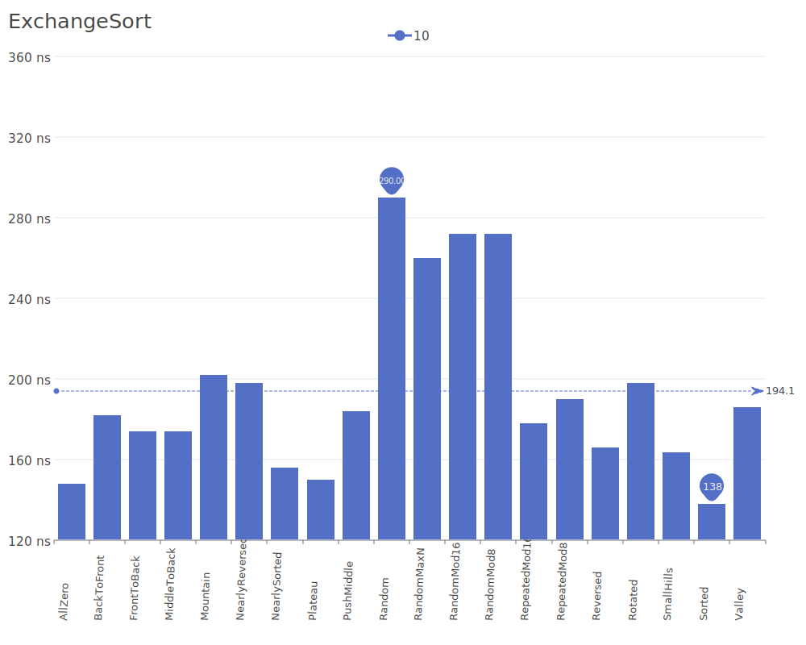
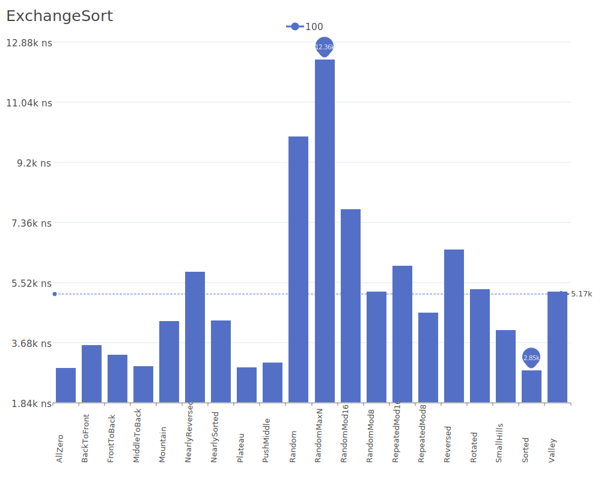
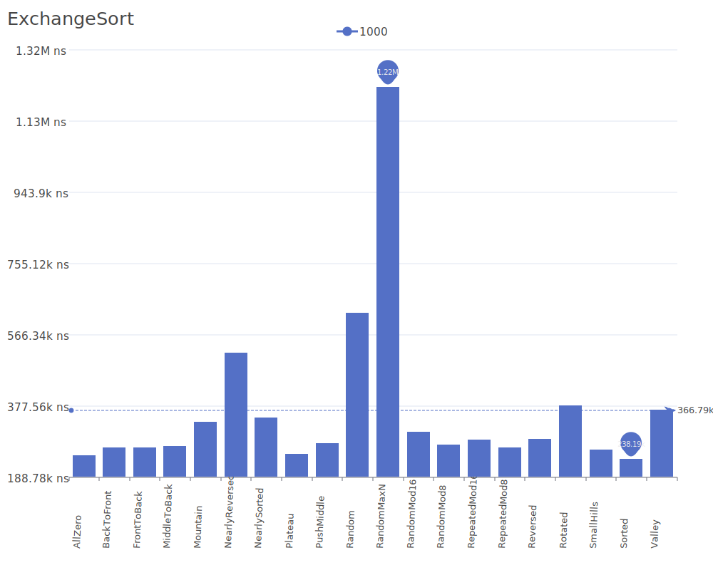
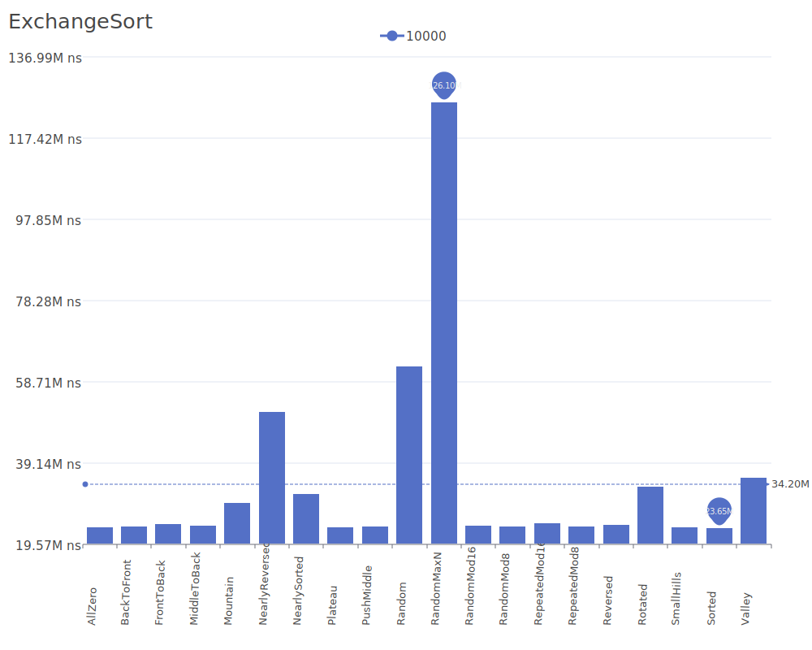

# Exchange Sort

Exchange Sort is a simple comparison-based sorting algorithm that works by comparing each element with every other element and swapping them if they are in the wrong order. While similar to Bubble Sort, it differs in its traversal pattern, comparing each element with all subsequent elements. For more details on the algorithm and its theory, see the [Exchange Sort description](https://www.geeksforgeeks.org/exchange-sort/).

## Benchmark Results

| Number of Elements | Benchmark Visualization                                                                    |
| ------------------ | ------------------------------------------------------------------------------------------ |
| 10                 |     |
| 100                |    |
| 1,000              |   |
| 10,000             |  |

Note: Exchange Sort has O(n²) time complexity in all cases, making it inefficient for large datasets. Its main advantage is its simplicity and minimal space requirements.