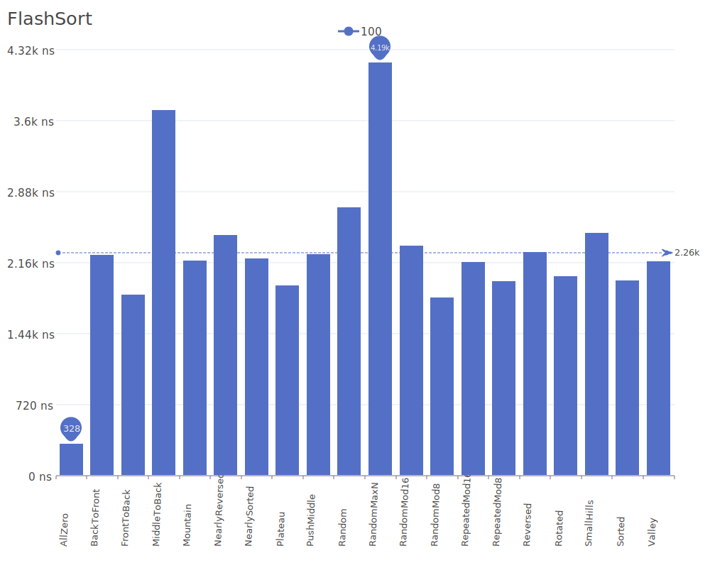

# Flash Sort

Flash Sort is a distribution sorting algorithm that uses a permutation to produce a sorted sequence. It is particularly efficient when dealing with uniformly distributed data. For more details on the algorithm and its theory, see the [Flash Sort paper](https://dl.acm.org/doi/10.1145/178243.178259).

## Benchmark Results

| Number of Elements | Benchmark Visualization                                                                     |
| ------------------ | ------------------------------------------------------------------------------------------- |
| 10                 |         |
| 100                |        |
| 1,000              |       |
| 10,000             |      |
| 100,000            |     |
| 1,000,000          |    |
| 10,000,000         |   |
| 100,000,000        |  |

Note: Flash Sort achieves O(n) complexity in the best and average cases but can degrade to O(n²) in the worst case. It requires O(n) additional memory.