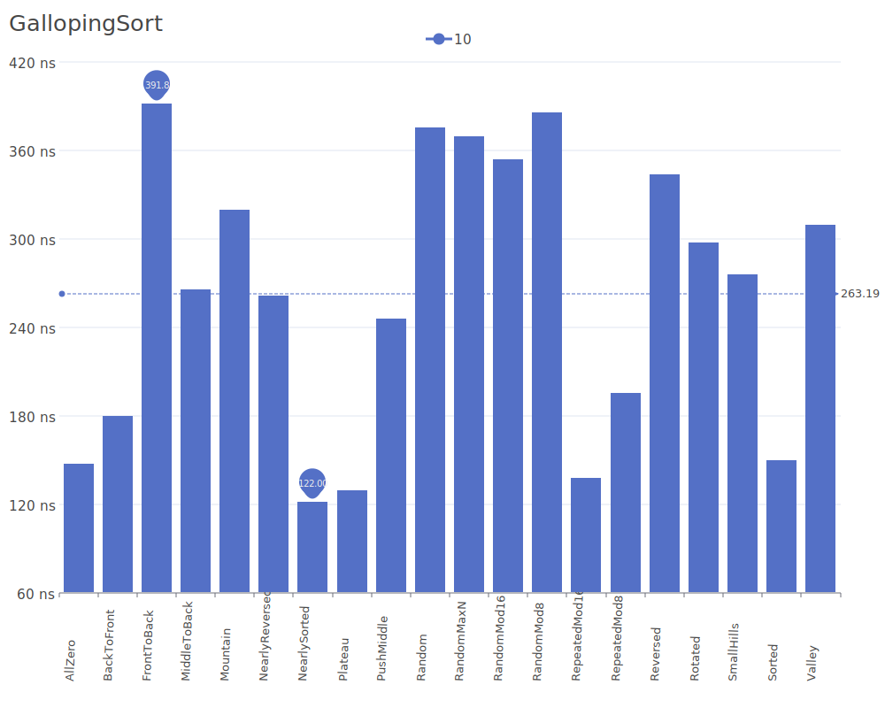
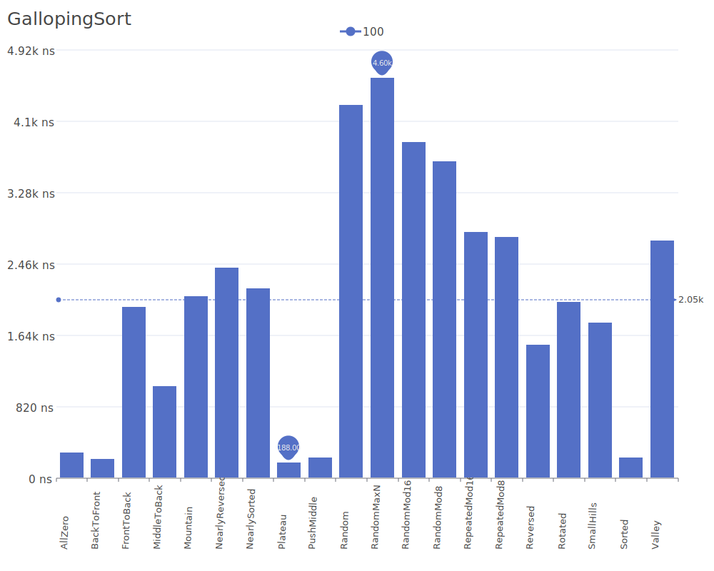
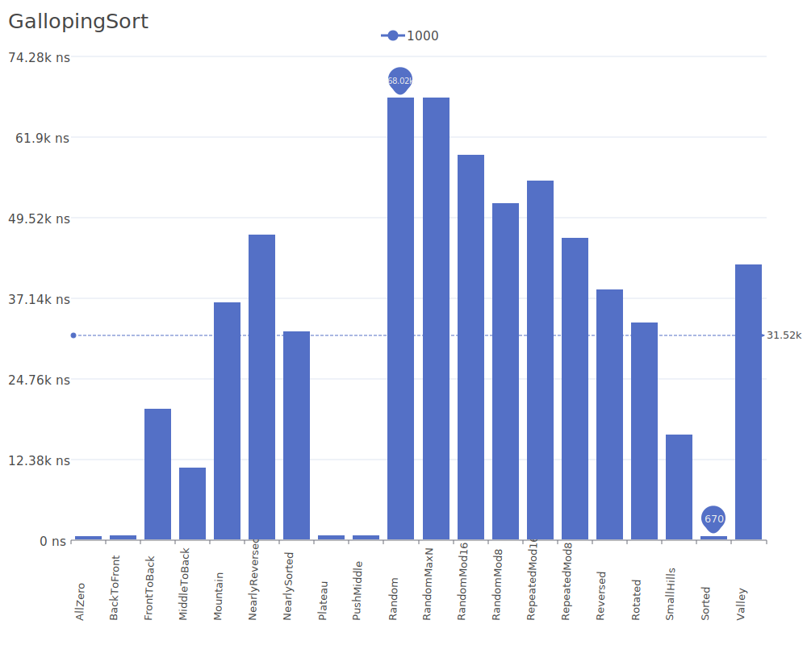
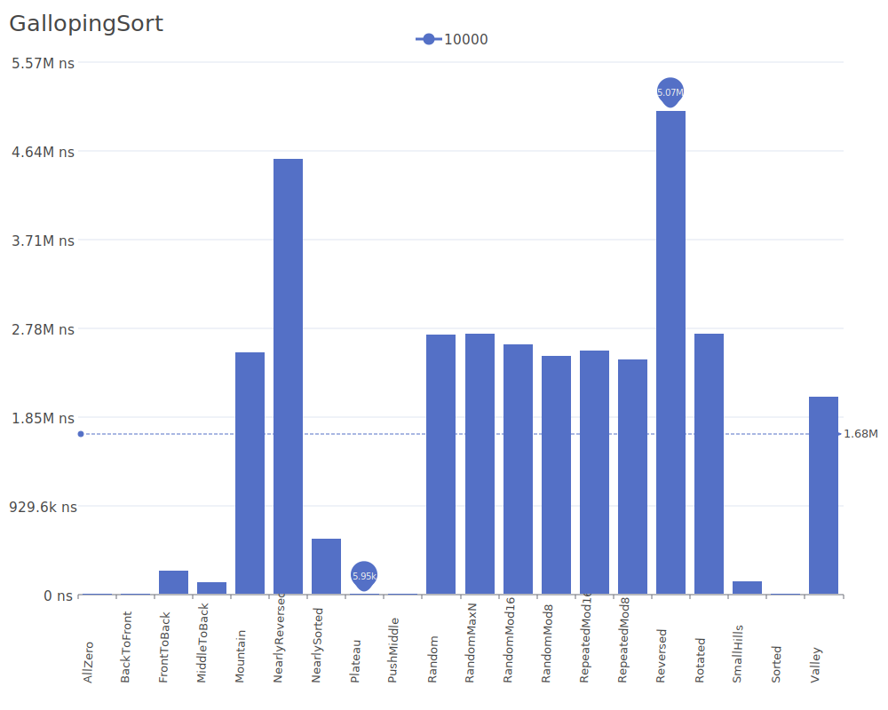

# Galloping Sort

Galloping Sort, also known as Exponential Search Sort, is an adaptive sorting algorithm that uses galloping search (also known as exponential search) to efficiently insert elements into a sorted sequence. For more details on galloping/exponential search, see the [Exponential Search Wikipedia article](https://en.wikipedia.org/wiki/Exponential_search).

## Benchmark Results

| Number of Elements | Benchmark Visualization                                                                     |
| ------------------ | ------------------------------------------------------------------------------------------- |
| 10                 |     |
| 100                |    |
| 1,000              |   |
| 10,000             |  |

Note: Galloping Sort achieves O(n) complexity in the best case and O(n log n) in the average and worst cases. It performs particularly well on nearly-sorted sequences and when the input contains long runs of sorted elements.