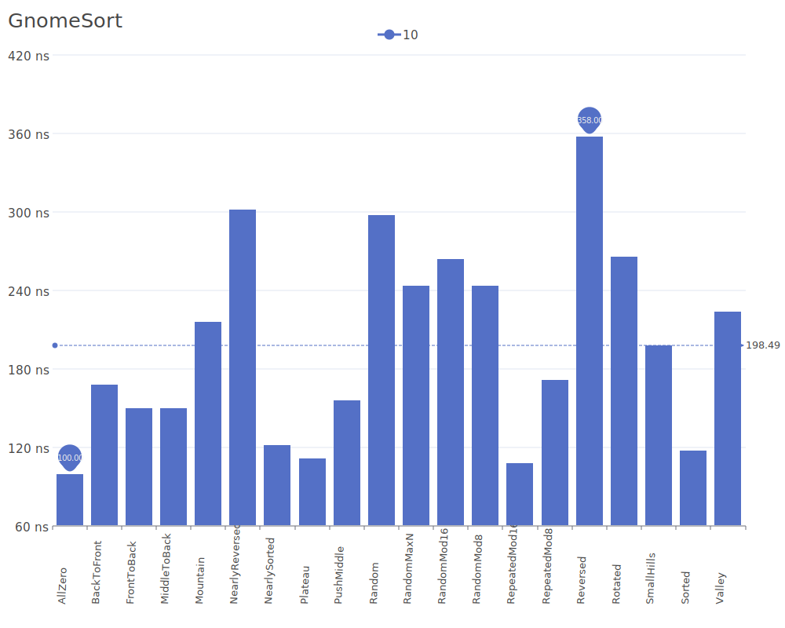
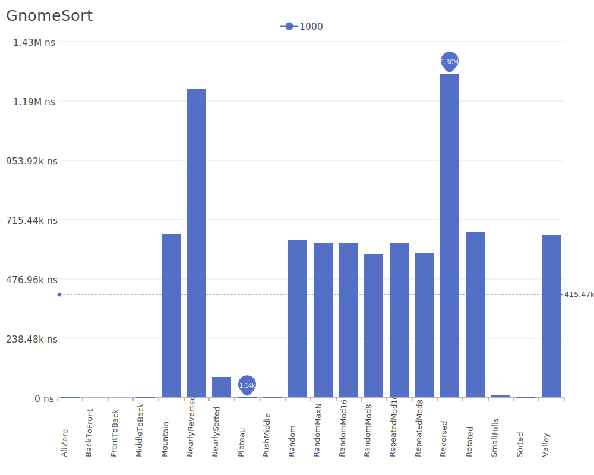

# Gnome Sort

Gnome Sort, also known as Stupid Sort, is a simple sorting algorithm that works similar to insertion sort but moves elements to their proper position by a series of swaps, similar to how a gnome sorts his flower pots. For more details on the algorithm and its theory, see the [Gnome Sort Wikipedia article](https://en.wikipedia.org/wiki/Gnome_sort).

## Benchmark Results

| Number of Elements | Benchmark Visualization                                                                 |
| ------------------ | --------------------------------------------------------------------------------------- |
| 10                 |     |
| 100                |    |
| 1,000              |   |
| 10,000             |  |

Note: While Gnome Sort has O(n) complexity in the best case when the input is already sorted, it degrades to O(n²) in average and worst cases. Its main advantages are its simplicity and the fact that it only uses a single temporary variable for swapping.