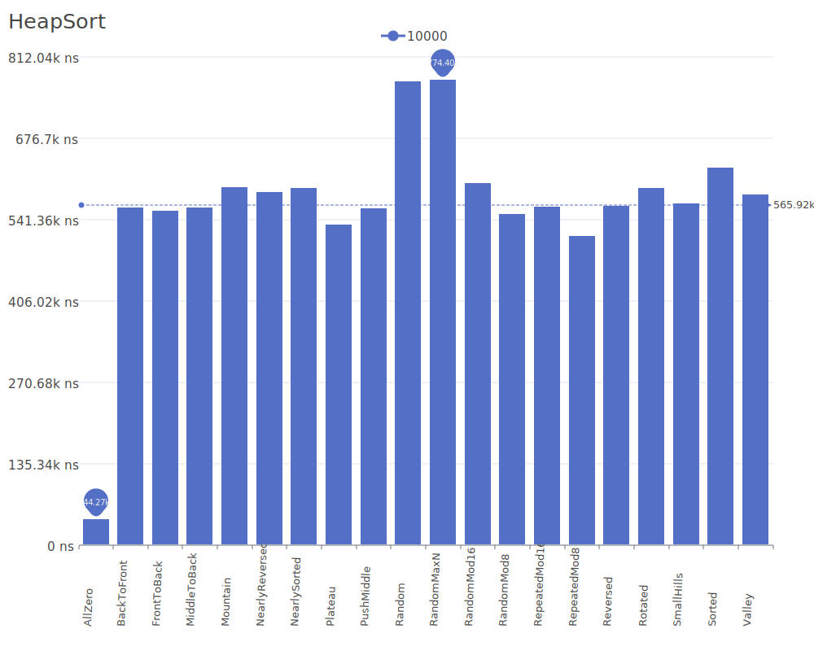

# Heap Sort

Heap Sort is a comparison-based sorting algorithm that uses a binary heap data structure. It divides its input into a sorted and an unsorted region, and iteratively shrinks the unsorted region by extracting the largest element and inserting it into the sorted region. For more details on the algorithm and its theory, see the [Heap Sort Wikipedia article](https://en.wikipedia.org/wiki/Heapsort).

## Benchmark Results

| Number of Elements | Benchmark Visualization                                                                    |
| ------------------ | ------------------------------------------------------------------------------------------ |
| 10                 |         |
| 100                |        |
| 1,000              |       |
| 10,000             |      |
| 100,000            |     |
| 1,000,000          |    |
| 10,000,000         |   |
| 100,000,000        |  |

Note: Heap Sort achieves O(n log n) complexity in all cases and requires O(1) additional memory, making it particularly useful when memory is constrained. However, it is not stable and typically performs slower than Quick Sort in practice.