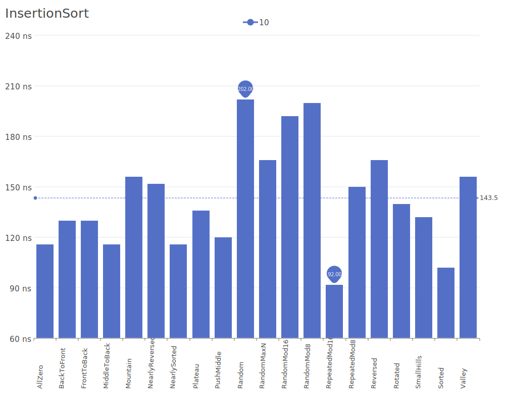

# Insertion Sort

Insertion Sort is a simple sorting algorithm that builds the final sorted array one item at a time. It iterates through the input array and grows a sorted array behind it. The algorithm repeatedly picks an element and inserts it into its correct position in the sorted portion. For more details on the algorithm and its theory, see the [Insertion Sort Wikipedia article](https://en.wikipedia.org/wiki/Insertion_sort).

## Benchmark Results

| Number of Elements | Benchmark Visualization                                                                     |
| ------------------ | ------------------------------------------------------------------------------------------- |
| 10                 |     |
| 100                |    |
| 1,000              |   |
| 10,000             |  |

Note: While Insertion Sort has O(n²) complexity in average and worst cases, it performs well (O(n)) on nearly sorted arrays and is more efficient in practice than most other quadratic algorithms. It's also stable and in-place, making it useful for small arrays or as part of more complex algorithms like Timsort.