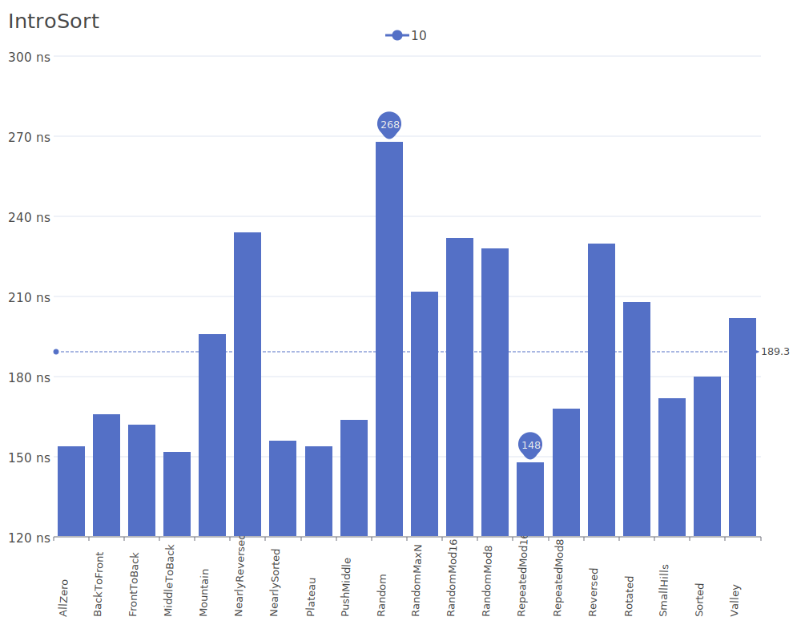
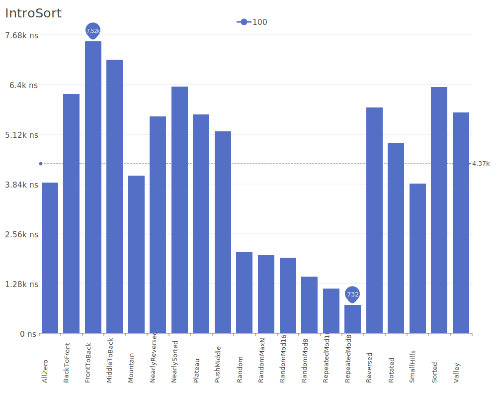
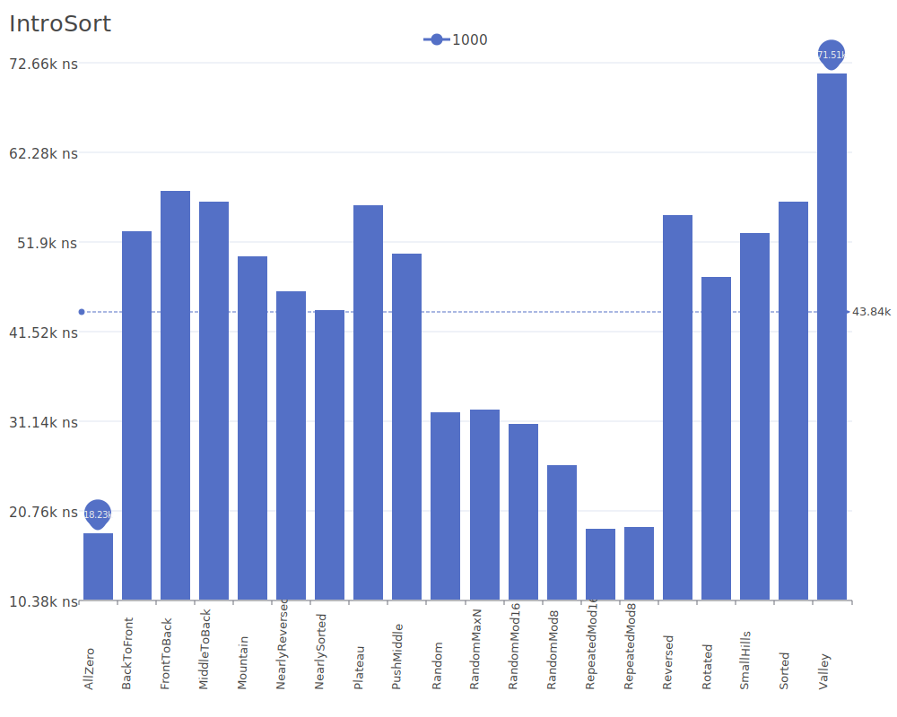
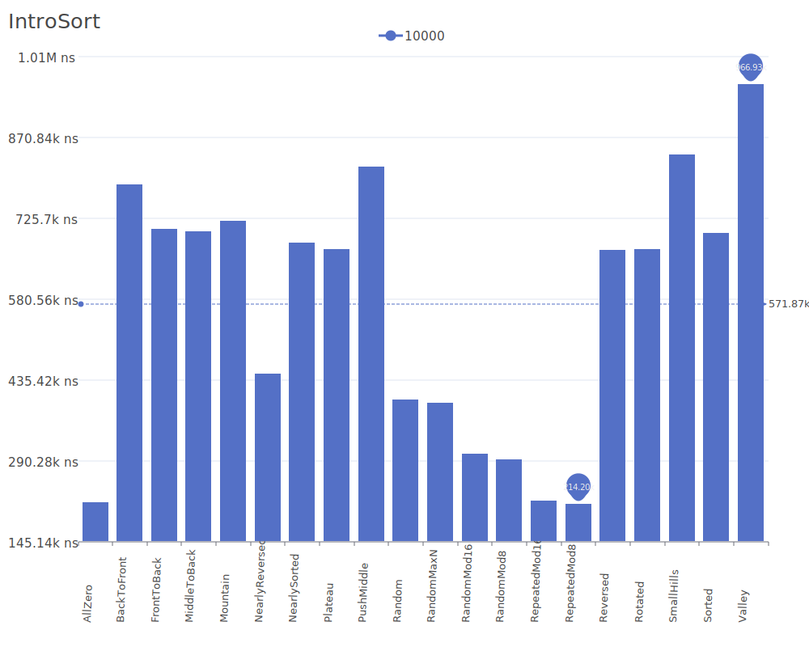
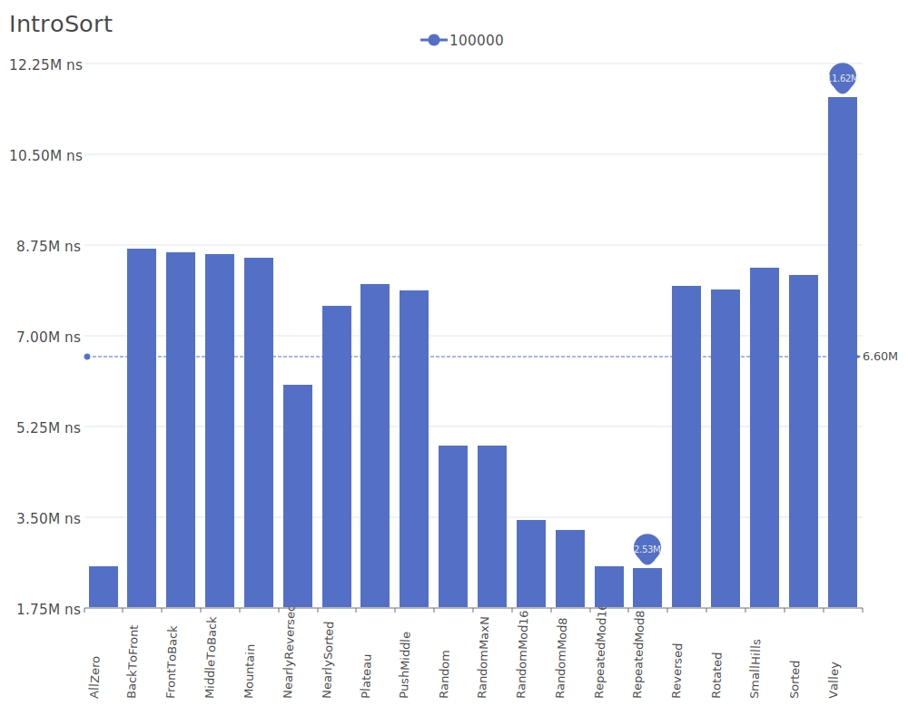
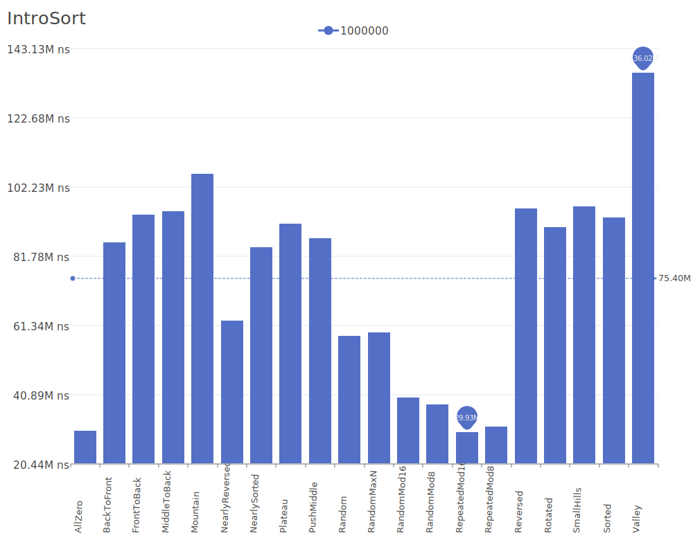
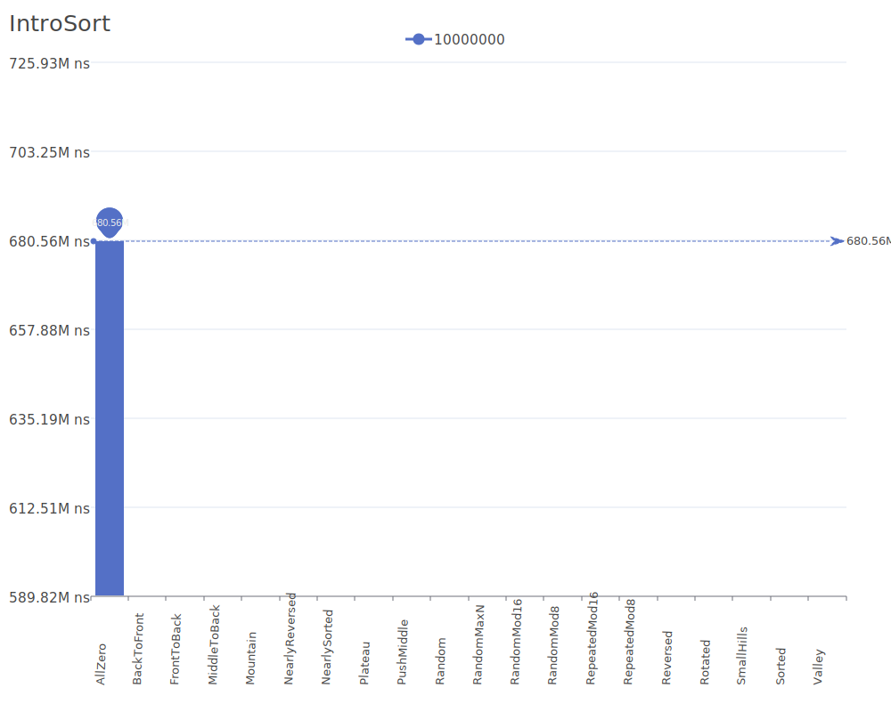

# Intro Sort

Intro Sort or Introspective Sort is a hybrid sorting algorithm that provides both fast average performance and optimal worst-case performance. It begins with quicksort and switches to heapsort when the recursion depth exceeds a certain level, and to insertion sort for small subarrays. For more details on the algorithm and its theory, see the [Introsort Wikipedia article](https://en.wikipedia.org/wiki/Introsort).

## Benchmark Results

| Number of Elements | Benchmark Visualization                                                                     |
| ------------------ | ------------------------------------------------------------------------------------------- |
| 10                 |         |
| 100                |        |
| 1,000              |       |
| 10,000             |      |
| 100,000            |     |
| 1,000,000          |    |
| 10,000,000         |   |
| 100,000,000        |  |

Note: Intro Sort guarantees O(n log n) worst-case performance while keeping quicksort's average-case efficiency. It requires O(log n) additional space for recursion. This algorithm is used in many standard library implementations, including C++'s std::sort.