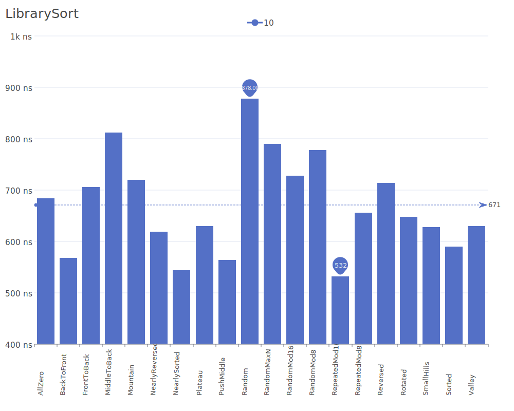
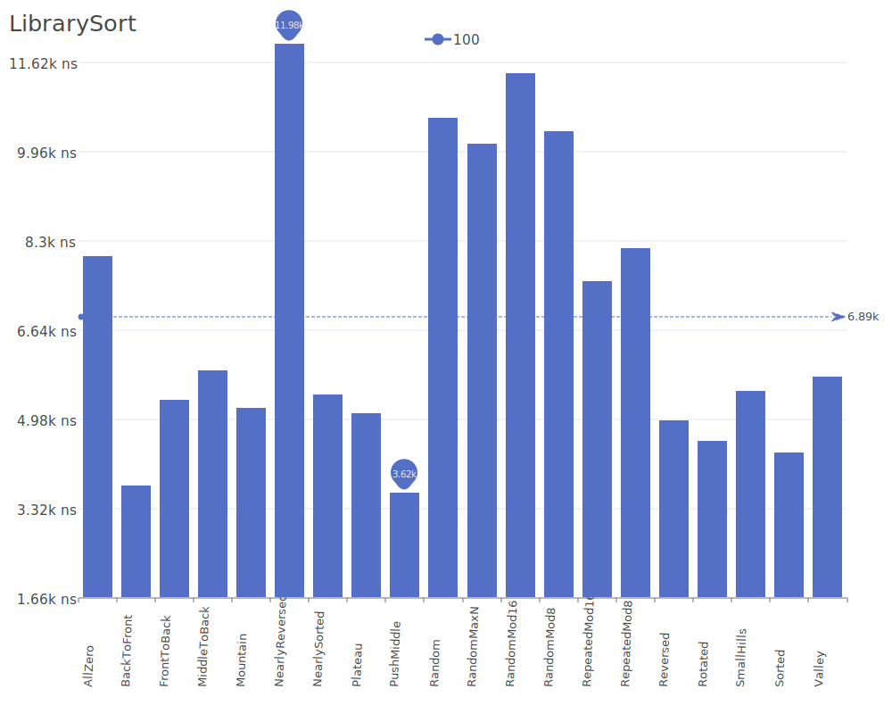
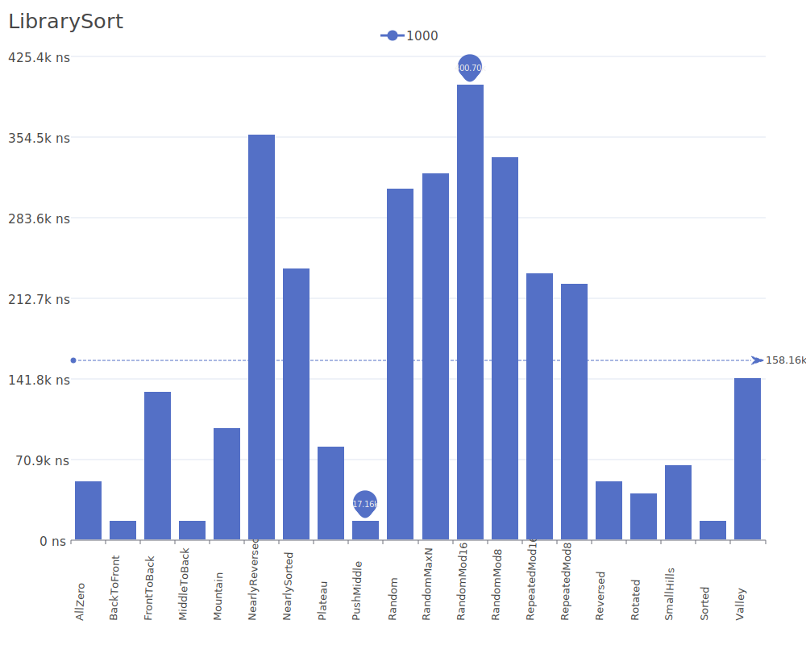
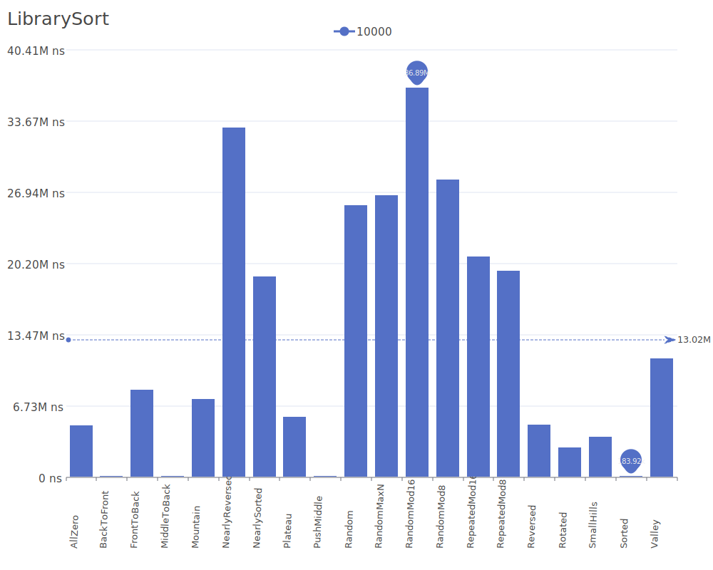

# Library Sort

Library Sort, also known as Gapped Insertion Sort, is a sorting algorithm that uses gaps or spaces between elements to improve insertion efficiency. It's inspired by the way librarians often leave spaces on shelves to make it easier to insert new books. For more details on the algorithm and its theory, see the [Library Sort research paper](https://doi.org/10.1145/1070432.1070454).

## Benchmark Results

| Number of Elements | Benchmark Visualization                                                                   |
| ------------------ | ----------------------------------------------------------------------------------------- |
| 10                 |     |
| 100                |    |
| 1,000              |   |
| 10,000             |  |

Note: Library Sort achieves O(n log n) complexity in all cases and maintains stability. While it requires O(n) additional space for the gaps, it can perform better than traditional insertion sort in practice due to reduced element shifting. The algorithm is particularly efficient when dealing with nearly sorted sequences or when new elements are being frequently inserted.