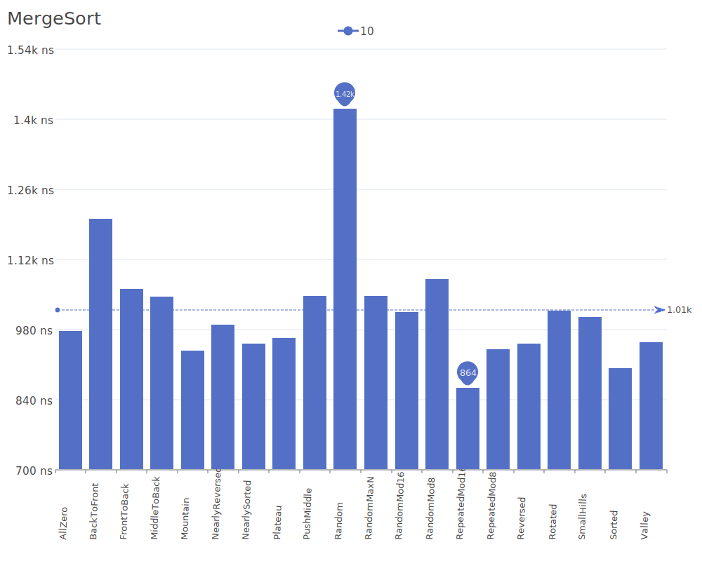
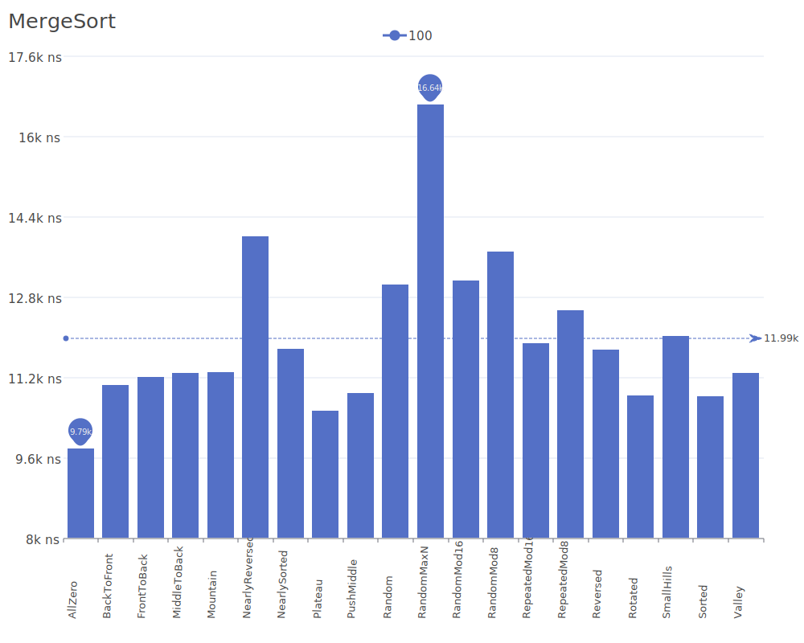
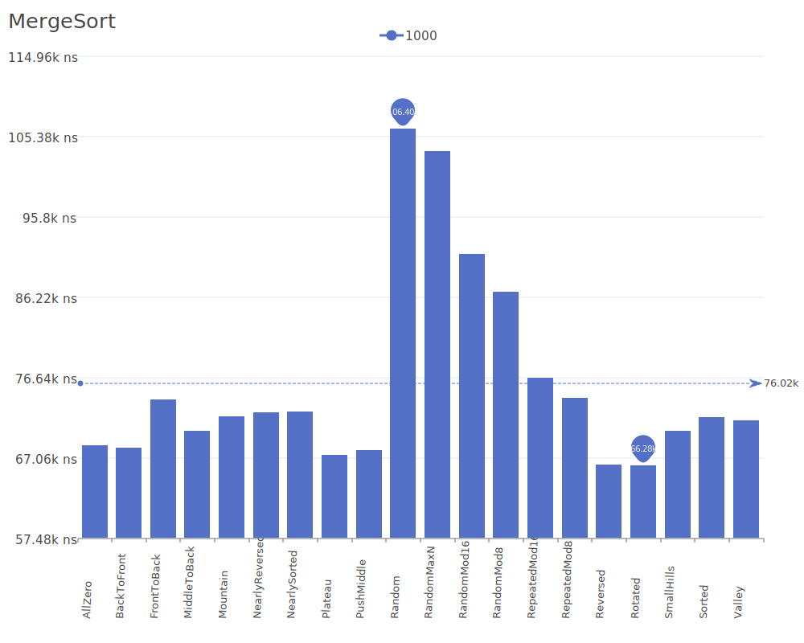
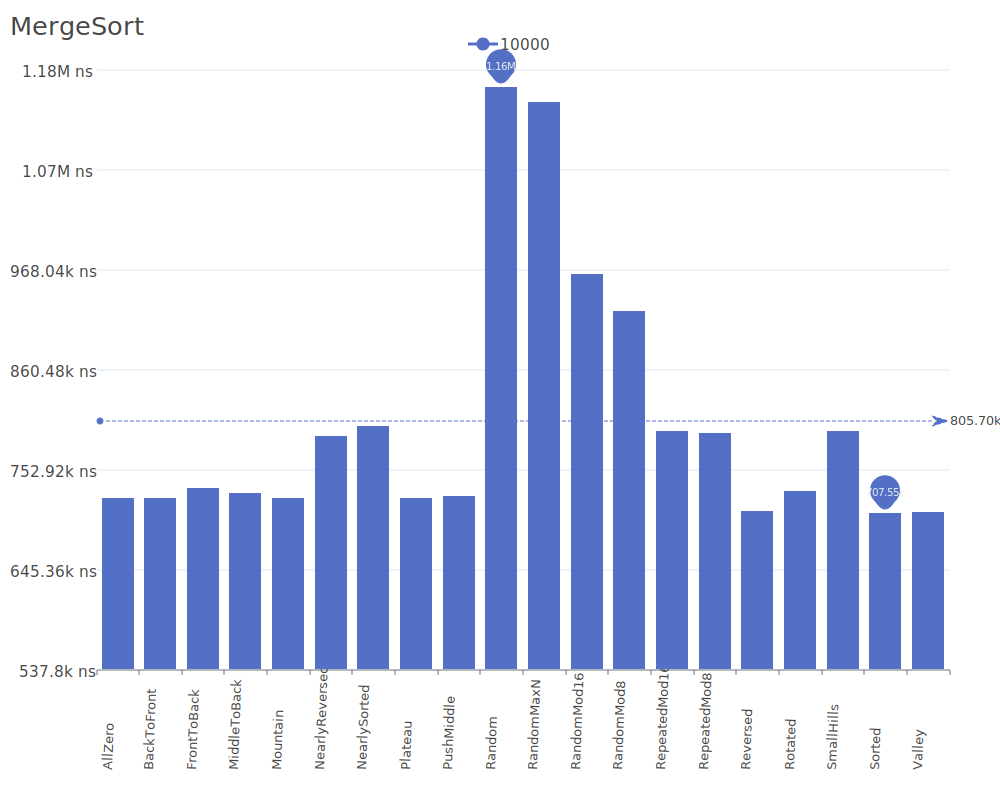
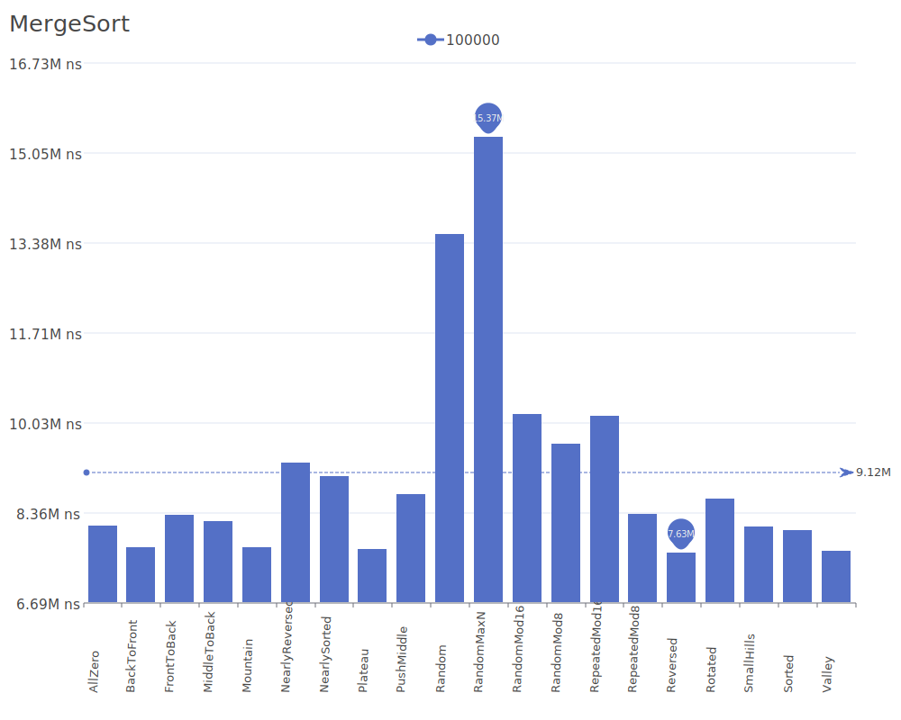
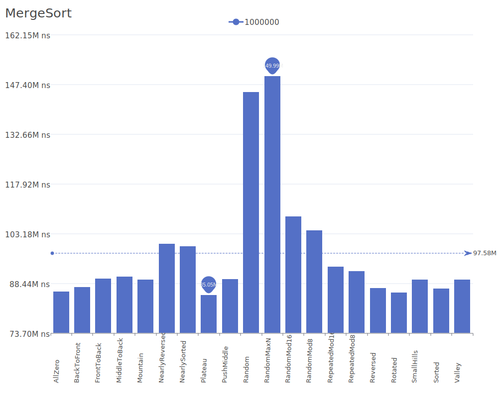
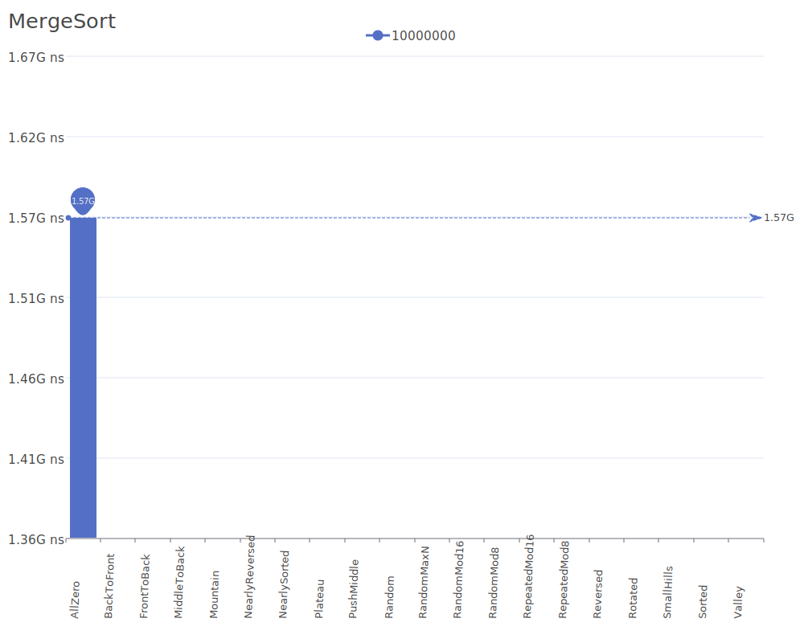

# Merge Sort

Merge Sort is a stable, divide-and-conquer sorting algorithm that recursively divides the input array into smaller subarrays, sorts them, and then merges them back together. For more details on the algorithm and its theory, see the [Merge Sort Wikipedia article](https://en.wikipedia.org/wiki/Merge_sort).

## Benchmark Results

| Number of Elements | Benchmark Visualization                                                                     |
| ------------------ | ------------------------------------------------------------------------------------------- |
| 10                 |         |
| 100                |        |
| 1,000              |       |
| 10,000             |      |
| 100,000            |     |
| 1,000,000          |    |
| 10,000,000         |   |
| 100,000,000        |  |

Note: Merge Sort consistently performs in O(n log n) time for all cases, making it reliable for any input. While it requires O(n) additional space, its stability and predictable performance make it valuable for sorting linked lists and in external sorting scenarios where data doesn't fit entirely in memory.