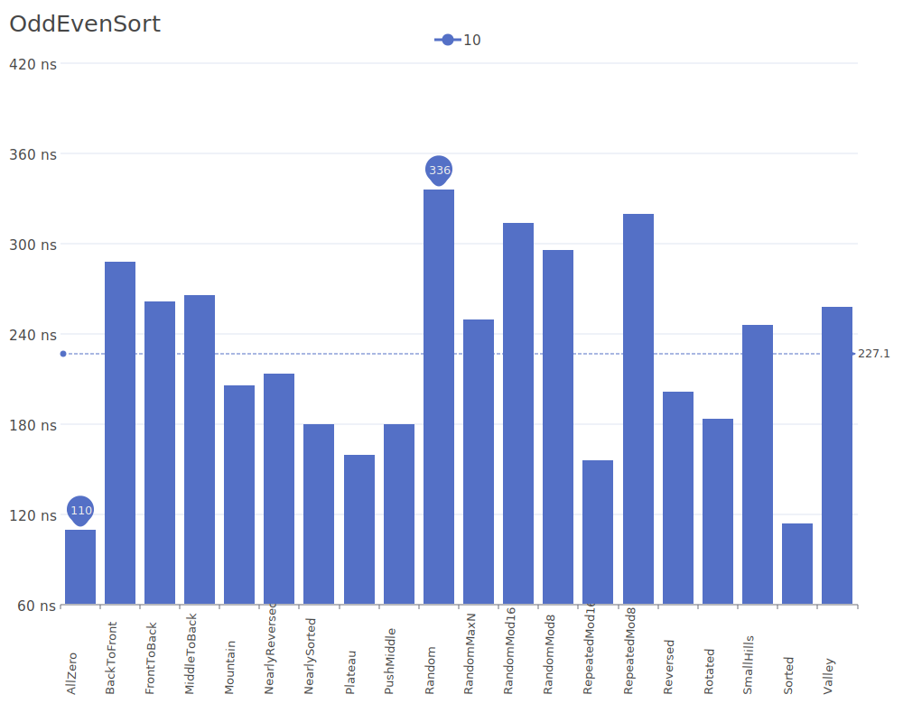

# Odd-Even Sort

Odd-Even Sort, also known as Brick Sort, is a relatively simple sorting algorithm that extends the concept of bubble sort. It works by comparing all odd/even indexed pairs of adjacent elements in the array and swapping them if they are in the wrong order. For more details on the algorithm and its theory, see the [Odd-Even Sort description](https://en.wikipedia.org/wiki/Odd–even_sort).

## Benchmark Results

| Number of Elements | Benchmark Visualization                                                                   |
| ------------------ | ----------------------------------------------------------------------------------------- |
| 10                 |     |
| 100                |    |
| 1,000              |   |
| 10,000             |  |

Note: Odd-Even Sort has O(n) complexity in the best case and O(n²) in average and worst cases. While not particularly efficient for sequential processing, its parallel nature makes it useful in parallel computing environments where adjacent elements can be compared simultaneously.