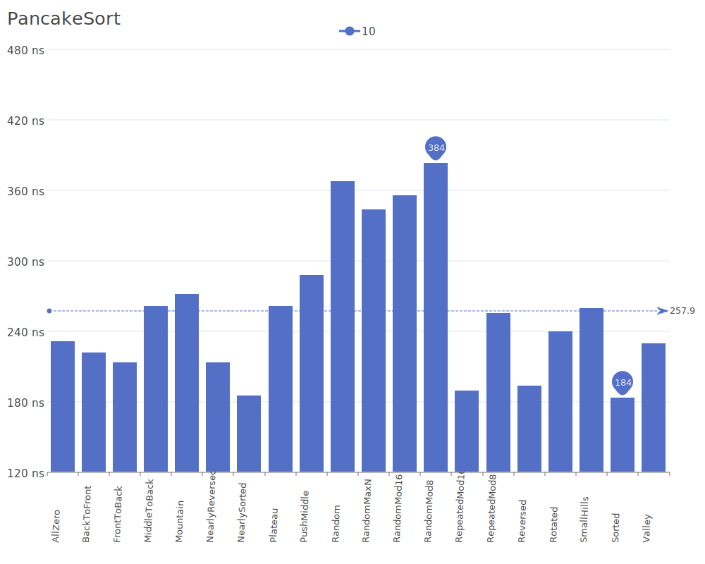
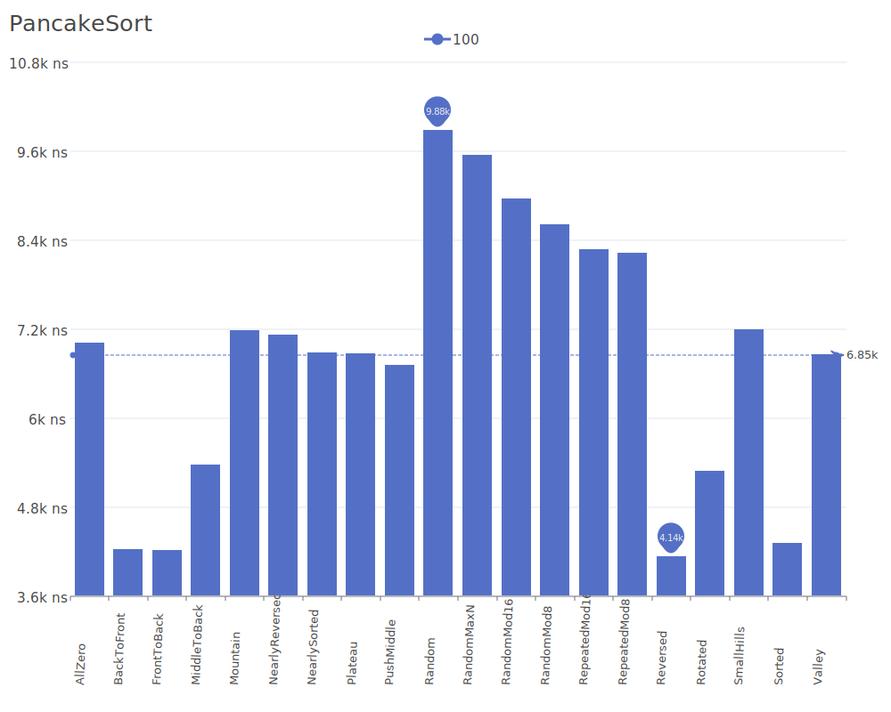
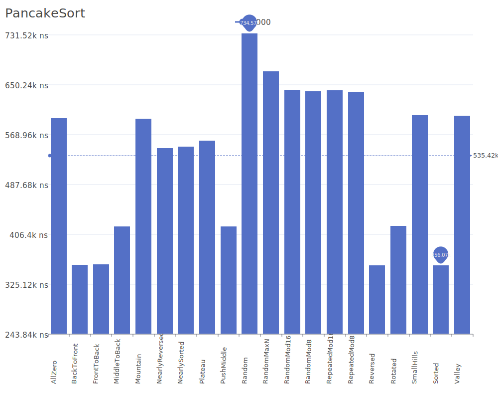
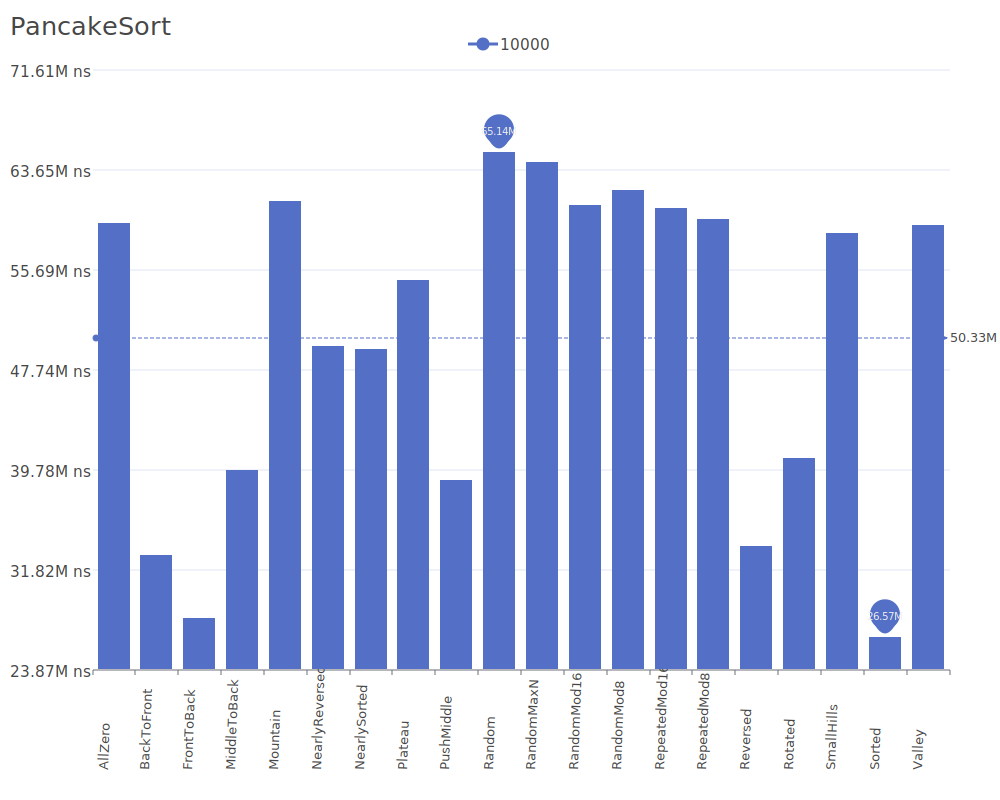

# Pancake Sort

Pancake Sort is a sorting algorithm that only uses flips (reversals) of prefixes of the sequence to sort elements, similar to sorting a stack of pancakes using a spatula. Each flip reverses a portion of the array from the beginning to a chosen index. For more details on the algorithm and its theory, see the [Pancake Sort Wikipedia article](https://en.wikipedia.org/wiki/Pancake_sorting).

## Benchmark Results

| Number of Elements | Benchmark Visualization                                                                   |
| ------------------ | ----------------------------------------------------------------------------------------- |
| 10                 |     |
| 100                |    |
| 1,000              |   |
| 10,000             |  |

Note: While Pancake Sort has O(n) complexity in the best case, it degrades to O(n²) in average and worst cases. The algorithm is primarily of theoretical interest and serves as a good example of a sorting algorithm with a unique constraint (only being able to reverse prefixes of the sequence).