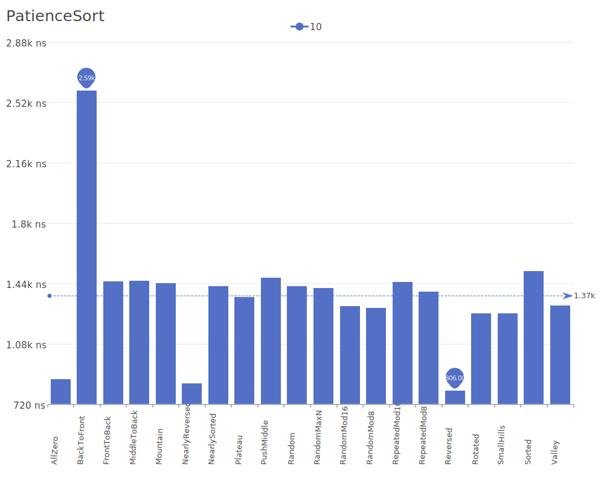
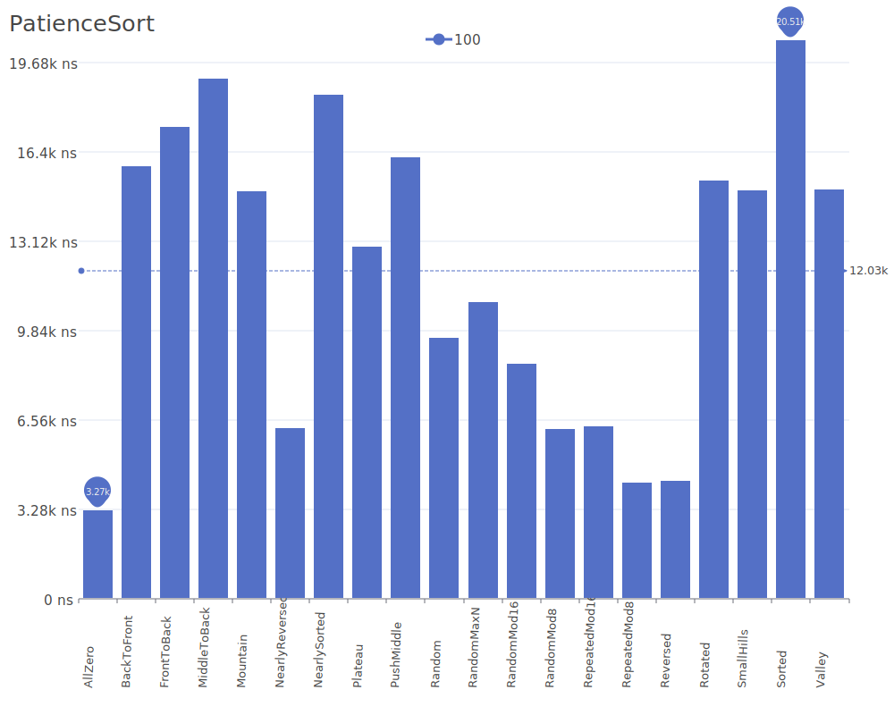
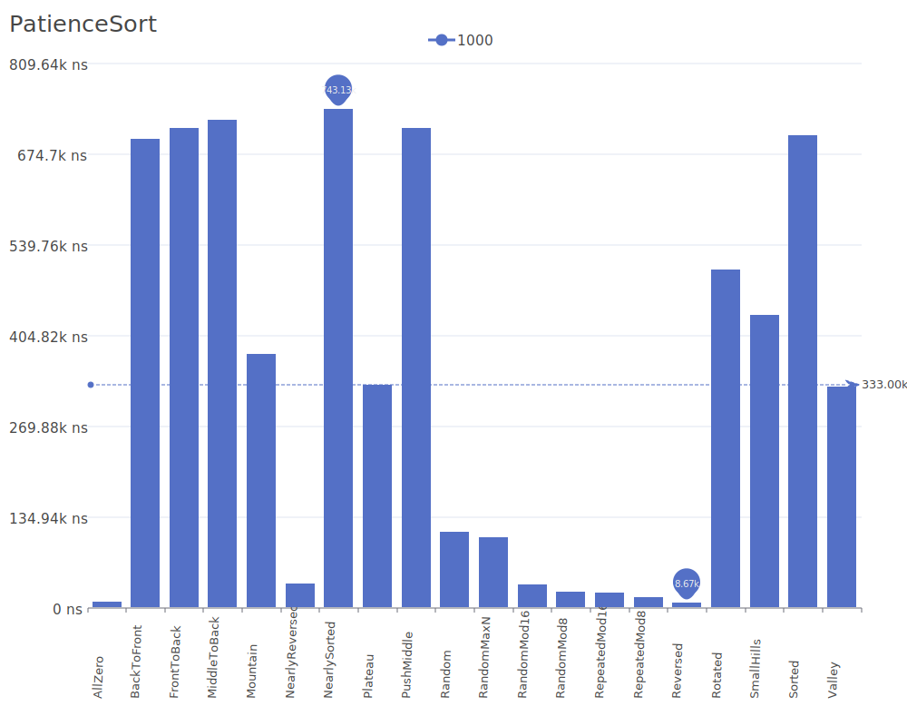
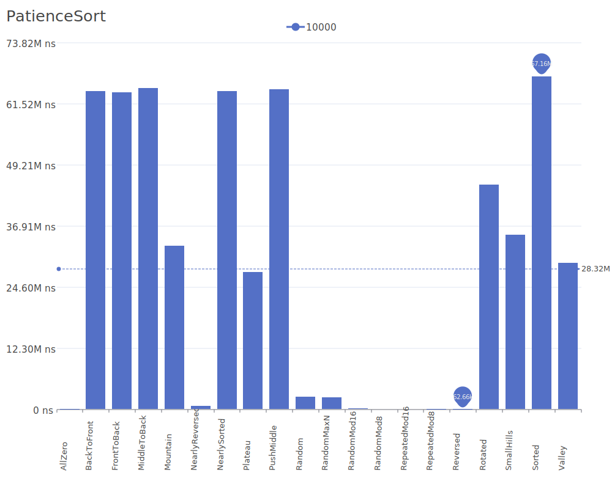
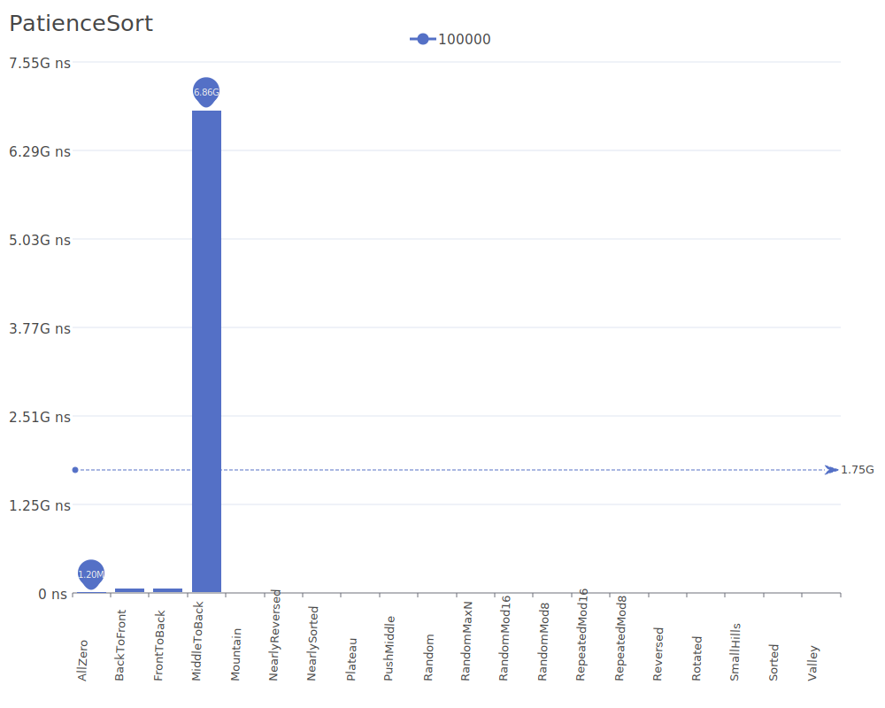

# Patience Sort

Patience Sort is a sorting algorithm inspired by the card game patience/solitaire. It works by creating piles of cards (elements) where each pile is sorted, similar to how players create piles in solitaire. For more details on the algorithm and its theory, see the [Patience Sort Wikipedia article](https://en.wikipedia.org/wiki/Patience_sorting).

## Benchmark Results

| Number of Elements | Benchmark Visualization                                                                      |
| ------------------ | -------------------------------------------------------------------------------------------- |
| 10                 |       |
| 100                |      |
| 1,000              |     |
| 10,000             |    |
| 100,000            |   |
| 1,000,000          |  |

Note: Patience Sort achieves O(n log n) complexity in all cases and is stable. While it requires O(n) additional space, it has the unique property of being able to determine the longest increasing subsequence in the input as a side effect of the sorting process.