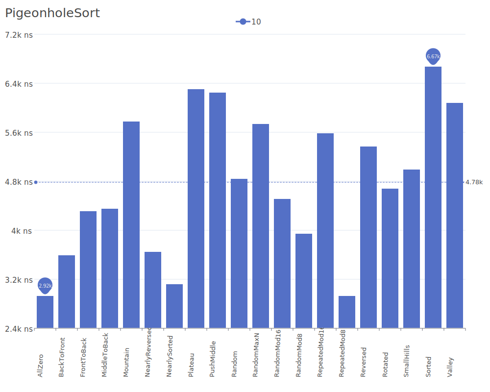
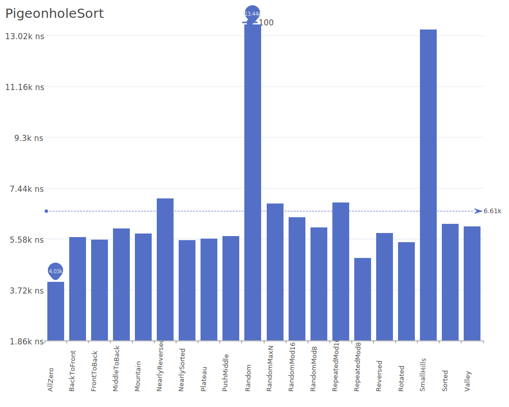
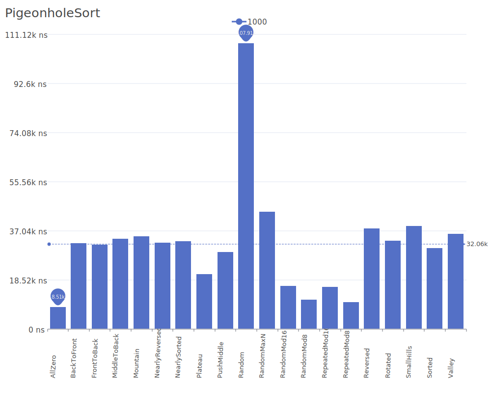
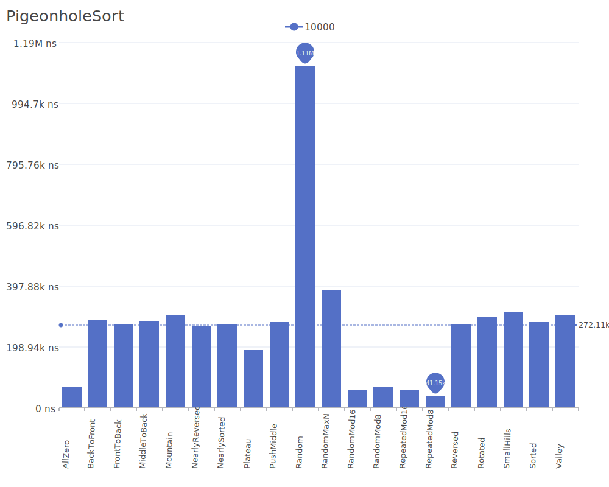
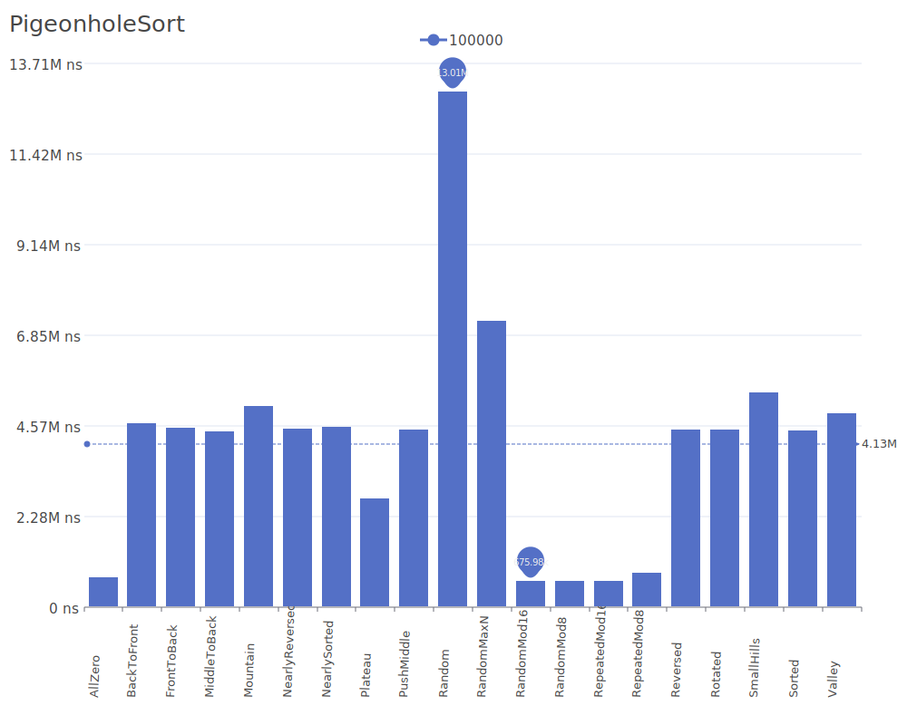
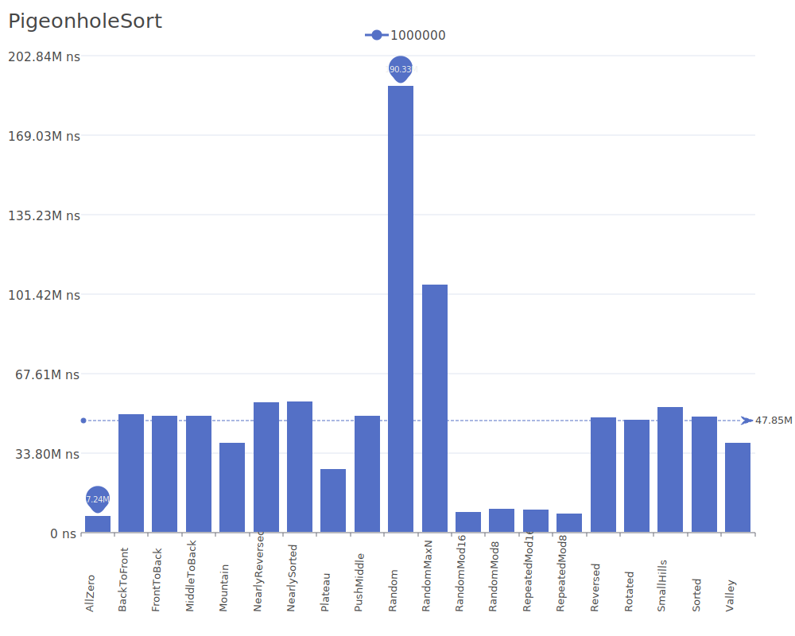
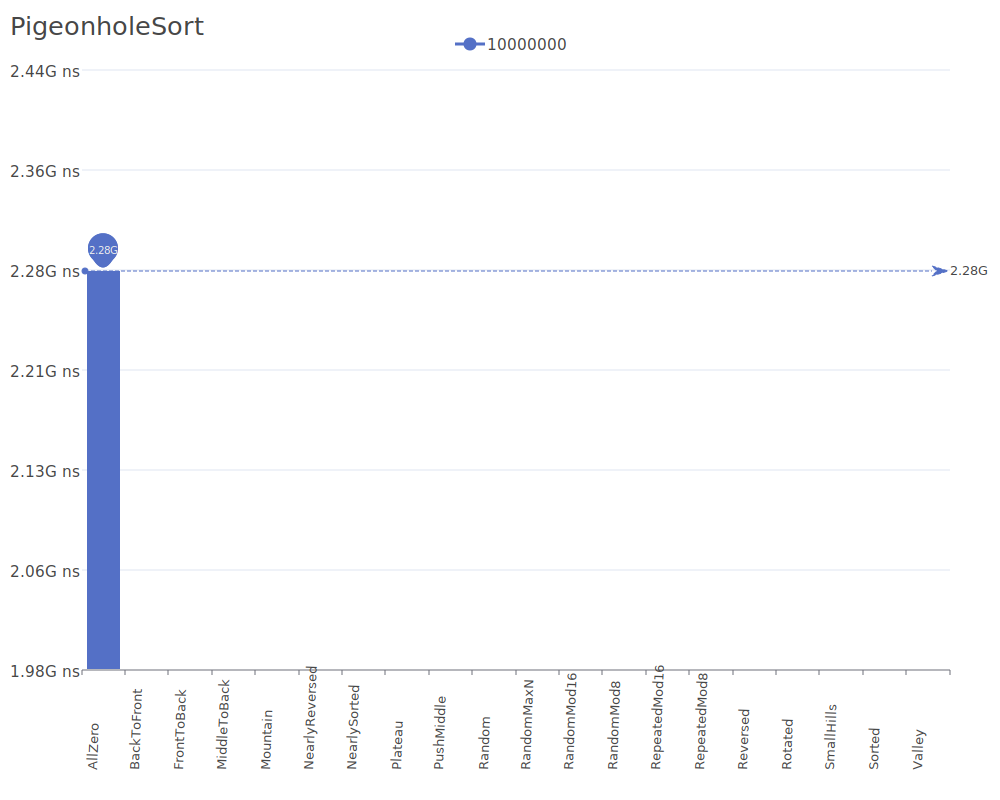

# Pigeonhole Sort

Pigeonhole Sort is a sorting algorithm that works by mapping each element to a pigeonhole (bucket) based on its value, then retrieving the elements in order from the pigeonholes. It's particularly efficient when the range of input values is not significantly larger than the number of elements. For more details on the algorithm and its theory, see the [Pigeonhole Sort Wikipedia article](https://en.wikipedia.org/wiki/Pigeonhole_sort).

## Benchmark Results

| Number of Elements | Benchmark Visualization                                                                          |
| ------------------ | ------------------------------------------------------------------------------------------------ |
| 10                 |         |
| 100                |        |
| 1,000              |       |
| 10,000             |      |
| 100,000            |     |
| 1,000,000          |    |
| 10,000,000         |   |
| 100,000,000        |  |

Note: Pigeonhole Sort achieves O(n + range) time complexity where 'range' is the difference between maximum and minimum values. It requires O(range) additional memory. The algorithm is most efficient when the range of possible values is close to the number of elements being sorted.