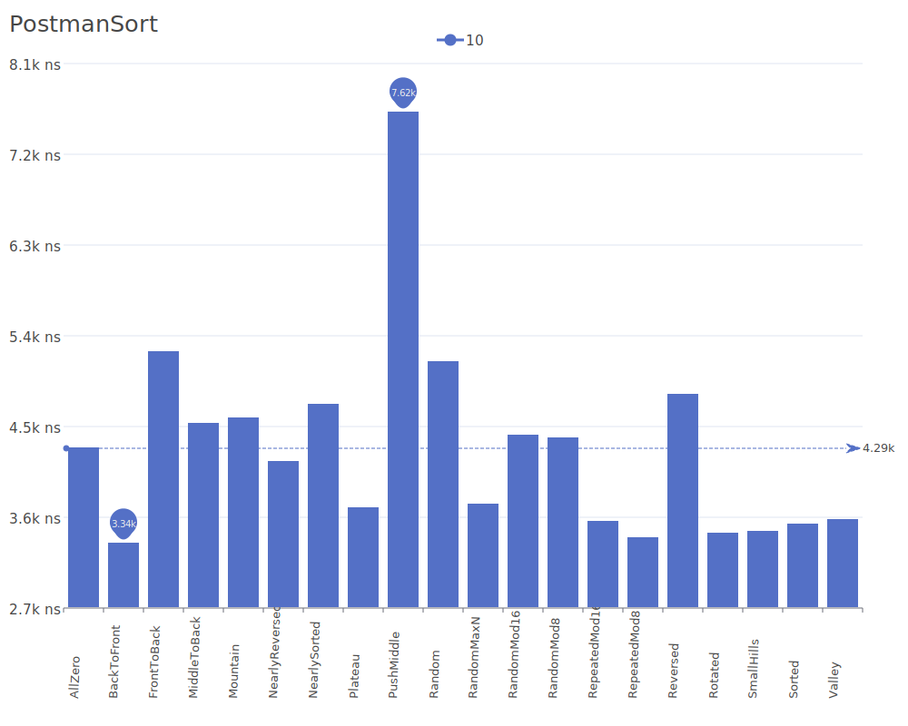

# Postman Sort

Postman Sort is a sorting algorithm that works by dividing elements into groups based on their most significant digits or bits, similar to how a postman might sort letters by postal codes. It processes elements from most significant to least significant position. For more details on the algorithm and its theory, see the [Postman Sort description](https://dl.acm.org/doi/10.1145/366622.366644).

## Benchmark Results

| Number of Elements | Benchmark Visualization                                                                       |
| ------------------ | --------------------------------------------------------------------------------------------- |
| 10                 |         |
| 100                |        |
| 1,000              |       |
| 10,000             |      |
| 100,000            |     |
| 1,000,000          |    |
| 10,000,000         |   |
| 100,000,000        |  |

Note: Postman Sort has O(n) complexity in the best case but can degrade to O(n*m) in average and worst cases, where m is the number of digits or bits being processed. It requires O(n) additional memory but maintains stability during the sorting process.