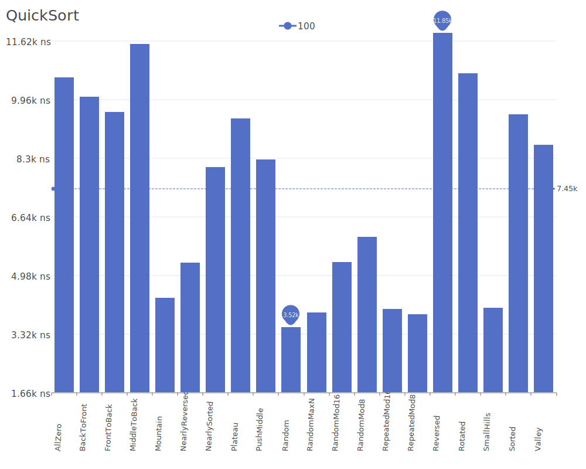

# Quick Sort

Quick Sort is a highly efficient, comparison-based sorting algorithm that uses a divide-and-conquer strategy. It works by selecting a 'pivot' element and partitioning the array around it, such that smaller elements are moved before the pivot and larger elements after it. For more details on the algorithm and its theory, see the [Quick Sort Wikipedia article](https://en.wikipedia.org/wiki/Quicksort).

## Benchmark Results

| Number of Elements | Benchmark Visualization                                                                     |
| ------------------ | ------------------------------------------------------------------------------------------- |
| 10                 |         |
| 100                |        |
| 1,000              |       |
| 10,000             |      |
| 100,000            |     |
| 1,000,000          |    |
| 10,000,000         |   |
| 100,000,000        |  |

Note: Quick Sort achieves O(n log n) complexity in best and average cases but can degrade to O(n²) in the worst case (when the array is already sorted or reverse sorted). It requires O(log n) additional space for recursion. Despite its worst-case behavior, Quick Sort is often the fastest sorting algorithm in practice due to its excellent cache performance and ability to sort in-place.