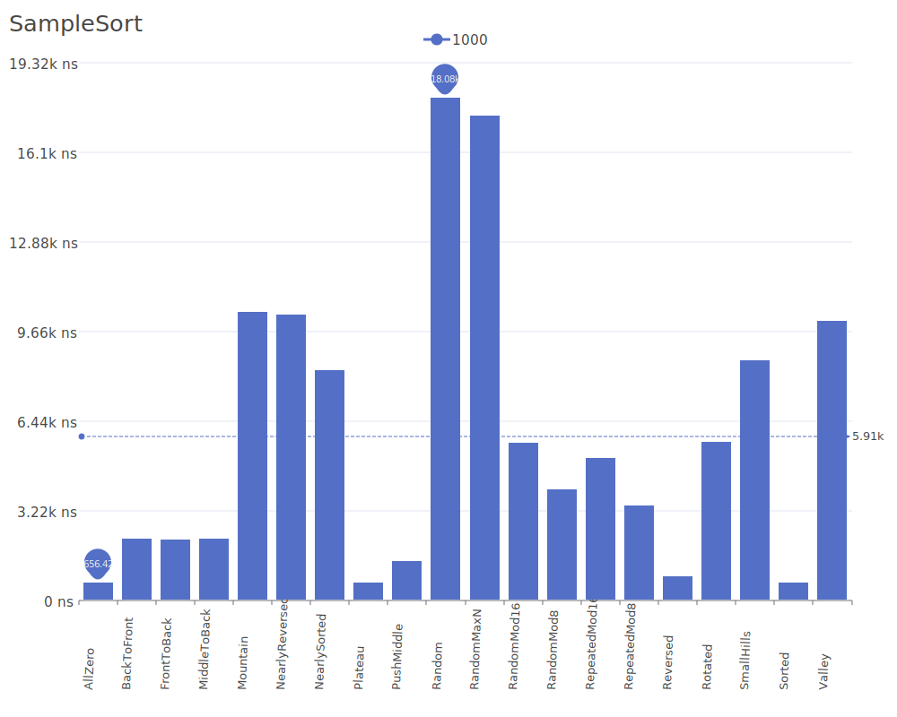
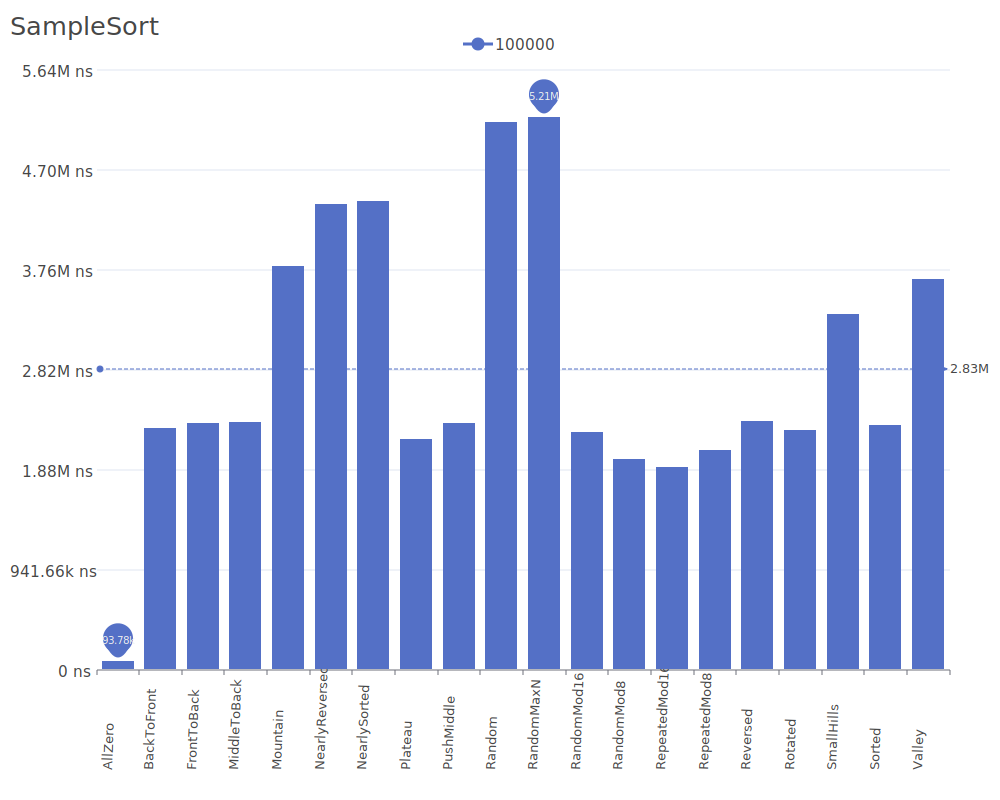
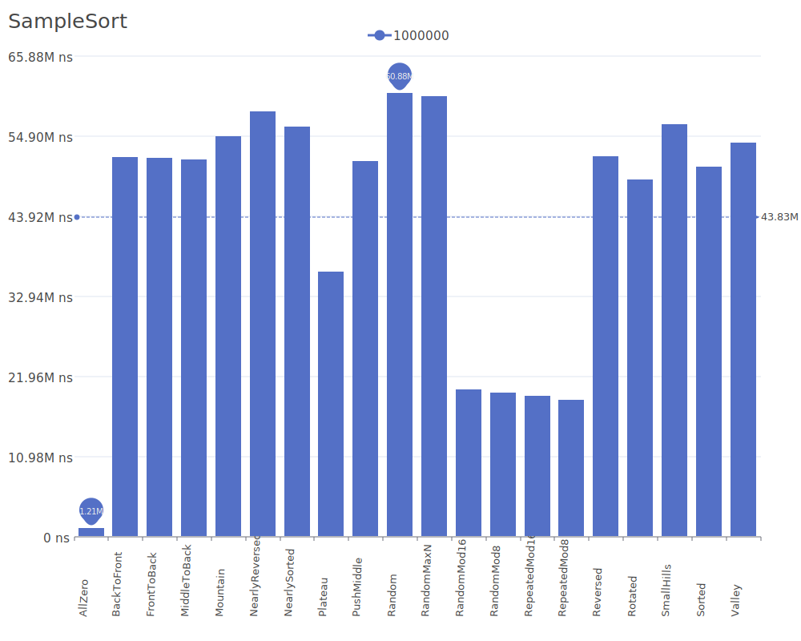

# Sample Sort

Sample Sort is a parallel sorting algorithm that works by selecting a sample of elements from the input, sorting this sample to determine splitters, and then using these splitters to partition the input into approximately equal-sized buckets. For more details on the algorithm and its theory, see the [Sample Sort paper](https://doi.org/10.1145/224170.224228).

## Benchmark Results

| Number of Elements | Benchmark Visualization                                                                      |
| ------------------ | -------------------------------------------------------------------------------------------- |
| 10                 |         |
| 100                |        |
| 1,000              |       |
| 10,000             |      |
| 100,000            |     |
| 1,000,000          |    |
| 10,000,000         |   |
| 100,000,000        |  |

Note: Sample Sort achieves O(n log n) complexity in all cases and requires O(n) additional memory. While it may not be the most efficient for sequential processing, its true strength lies in parallel implementations where it can achieve near-linear speedup with additional processors.