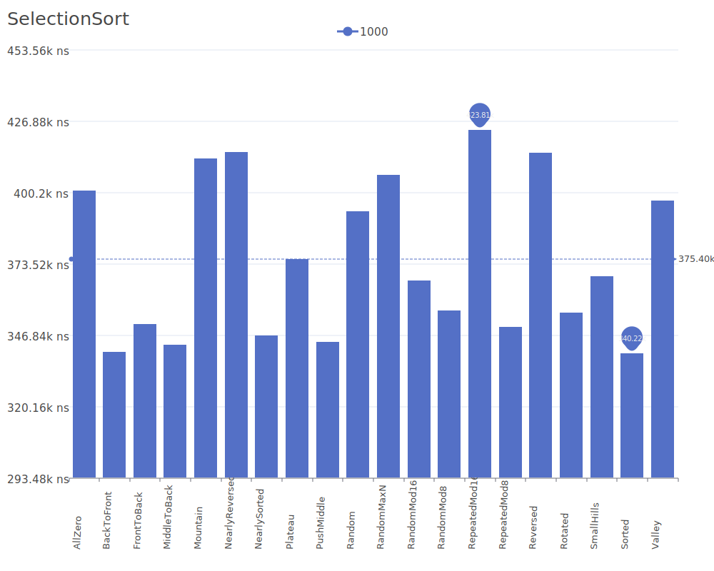

# Selection Sort

Selection Sort is a simple comparison-based sorting algorithm that divides the input into a sorted and an unsorted region. It repeatedly selects the smallest element from the unsorted region and adds it to the sorted region. For more details on the algorithm and its theory, see the [Selection Sort Wikipedia article](https://en.wikipedia.org/wiki/Selection_sort).

## Benchmark Results

| Number of Elements | Benchmark Visualization                                                                     |
| ------------------ | ------------------------------------------------------------------------------------------- |
| 10                 |     |
| 100                |    |
| 1,000              |   |
| 10,000             |  |

Note: Selection Sort has O(n²) complexity in all cases, making it inefficient on large lists. However, it has the advantage of making the minimum possible number of swaps (O(n)). It performs well on small lists and when auxiliary memory is limited, as it only requires O(1) additional space.