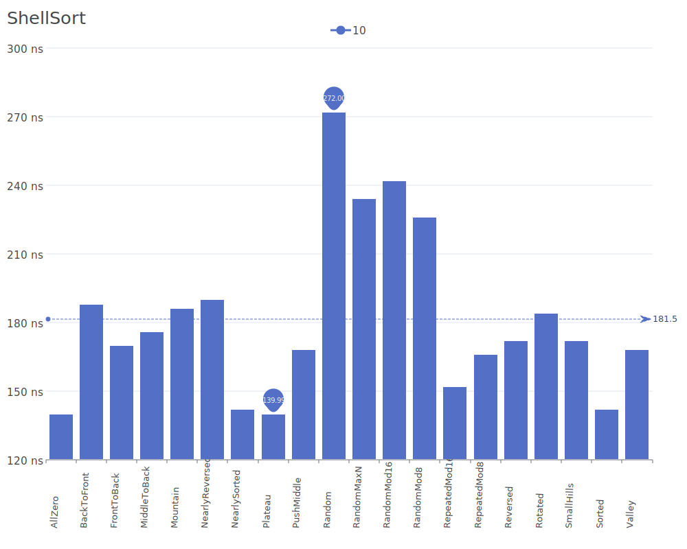
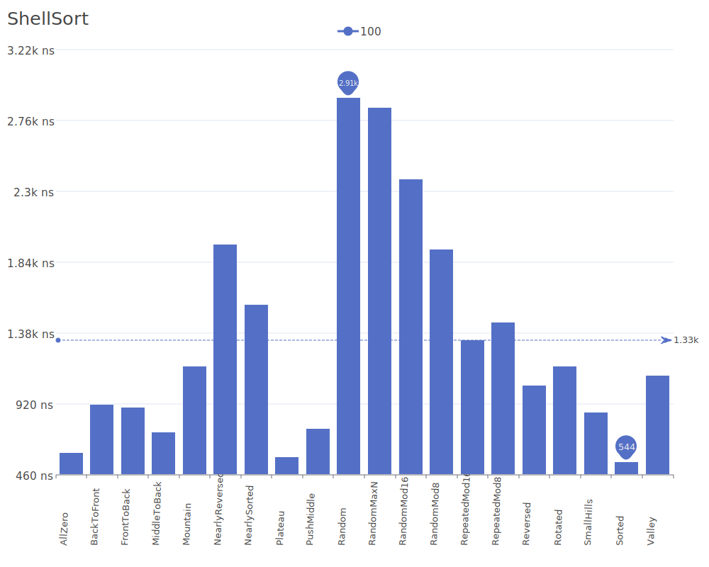
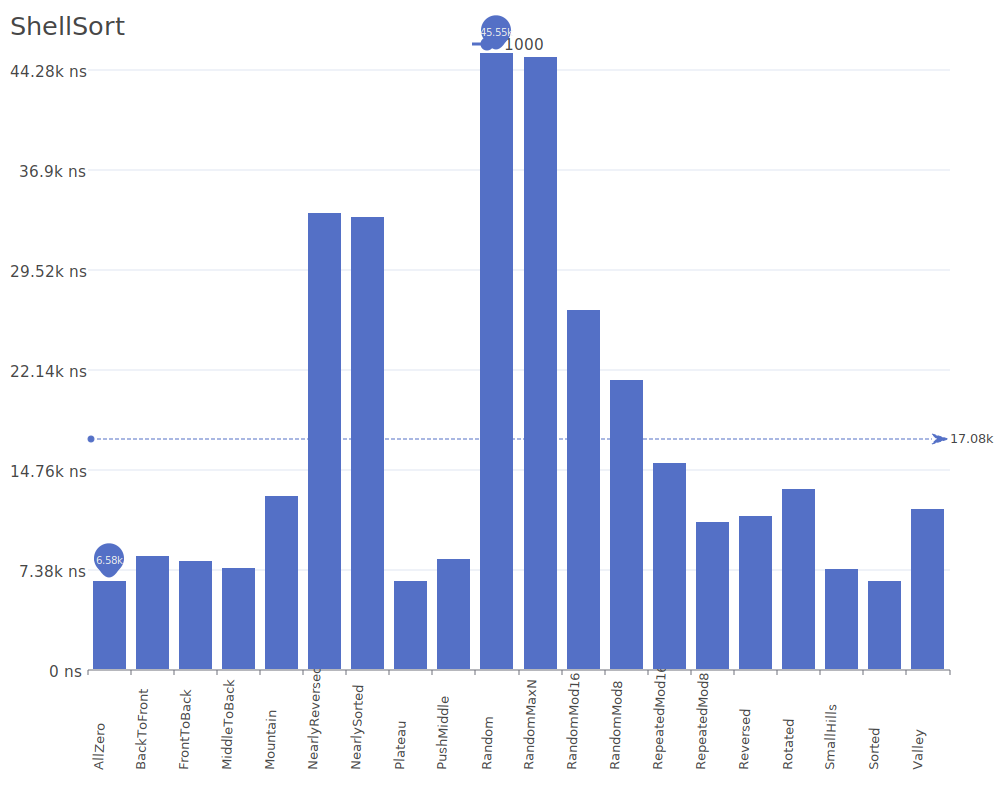
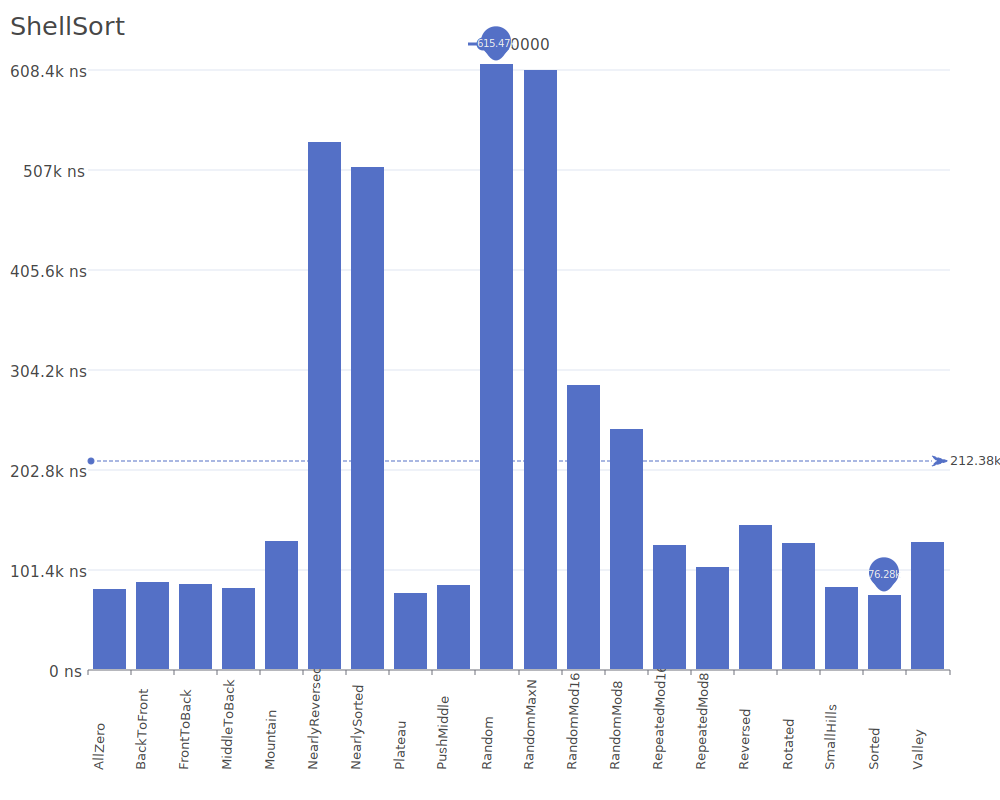
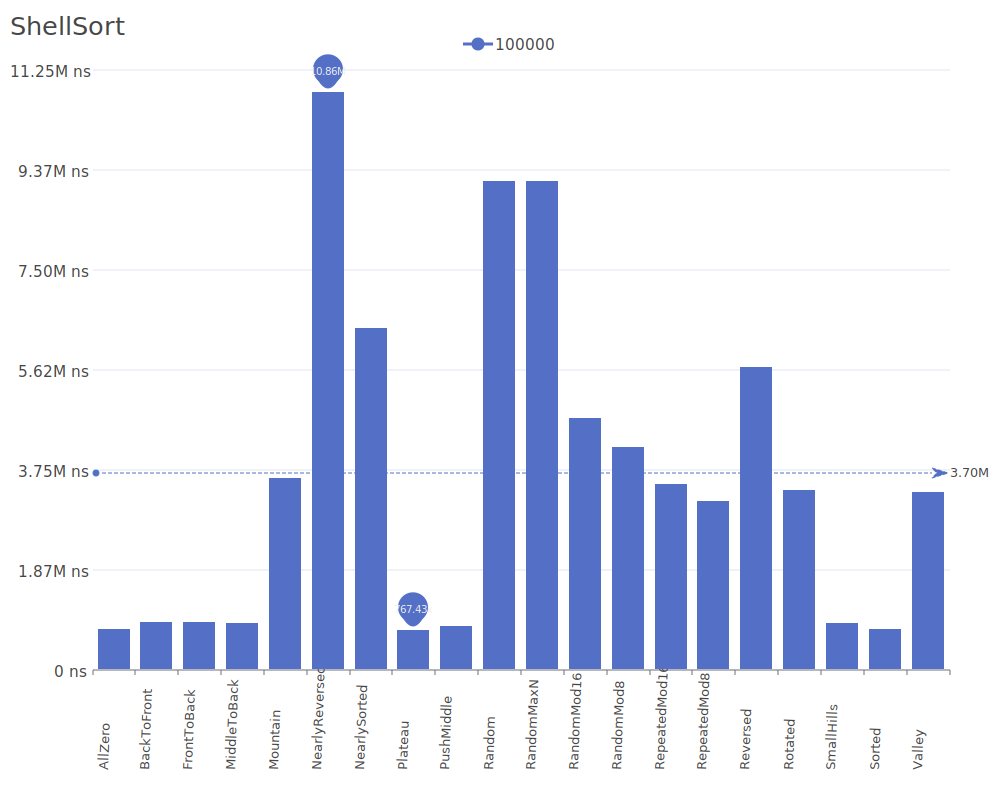
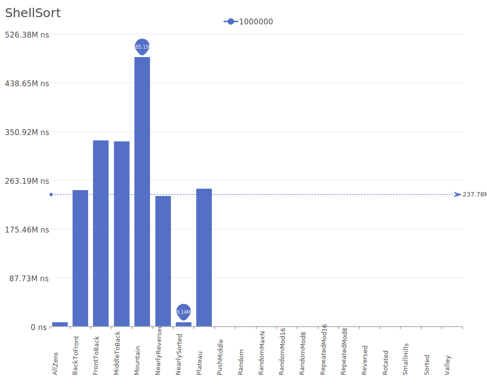

# Shell Sort

Shell Sort is an optimization of insertion sort that allows the exchange of items that are far apart. The algorithm starts by sorting pairs of elements far apart from each other, then progressively reduces the gap between elements to be compared. For more details on the algorithm and its theory, see the [Shell Sort Wikipedia article](https://en.wikipedia.org/wiki/Shellsort).

## Benchmark Results

| Number of Elements | Benchmark Visualization                                                                   |
| ------------------ | ----------------------------------------------------------------------------------------- |
| 10                 |       |
| 100                |      |
| 1,000              |     |
| 10,000             |    |
| 100,000            |   |
| 1,000,000          |  |

Note: Shell Sort's time complexity depends on the gap sequence used, but is generally O(n log n) in the best case and O(n log² n) in average and worst cases. It requires O(1) additional memory and performs particularly well on medium-sized arrays.