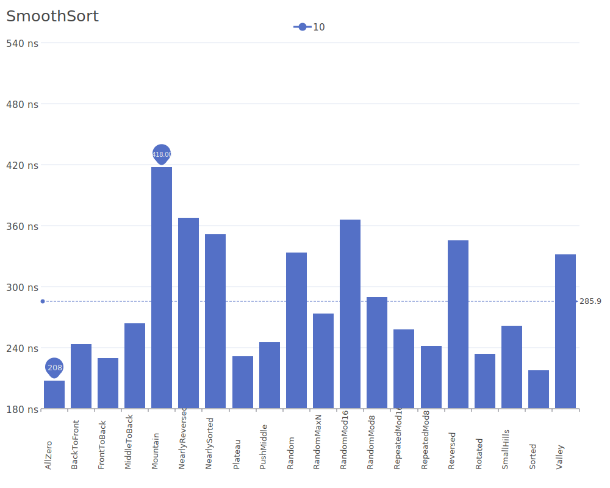
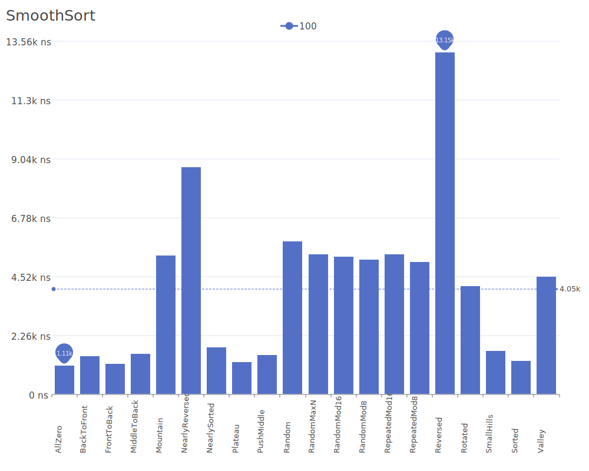
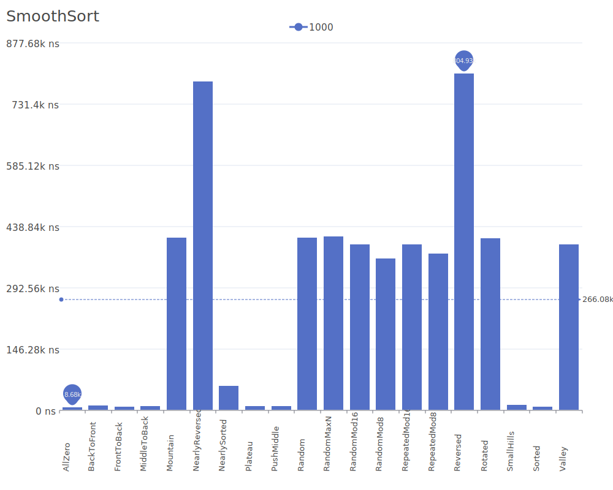
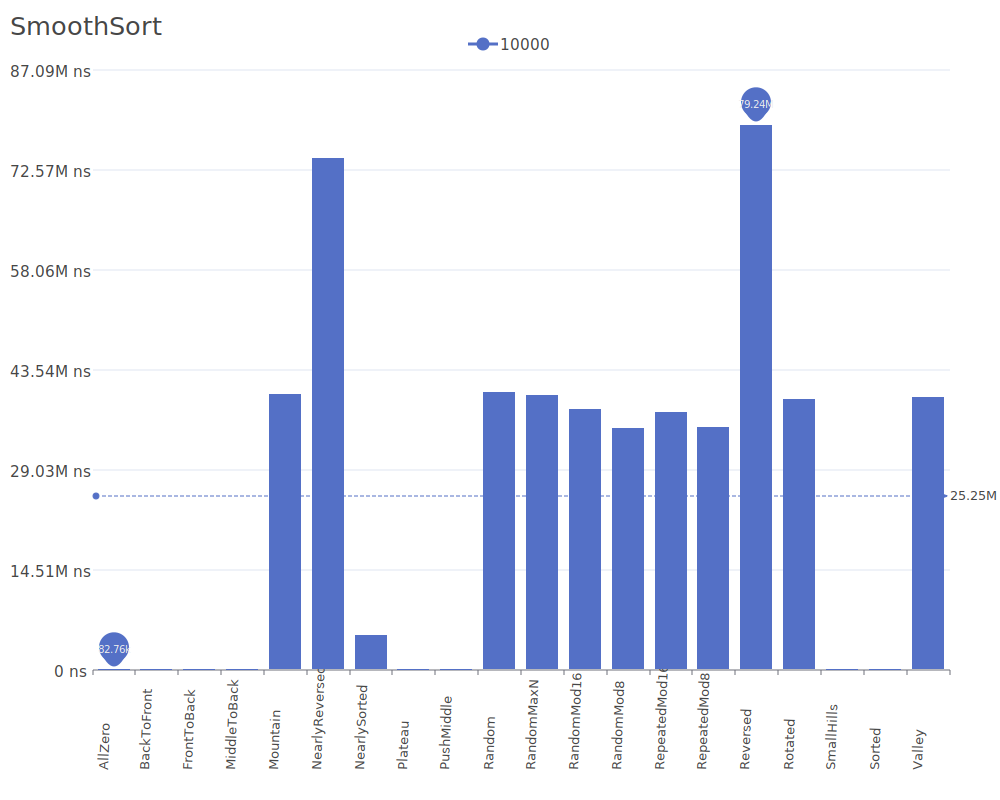

# Smooth Sort

Smooth Sort is a comparison-based sorting algorithm that is a variation of heapsort. It was invented by Edsger Dijkstra and uses a different heap structure based on Leonardo numbers. The algorithm is particularly efficient for nearly sorted sequences. For more details on the algorithm and its theory, see the [Smooth Sort paper](https://doi.org/10.1016/0167-6423(82)90016-2).

## Benchmark Results

| Number of Elements | Benchmark Visualization                                                                  |
| ------------------ | ---------------------------------------------------------------------------------------- |
| 10                 |     |
| 100                |    |
| 1,000              |   |
| 10,000             |  |

Note: Smooth Sort achieves O(n) complexity in the best case (when the input is already sorted) and O(n log n) in average and worst cases. It requires O(1) additional memory as it sorts in-place. The algorithm adapts its behavior to the presortedness of the input, making it particularly efficient for partially sorted sequences.