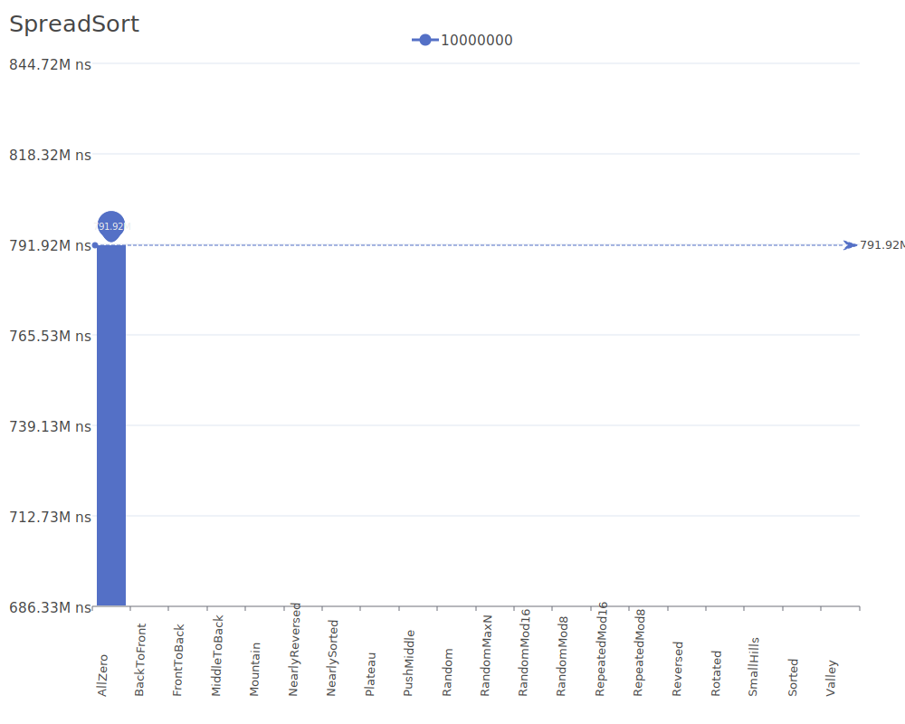

# Spread Sort

Spread Sort is a hybrid sorting algorithm that combines the distribution-based approach with comparison sorting. It spreads out elements based on their values and uses this information to sort efficiently. For more details on the algorithm, see the [Spread Sort implementation](https://github.com/orlp/pdqsort).

## Benchmark Results

| Number of Elements | Benchmark Visualization                                                                      |
| ------------------ | -------------------------------------------------------------------------------------------- |
| 10                 |         |
| 100                |        |
| 1,000              |       |
| 10,000             |      |
| 100,000            |     |
| 1,000,000          |    |
| 10,000,000         |   |
| 100,000,000        |  |

Note: Spread Sort achieves O(n) complexity in the best case and O(n log² n) in average and worst cases. It requires O(n) additional memory. The algorithm is particularly effective when dealing with data that has a relatively uniform distribution.