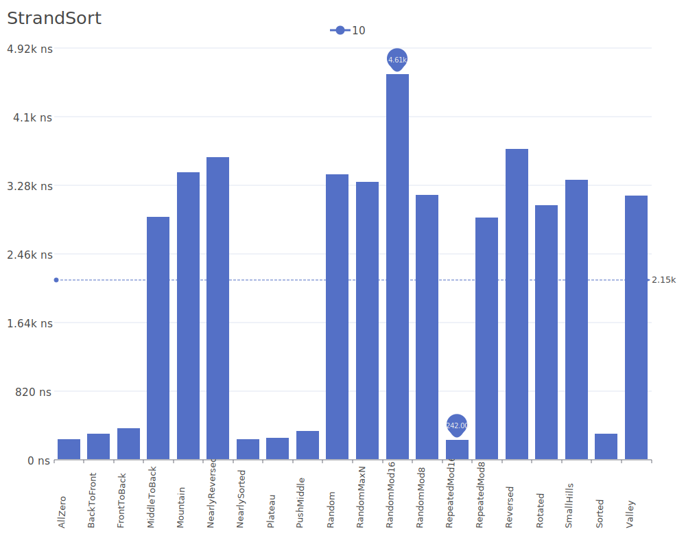
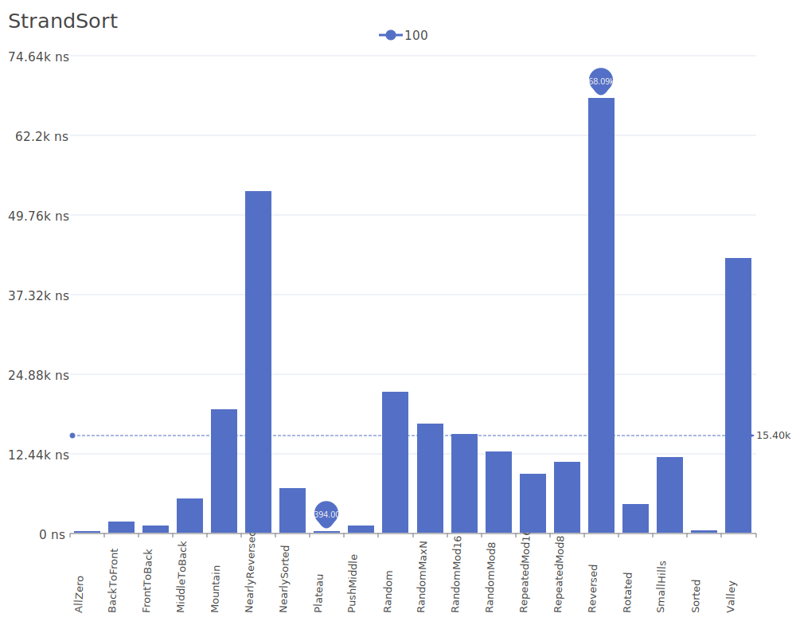
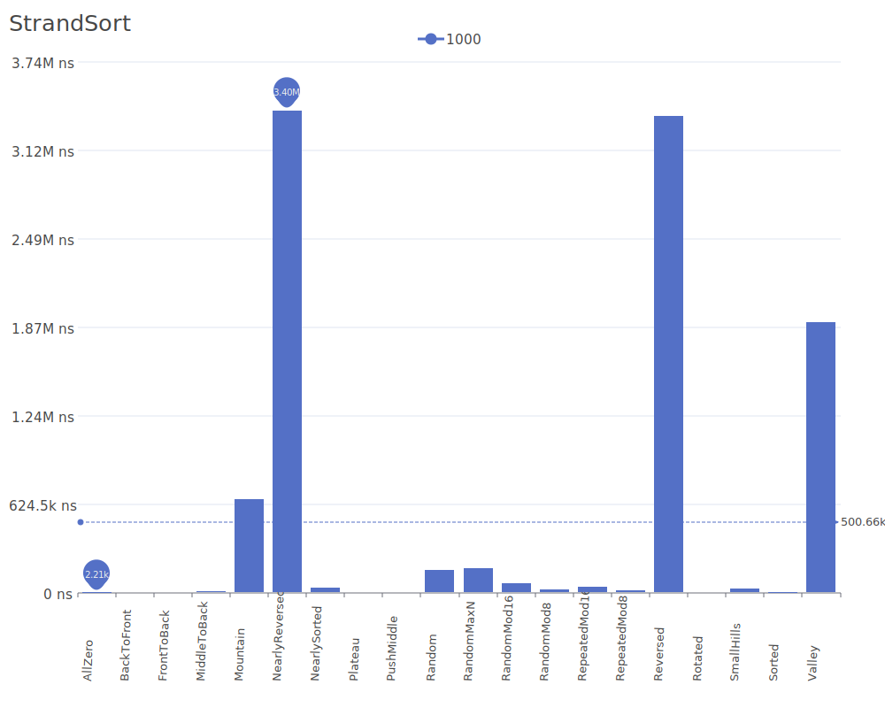
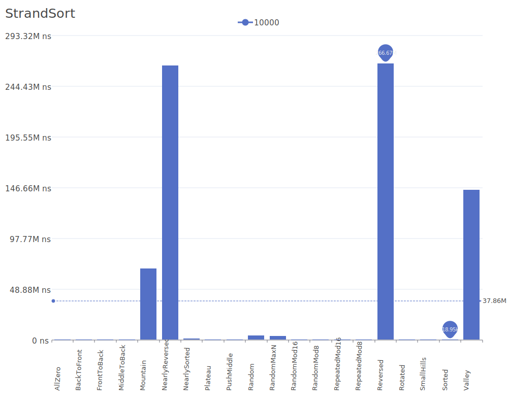

# Strand Sort

Strand Sort is a sorting algorithm that works by repeatedly pulling sorted subsequences (strands) out of the input list and merging them with a result array. It identifies already sorted sequences within the input and uses them to build the final sorted output. For more details on the algorithm and its theory, see the [Strand Sort description](https://en.wikipedia.org/wiki/Strand_sort).

## Benchmark Results

| Number of Elements | Benchmark Visualization                                                                    |
| ------------------ | ------------------------------------------------------------------------------------------ |
| 10                 |       |
| 100                |      |
| 1,000              |     |
| 10,000             |    |
| 100,000            |   |
| 1,000,000          |  |

Note: Strand Sort achieves O(n) complexity in the best case (when the input contains few reverse ordered subsequences) but degrades to O(n²) in average and worst cases. It requires O(n) additional memory and maintains stability. The algorithm is particularly efficient when the input contains many sorted subsequences.