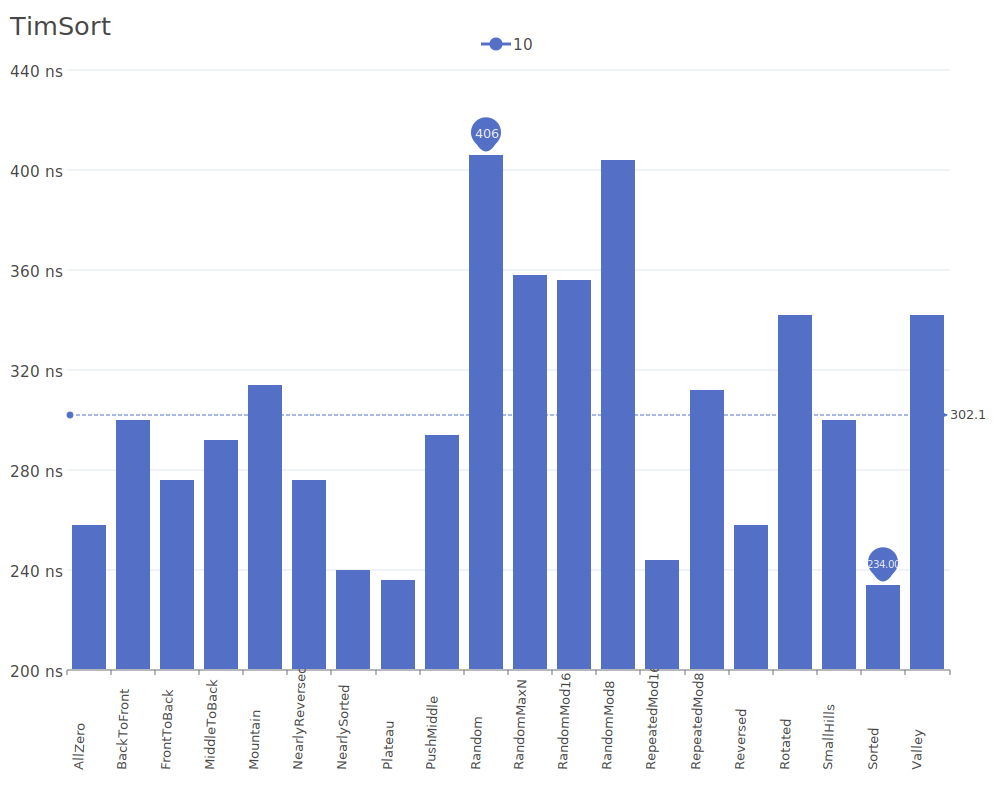
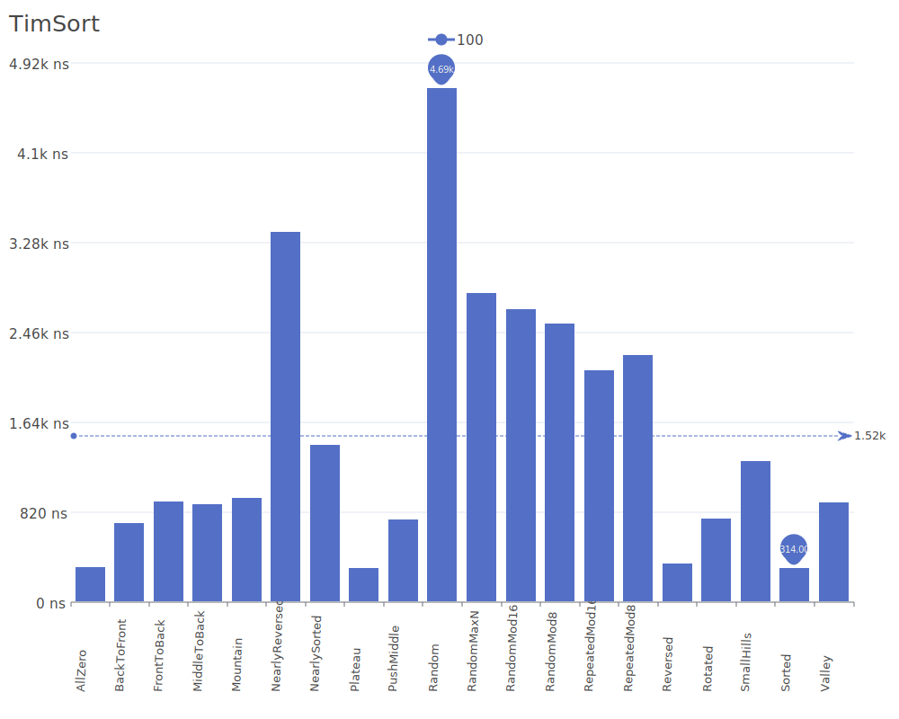
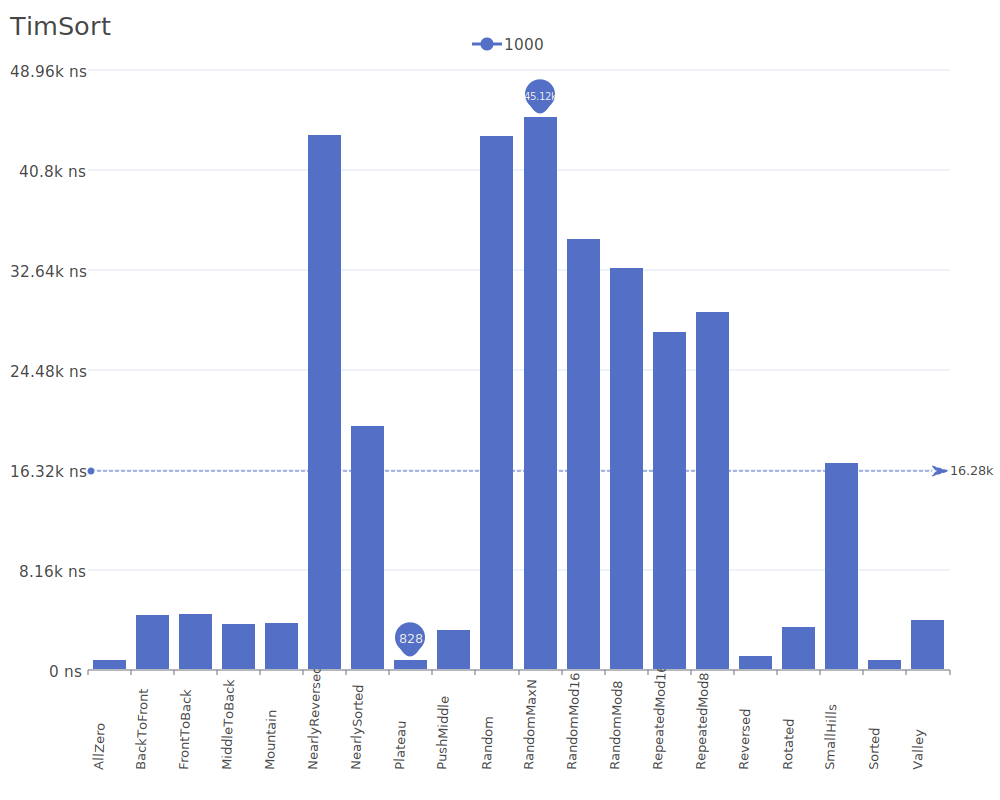
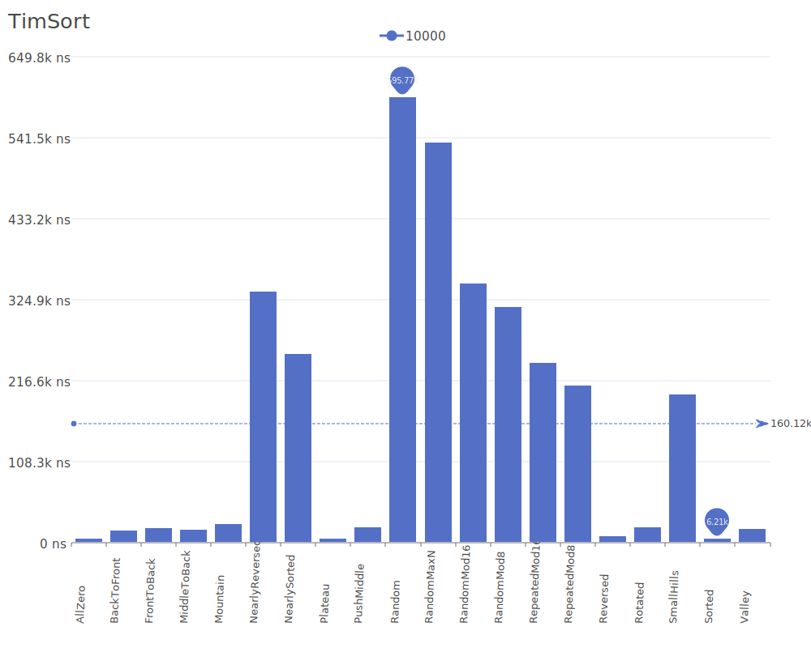
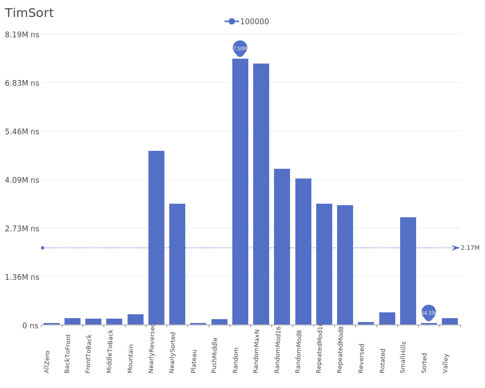
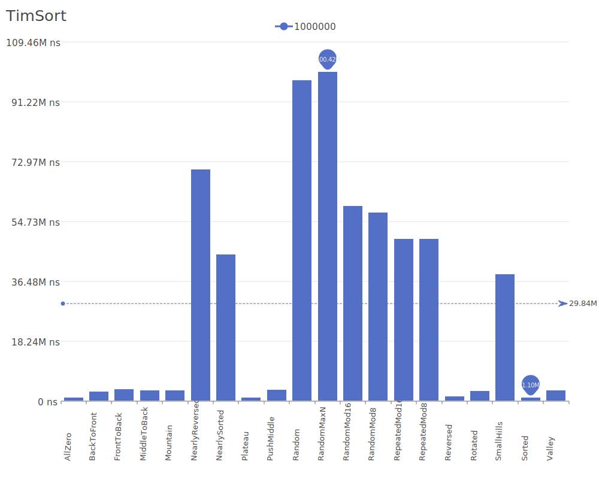
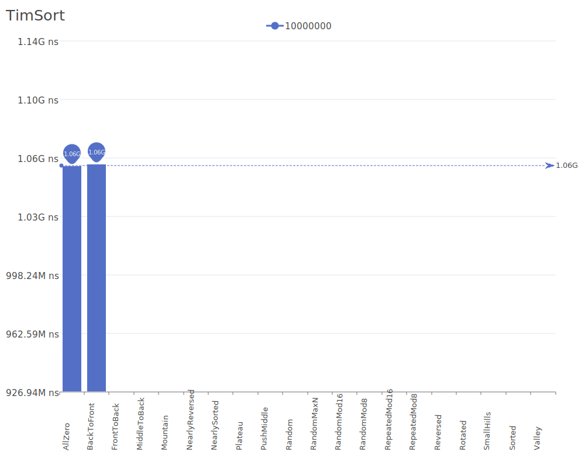

# Tim Sort

Tim Sort is a hybrid stable sorting algorithm, combining merge sort and insertion sort, designed to perform well on many kinds of real-world data. It was implemented by Tim Peters in 2002 for Python's sorting method. For more details on the algorithm and its theory, see the [Tim Sort Wikipedia article](https://en.wikipedia.org/wiki/Timsort).

## Benchmark Results

| Number of Elements | Benchmark Visualization                                                                   |
| ------------------ | ----------------------------------------------------------------------------------------- |
| 10                 |         |
| 100                |        |
| 1,000              |       |
| 10,000             |      |
| 100,000            |     |
| 1,000,000          |    |
| 10,000,000         |   |
| 100,000,000        |  |

Note: Tim Sort achieves O(n) complexity in the best case (already sorted) and O(n log n) in average and worst cases. It requires O(n) additional memory and is stable. The algorithm is particularly efficient on real-world data that often contains partially ordered subsequences.