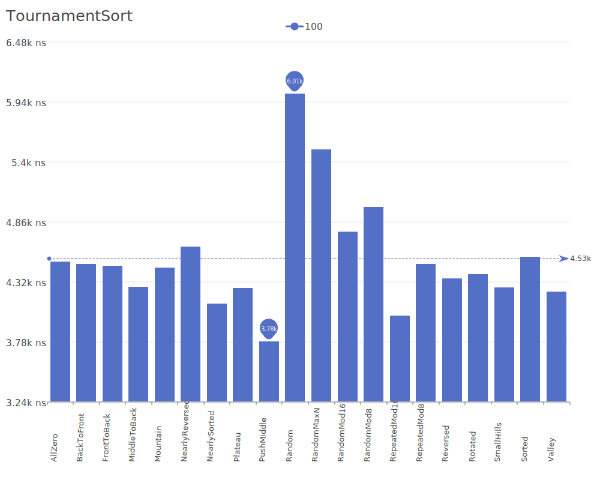
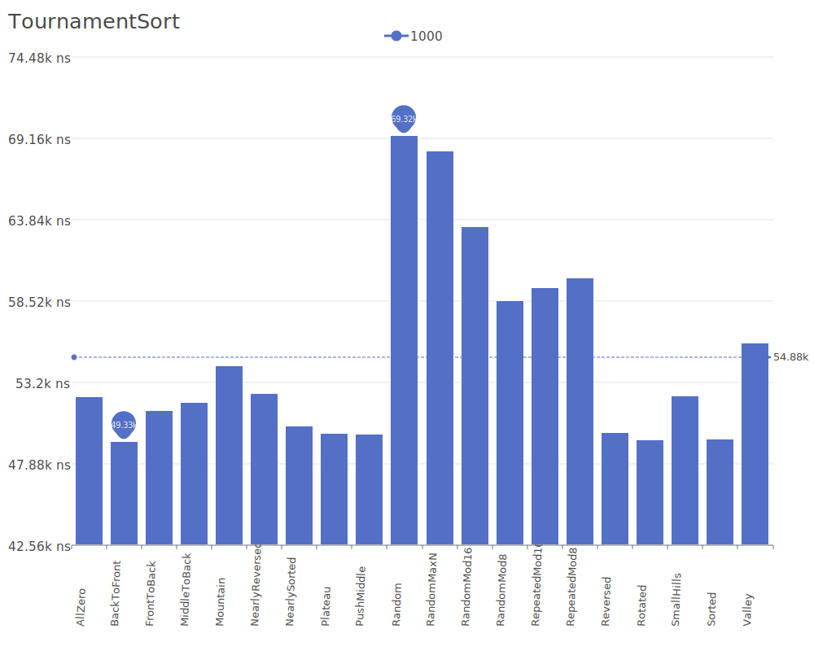
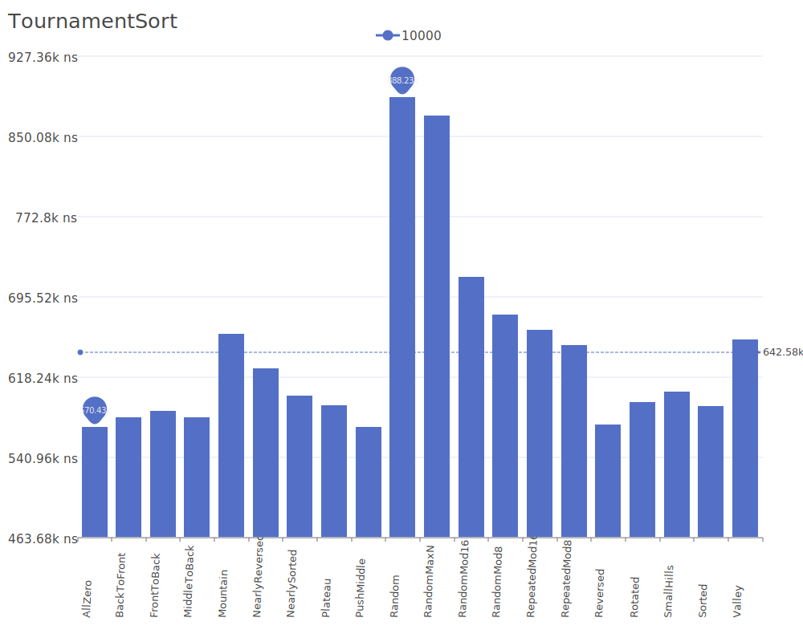
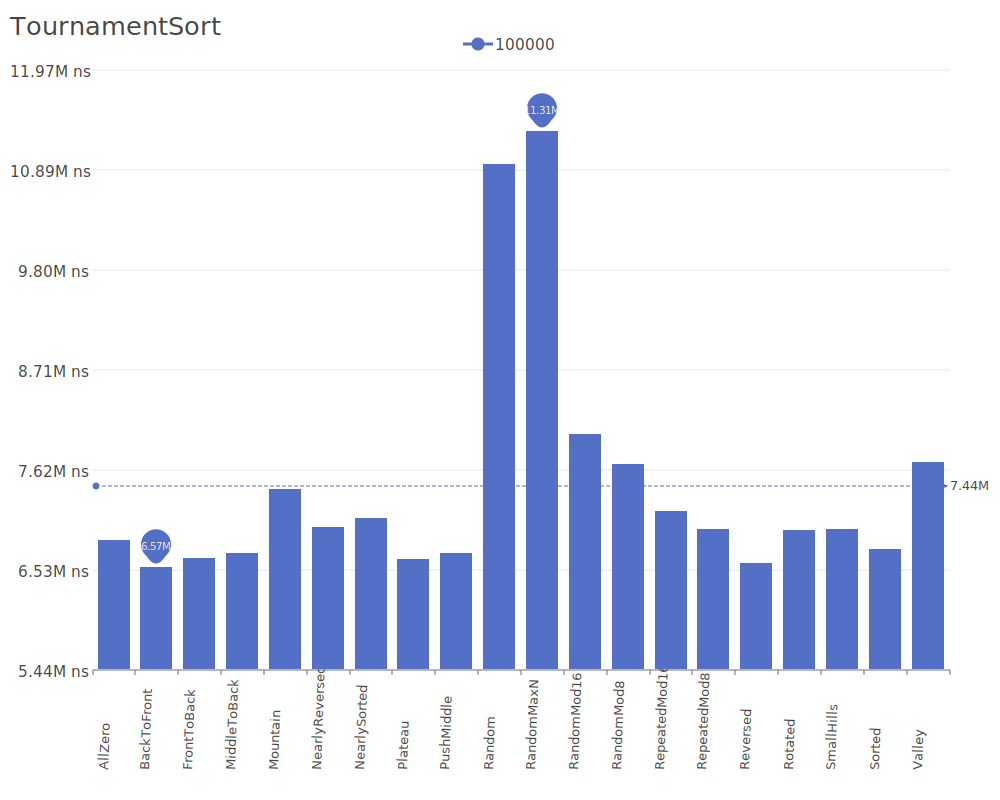
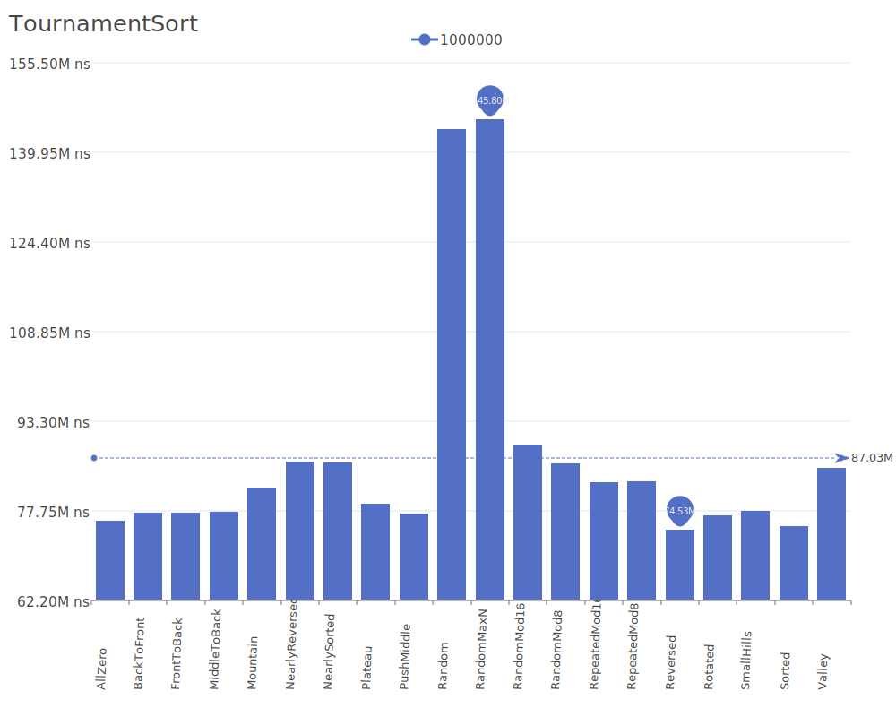
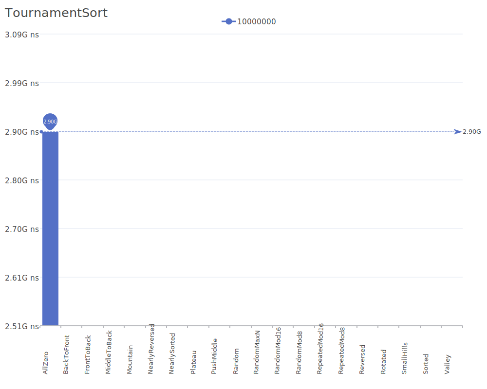

# Tournament Sort

Tournament Sort is a comparison-based sorting algorithm that uses a binary tree structure to determine the order of elements, similar to how a tournament bracket works. It repeatedly selects the smallest element from the remaining elements using a tournament tree. For more details on the algorithm and its theory, see the [Tournament Sort description](https://en.wikipedia.org/wiki/Tournament_sort).

## Benchmark Results

| Number of Elements | Benchmark Visualization                                                                          |
| ------------------ | ------------------------------------------------------------------------------------------------ |
| 10                 |         |
| 100                |        |
| 1,000              |       |
| 10,000             |      |
| 100,000            |     |
| 1,000,000          |    |
| 10,000,000         |   |
| 100,000,000        |  |

Note: Tournament Sort achieves O(n log n) complexity in all cases and requires O(n) additional memory for the tournament tree structure. While not commonly used in practice, it provides an interesting theoretical approach to sorting and can be implemented in parallel.