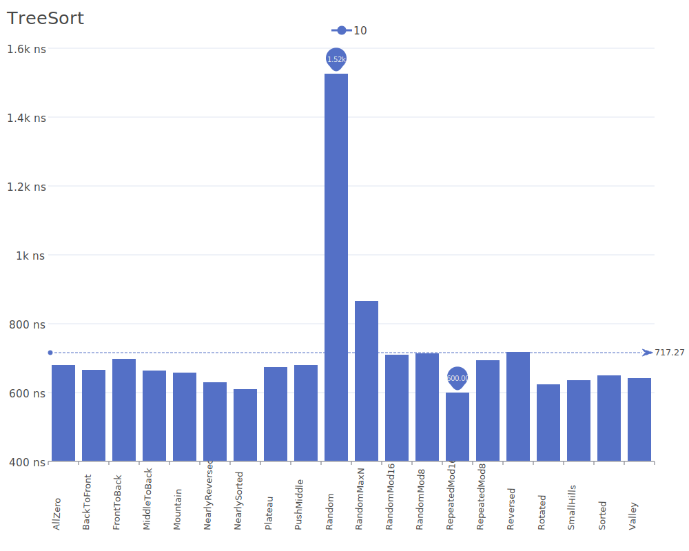
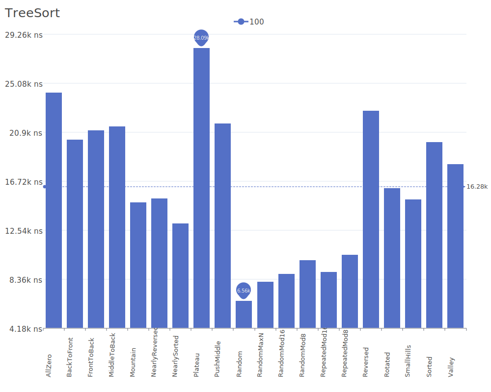
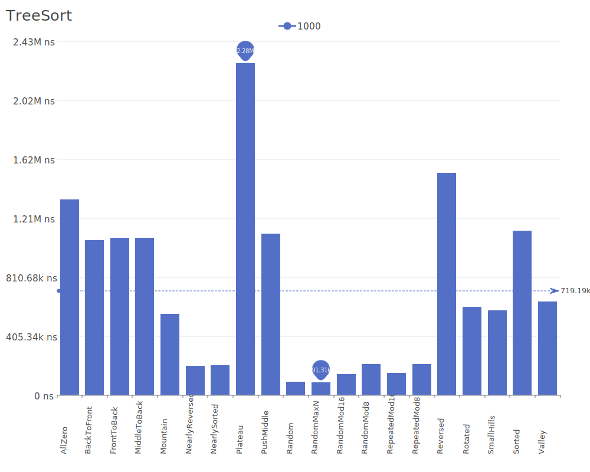
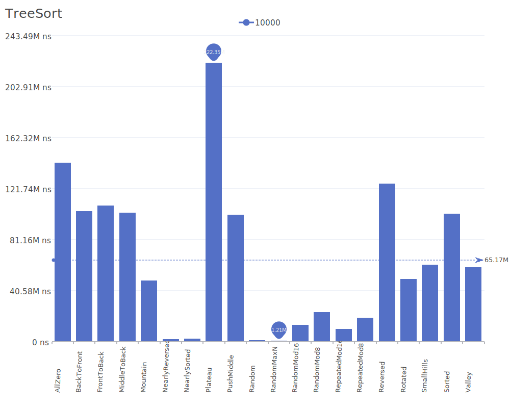

# Tree Sort

Tree Sort is a sorting algorithm that builds a binary search tree from the elements and then traverses the tree in-order to get the elements in sorted order. It's a fairly straightforward application of a binary search tree data structure. For more details on the algorithm and its theory, see the [Tree Sort Wikipedia article](https://en.wikipedia.org/wiki/Tree_sort).

## Benchmark Results

| Number of Elements | Benchmark Visualization                                                                |
| ------------------ | -------------------------------------------------------------------------------------- |
| 10                 |     |
| 100                |    |
| 1,000              |   |
| 10,000             |  |

Note: Tree Sort achieves O(n log n) complexity in average case but can degrade to O(n²) in the worst case when the tree becomes unbalanced. It requires O(n) additional memory for storing the binary search tree. The algorithm is stable and particularly useful when data needs to be maintained in a sorted state in a binary search tree structure.