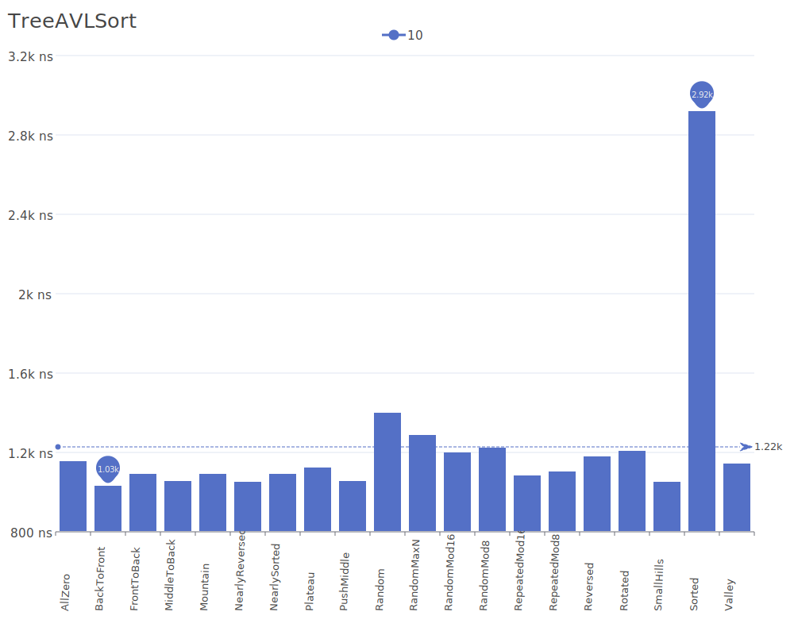
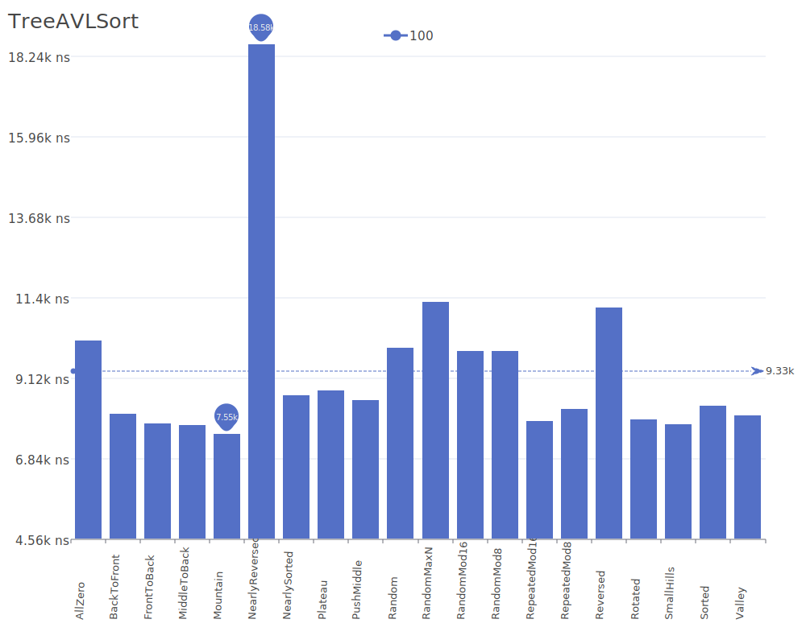
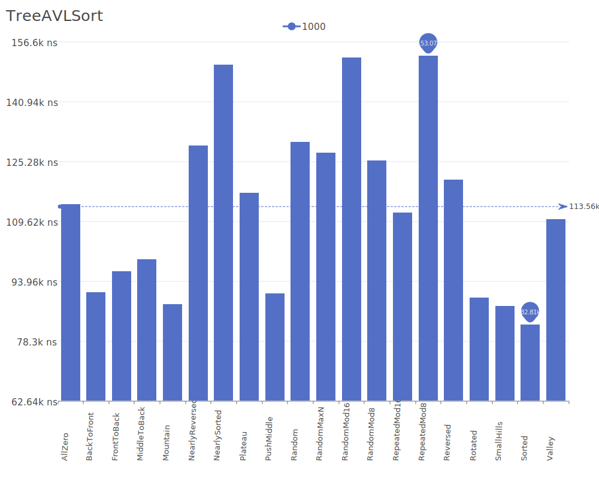
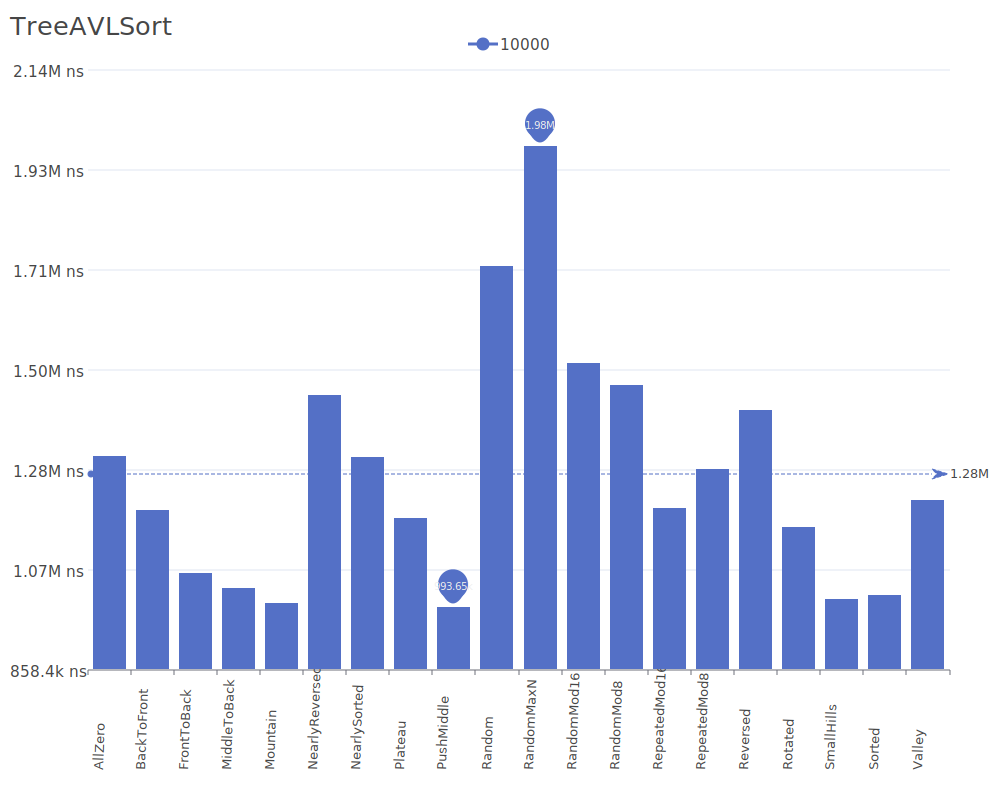
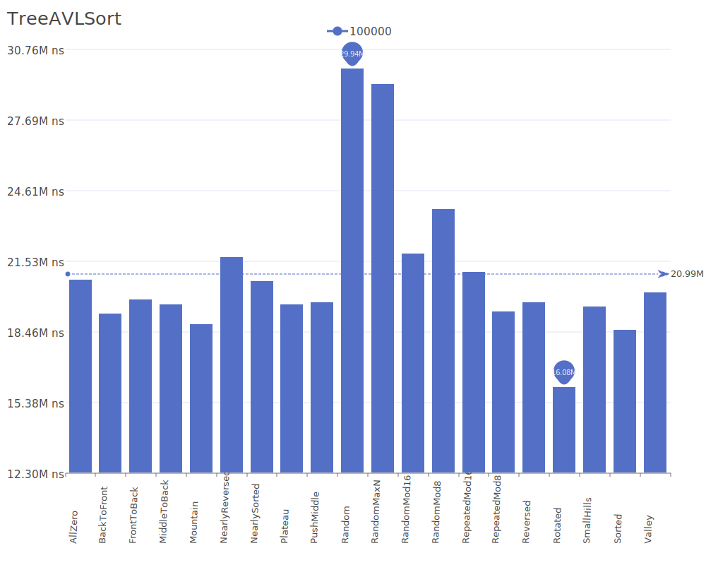
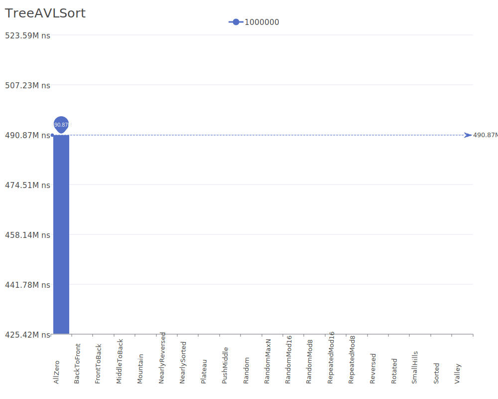

# Tree Sort AVL

Tree Sort AVL is a variation of Tree Sort that uses an AVL tree instead of a basic binary search tree. AVL trees are self-balancing binary search trees that maintain a height balance factor, ensuring optimal performance. For more details on AVL trees, see the [AVL Tree Wikipedia article](https://en.wikipedia.org/wiki/AVL_tree).

## Benchmark Results

| Number of Elements | Benchmark Visualization                                                                     |
| ------------------ | ------------------------------------------------------------------------------------------- |
| 10                 |       |
| 100                |      |
| 1,000              |     |
| 10,000             |    |
| 100,000            |   |
| 1,000,000          |  |

Note: Tree Sort AVL achieves O(n log n) complexity in all cases due to the self-balancing nature of AVL trees. It requires O(n) additional memory for storing the AVL tree structure. The algorithm is stable and particularly useful when data needs to be maintained in a balanced binary search tree structure.