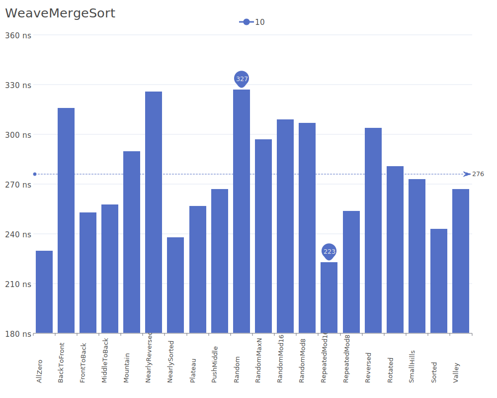
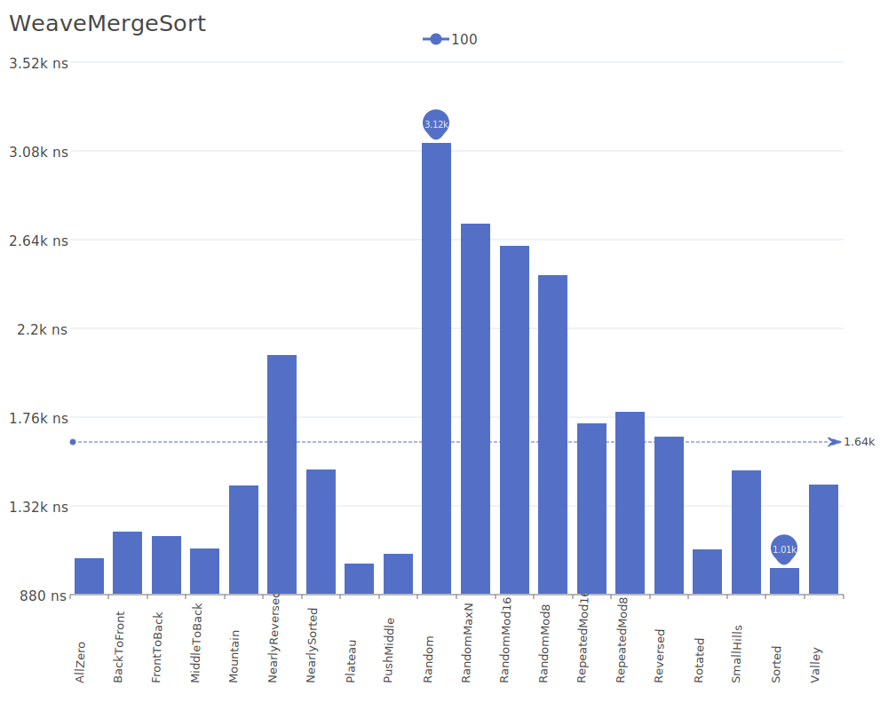
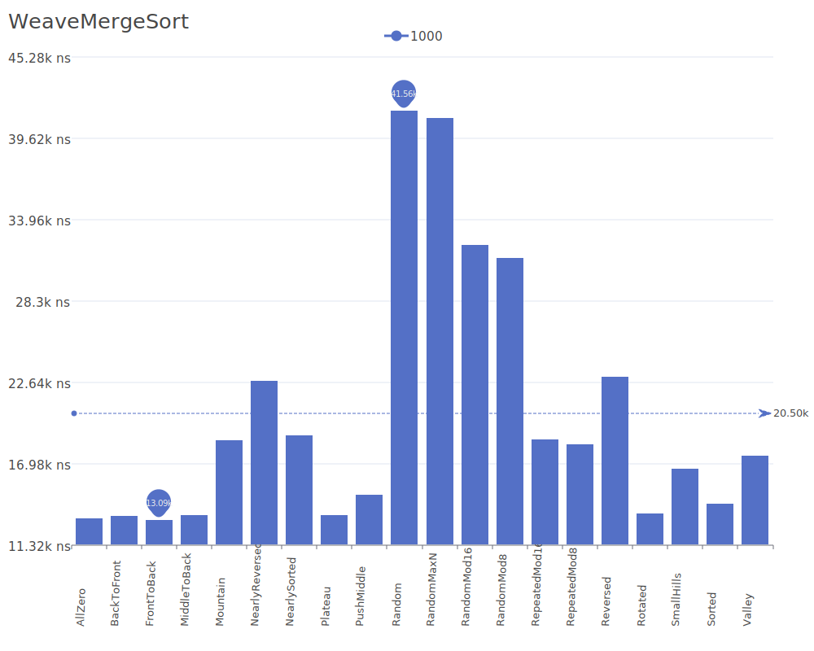
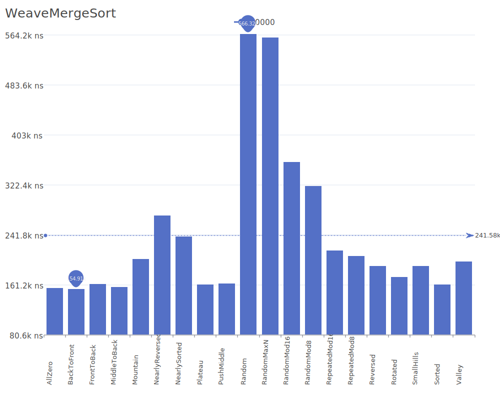
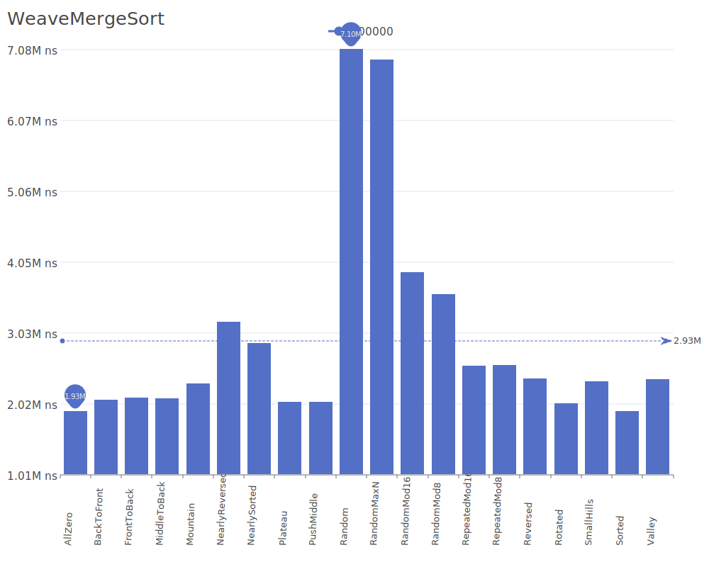
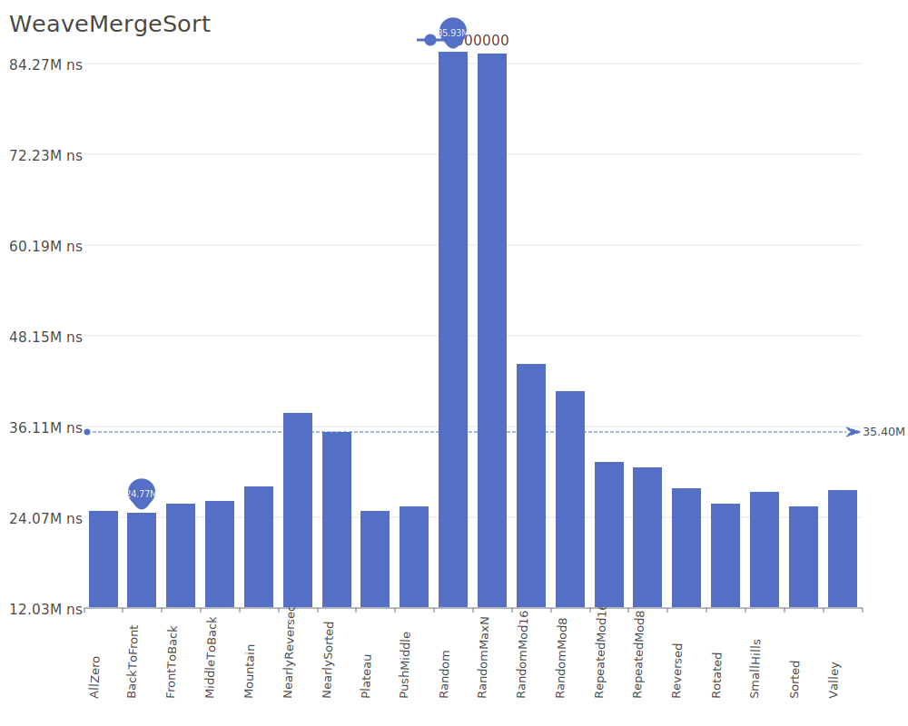
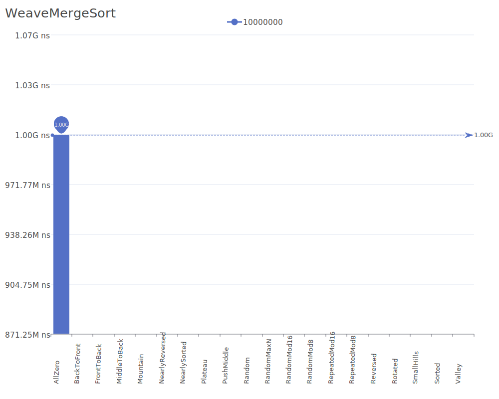

# Weave Merge Sort

Weave Merge Sort is a variation of merge sort that uses a weaving pattern to combine sorted sequences. It focuses on efficient memory usage and cache performance by interleaving elements during the merge phase. For more details on merge sort variations, see the [Merge Sort Wikipedia article](https://en.wikipedia.org/wiki/Merge_sort).

## Benchmark Results

| Number of Elements | Benchmark Visualization                                                                          |
| ------------------ | ------------------------------------------------------------------------------------------------ |
| 10                 |         |
| 100                |        |
| 1,000              |       |
| 10,000             |      |
| 100,000            |     |
| 1,000,000          |    |
| 10,000,000         |   |
| 100,000,000        |  |

Note: Weave Merge Sort achieves O(n log n) complexity in all cases and requires O(n) additional memory. The algorithm maintains stability and can provide better cache performance than traditional merge sort implementations due to its weaving merge pattern.