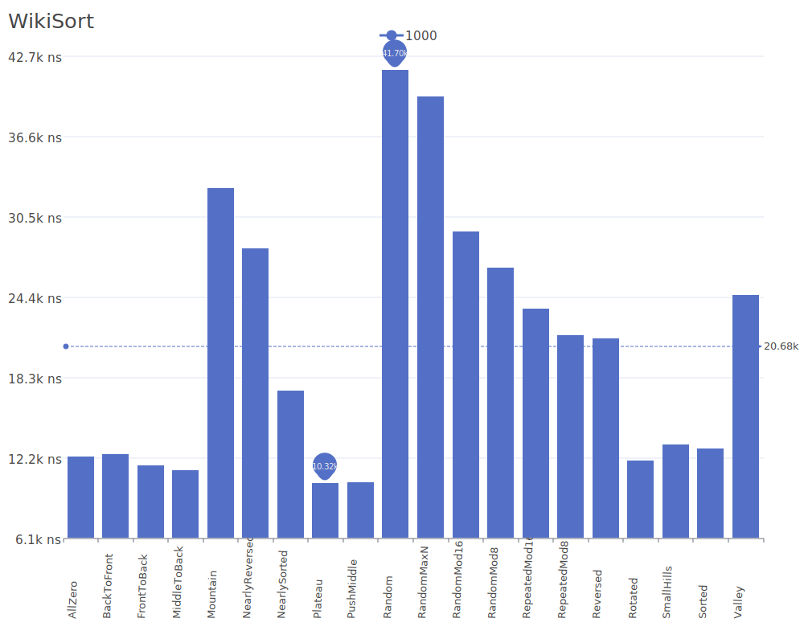

# Wiki Sort

Wiki Sort, also known as Block Merge Sort, is an in-place stable sorting algorithm that combines ideas from merge sort with block operations to achieve optimal performance with minimal additional memory. For more details on the algorithm and its theory, see the [Wiki Sort implementation](https://github.com/BonzaiThePenguin/WikiSort).

## Benchmark Results

| Number of Elements | Benchmark Visualization                                                                  |
| ------------------ | ---------------------------------------------------------------------------------------- |
| 10                 |       |
| 100                |      |
| 1,000              |     |
| 10,000             |    |
| 100,000            |   |
| 1,000,000          |  |

Note: Wiki Sort achieves O(n log n) complexity in all cases while maintaining stability and using only O(1) additional memory. The algorithm is particularly notable for being one of the few stable sorting algorithms that can sort in-place with optimal time complexity.