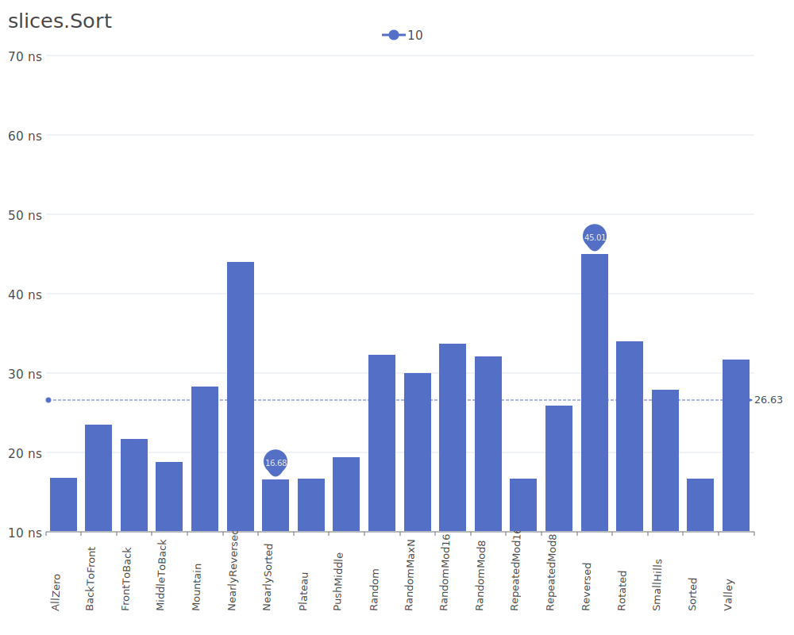
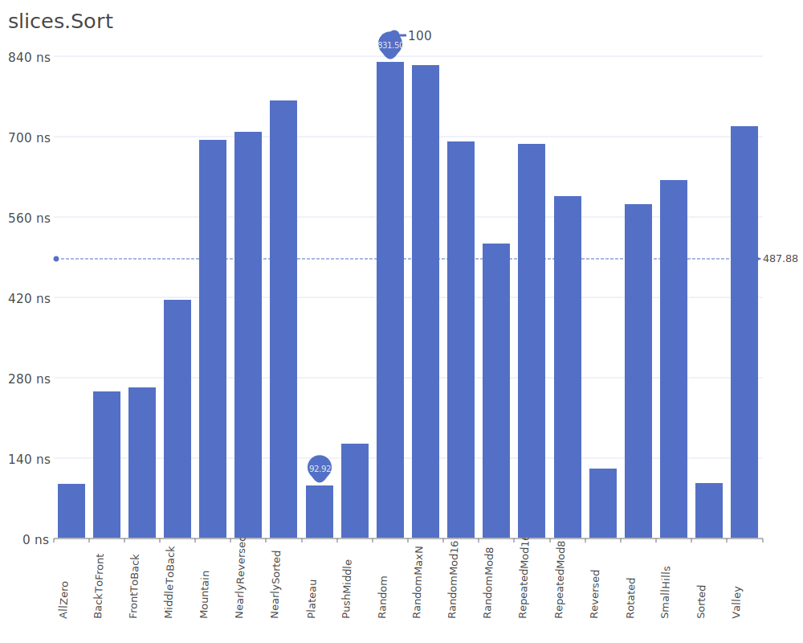
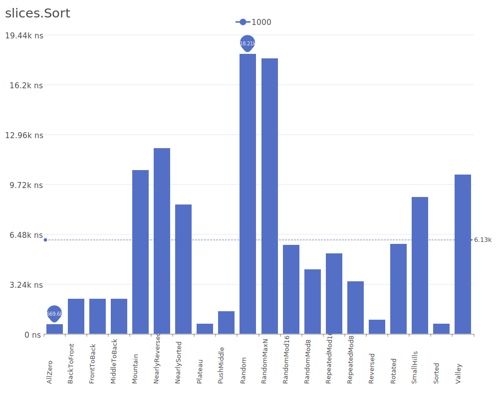
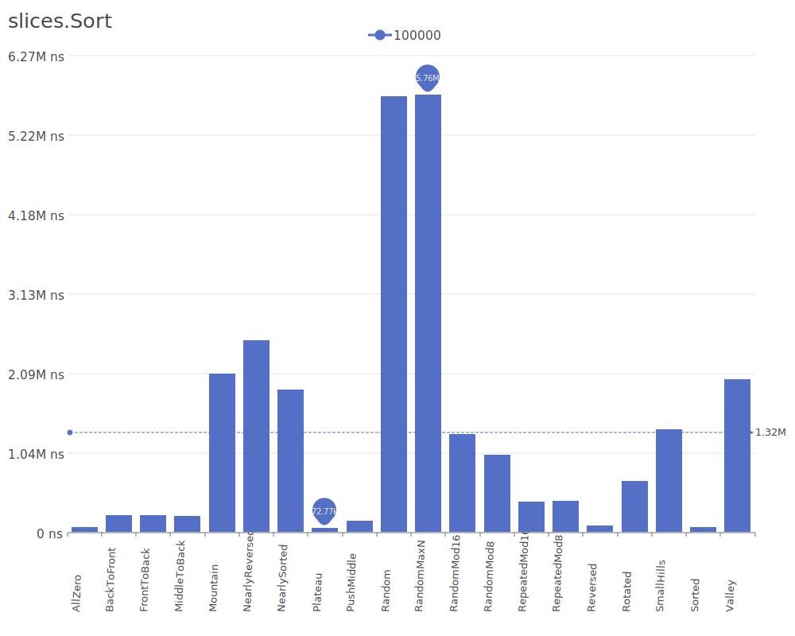
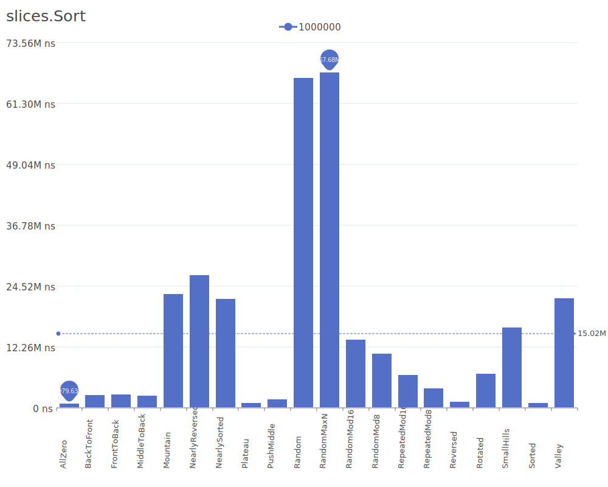
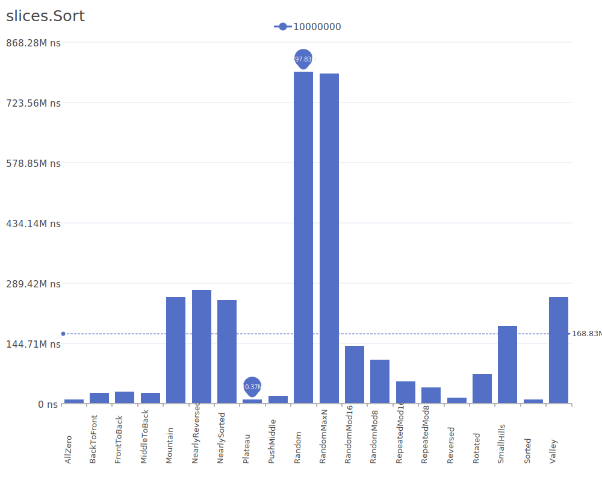
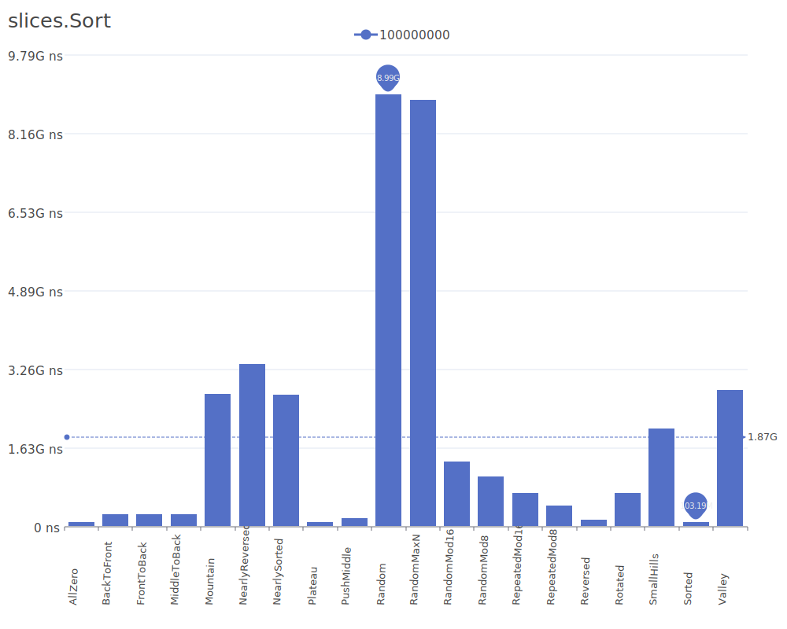

# slices.Sort

slices.Sort is the built-in sorting function provided by Go for sorting slices. It leverages efficient algorithms under the hood and is optimized for various use cases. For more details on sorting methodologies, see the [Sorting algorithm Wikipedia article](https://en.wikipedia.org/wiki/Sorting_algorithm).

## Benchmark Results

| Number of Elements | Benchmark Visualization                                                                        |
| ------------------ | ---------------------------------------------------------------------------------------------- |
| 10                 |          |
| 100                |         |
| 1,000              |        |
| 10,000             |       |
| 100,000            |      |
| 1,000,000          |     |
| 10,000,000         |    |
| 100,000,000        |   |
| 1,000,000,000      |  |