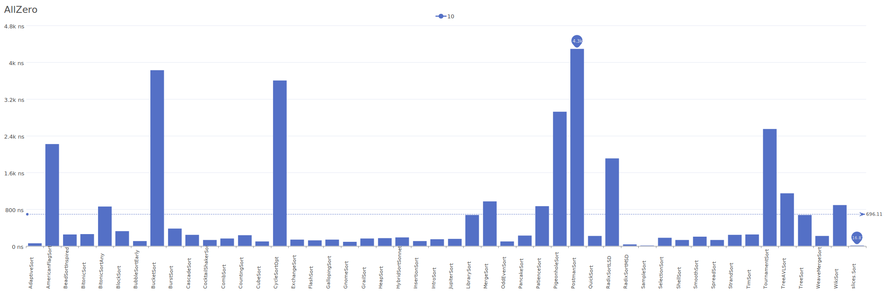
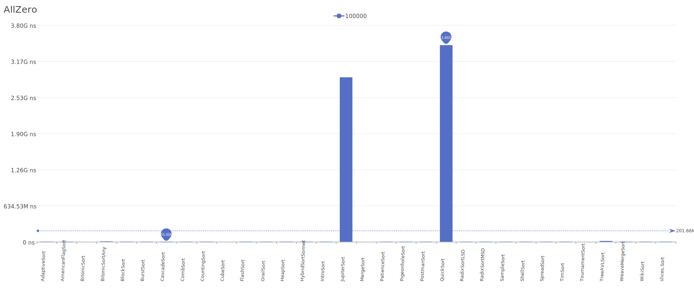
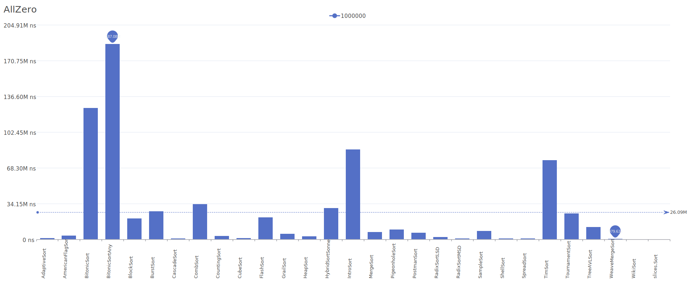

# AllZero Distribution

A distribution where all elements are zero.

| Elements | Performance                                                                                                                                                                                          |
| -------- | ---------------------------------------------------------------------------------------------------------------------------------------------------------------------------------------------------- |
| 10       |  |
| 10 blank |  |
| 100      |                           |
| 1k       |                         |
| 10k      |                       |
| 100k     |                     |
| 1M       |                   |
| 10M      |                 |
| 100M     |               |
| 1B       |             |