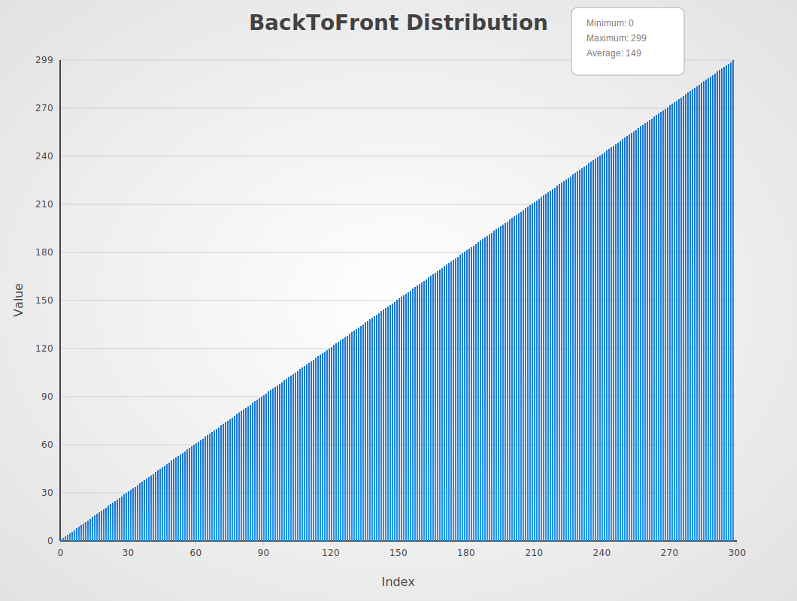
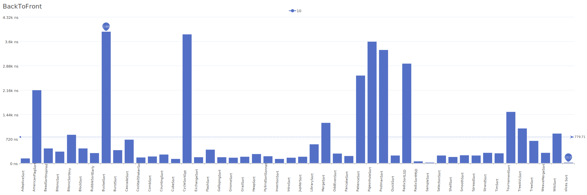
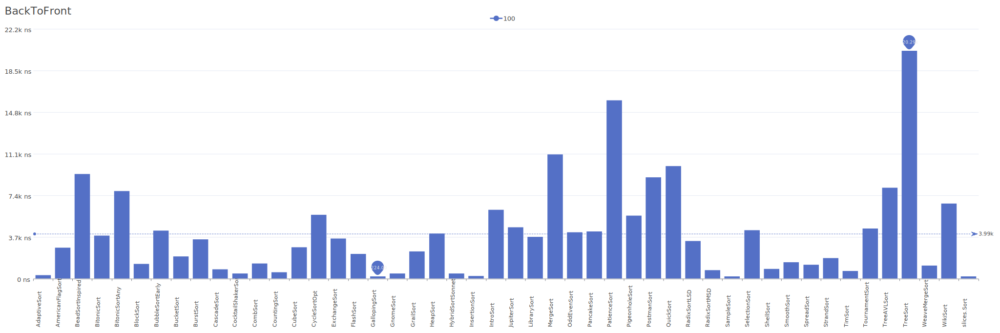
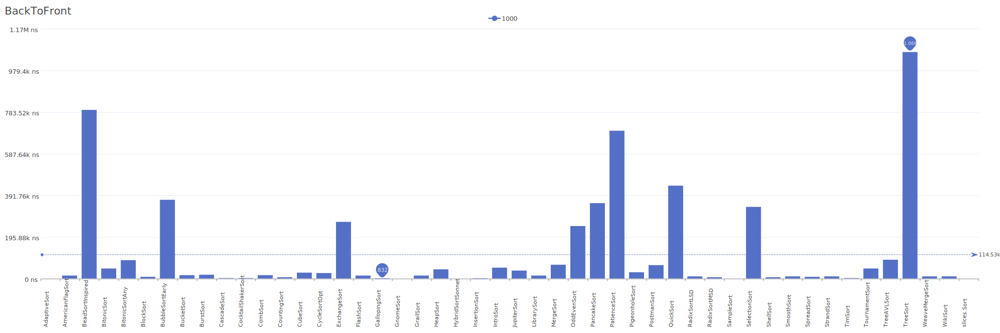

# BackToFront Distribution

A distribution where a single element is pushed from the back to the front of the array.

| Elements | Performance                                                                                                                                                                    |
| -------- | ------------------------------------------------------------------------------------------------------------------------------------------------------------------------------ |
| 10       |        |
| 100      |      |
| 1000     |    |
| 10000    |  |
