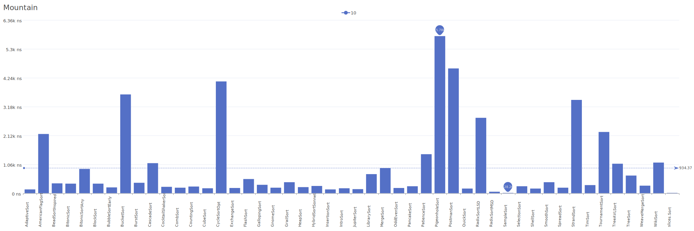
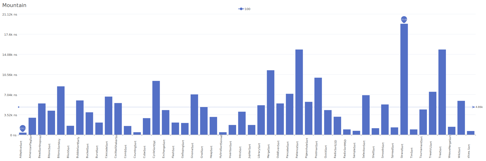
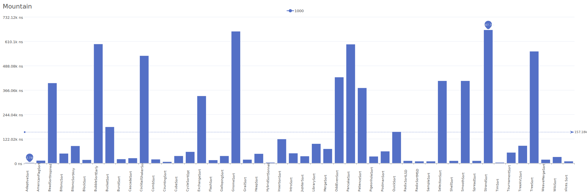

# Mountain Distribution

A distribution where elements form a mountain shape, ascending then descending.

| Elements | Performance                                                                                                                                                              |
| -------- | ------------------------------------------------------------------------------------------------------------------------------------------------------------------------ |
| 10       |        |
| 100      |      |
| 1000     |    |
| 10000    |  |