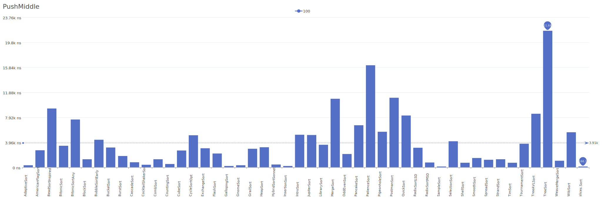
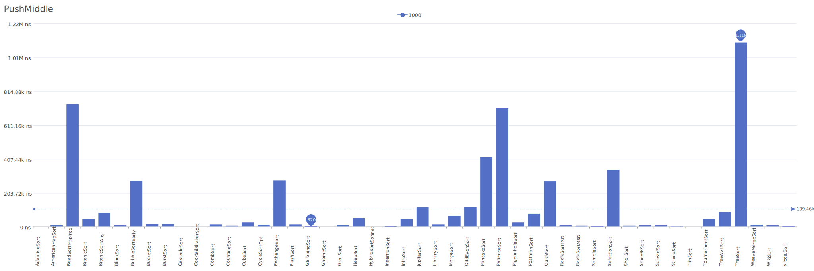
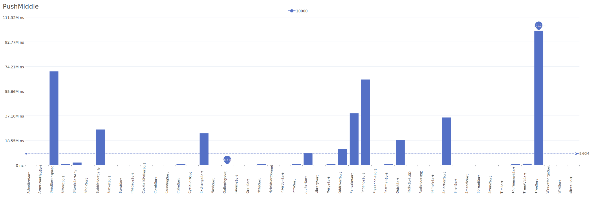

# PushMiddle Distribution

A distribution where elements are pushed into the middle of the array.

| Elements | Performance                                                                                                                                                                  |
| -------- | ---------------------------------------------------------------------------------------------------------------------------------------------------------------------------- |
| 10       |        |
| 100      |      |
| 1000     |    |
| 10000    |  |