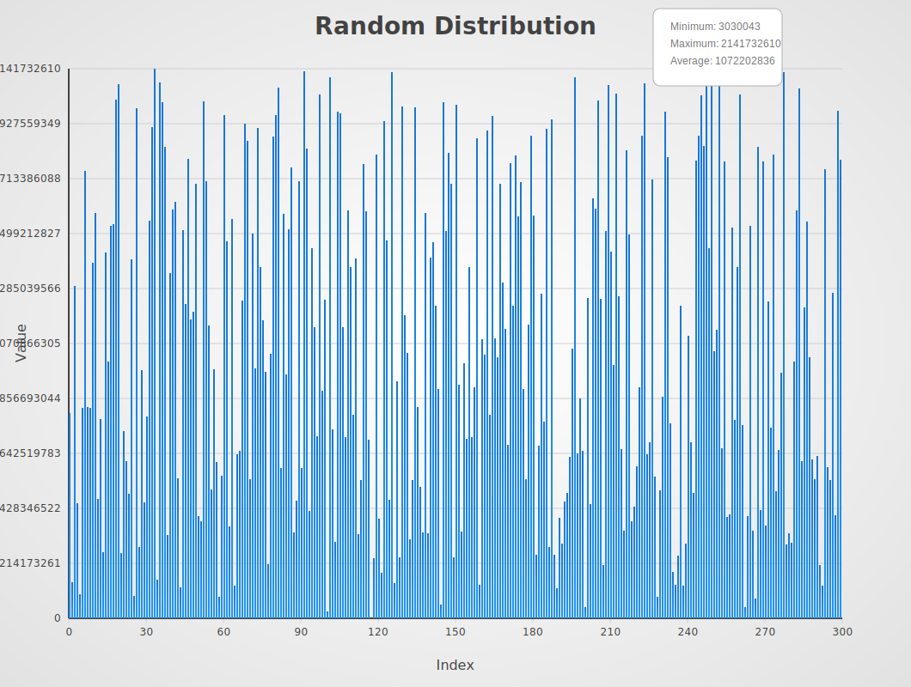
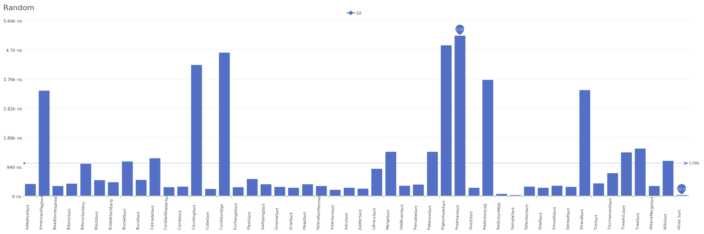
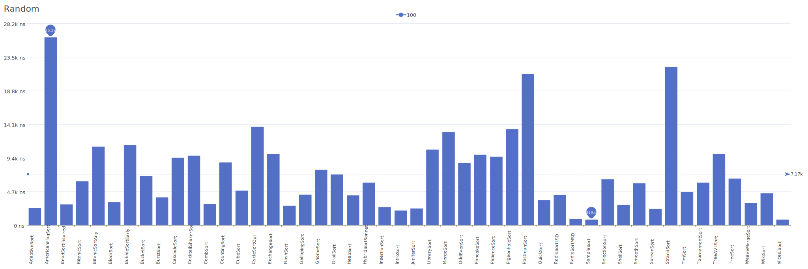
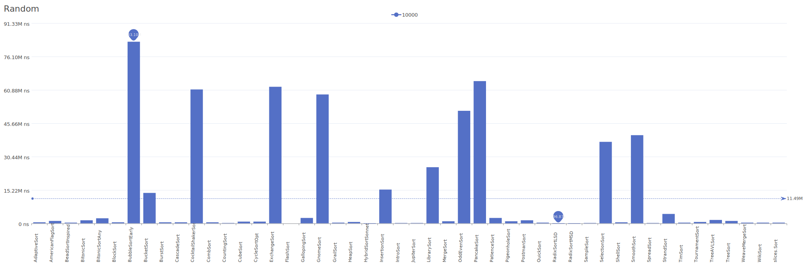

# Random Distribution

A distribution where elements are randomly ordered with no specific pattern.

| Elements | Performance                                                                                                                                                          |
| -------- | -------------------------------------------------------------------------------------------------------------------------------------------------------------------- |
| 10       |        |
| 100      |      |
| 1000     |    |
| 10000    |  |