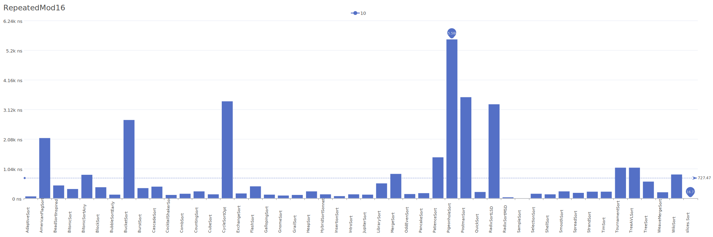
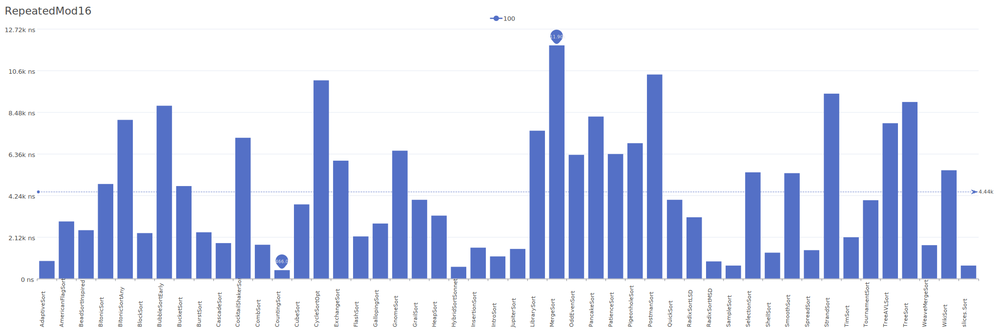
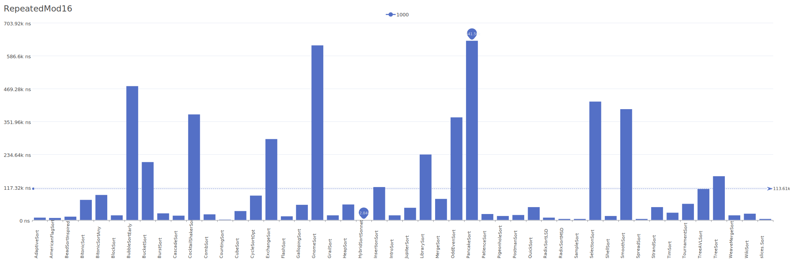
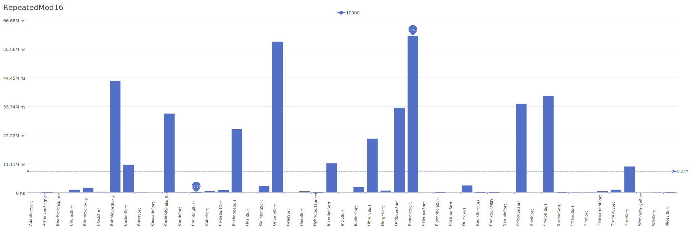

# RepeatedMod16 Distribution

A distribution where elements repeat in a pattern of modulo 16, creating regular intervals of the same values.

| Elements | Performance                                                                                                                                                                        |
| -------- | ---------------------------------------------------------------------------------------------------------------------------------------------------------------------------------- |
| 10       |        |
| 100      |      |
| 1000     |    |
| 10000    |  |