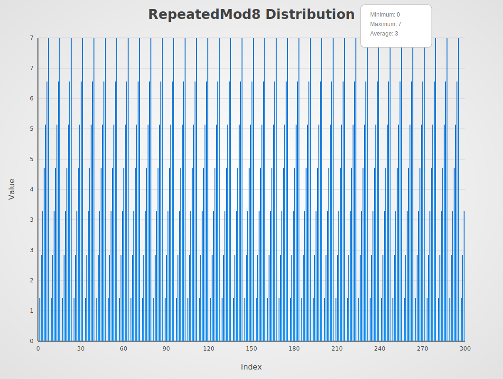
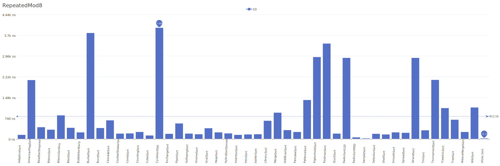
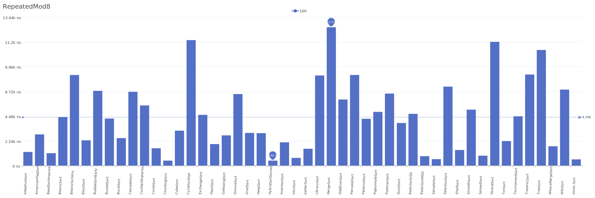

# RepeatedMod8 Distribution

A distribution where elements repeat in a pattern of modulo 8, creating regular intervals of the same values.

| Elements | Performance                                                                                                                                                                      |
| -------- | -------------------------------------------------------------------------------------------------------------------------------------------------------------------------------- |
| 10       |        |
| 100      |      |
| 1000     |    |
| 10000    |  |