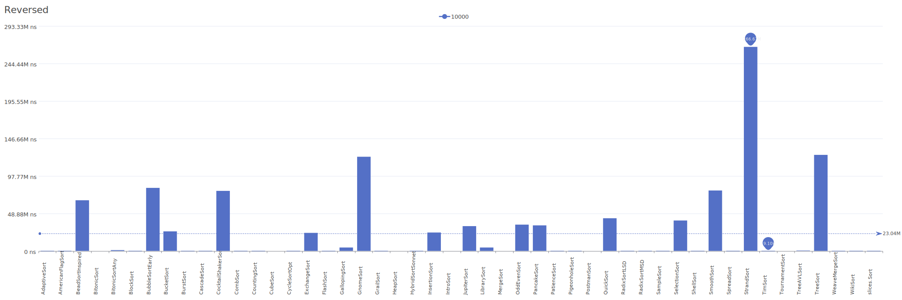

# Reversed Distribution

A distribution where elements are in completely reversed order, from highest to lowest value.

| Elements | Performance                                                                                                                                                              |
| -------- | ------------------------------------------------------------------------------------------------------------------------------------------------------------------------ |
| 10       |        |
| 100      |      |
| 1000     |    |
| 10000    |  |