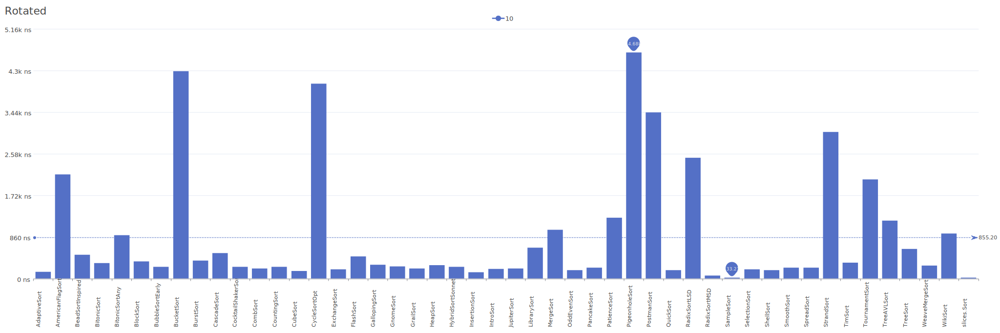
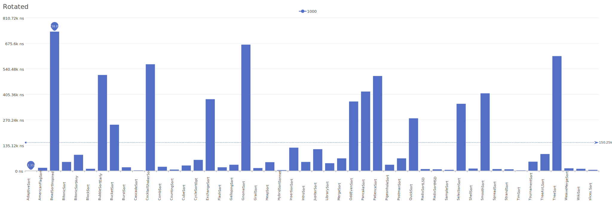
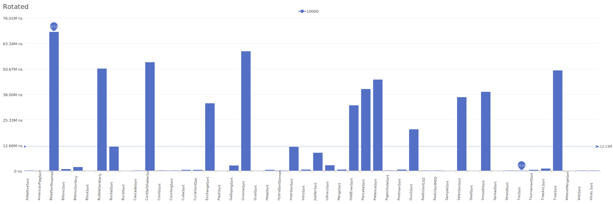

# Rotated Distribution

A distribution where the sorted array is rotated by a fixed amount, shifting all elements.

| Elements | Performance                                                                                                                                                            |
| -------- | ---------------------------------------------------------------------------------------------------------------------------------------------------------------------- |
| 10       |        |
| 100      |      |
| 1000     |    |
| 10000    |  |